# Exploratory Data Analysis Report: Google Books Dataset

## 1. Dataset Overview

### Subject Matter
This dataset contains metadata for **15,147 books** collected from Google Books API, organized across approximately 100 search categories. The data appears to be gathered by querying Google Books with specific search terms (the `search_category` column) and collecting the returned book metadata.

### File Structure
- **Single file**: `google_books_dataset.csv`
- **Shape**: 15,147 rows x 21 columns
- **No duplicate rows** (each `book_id` is unique)

### Column Descriptions

| Column | Type | Description | Missing % |
|--------|------|-------------|-----------|
| book_id | string | Google Books unique identifier | 0% |
| title | string | Book title | 0.05% |
| subtitle | string | Book subtitle | 60.5% |
| authors | string | Comma-separated author names | 23.3% |
| publisher | string | Publisher name | 53.2% |
| published_date | string | Publication date (various formats) | 1.4% |
| description | string | Book description text | 44.9% |
| page_count | float | Number of pages | 1.4% |
| categories | string | Google-assigned category | 16.2% |
| average_rating | float | Average user rating (1-5) | 94.3% |
| ratings_count | int | Number of ratings received | 0% |
| language | string | Language code | 0% |
| preview_link | string | URL to Google Books preview | 0% |
| info_link | string | URL to book information | 0% |
| isbn_13 | float | ISBN-13 identifier | 51.3% |
| isbn_10 | string | ISBN-10 identifier | 53.0% |
| list_price | float | Listed price in USD | 80.6% |
| currency | string | Currency (all USD when present) | 80.6% |
| buyable | bool | Whether book is available for purchase | 0% |
| search_category | string | The search term used to find this book | 0% |
| thumbnail | string | URL to book cover image | 4.4% |

---

## 2. Data Quality Analysis

### Missing Data Overview

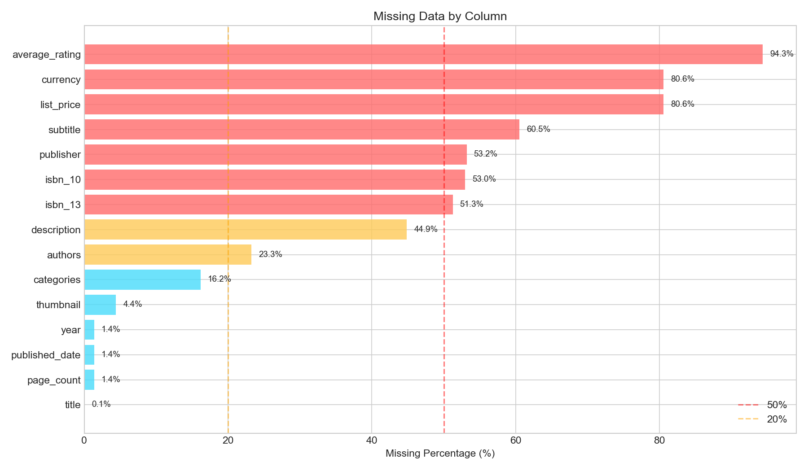

**Key observations:**
- **average_rating** is missing for 94.3% of books. This is because `ratings_count` is 0 for most books (14,290 out of 15,147), meaning they have never been rated.
- **list_price** and **currency** are missing for 80.6% of books, indicating many books are not available for direct purchase.
- **subtitle** (60.5%), **publisher** (53.2%), and **description** (44.9%) have substantial missing data.
- Core metadata like **title**, **page_count**, and **published_date** have minimal missing values (<2%).

### Duplicate Analysis

- **Exact duplicate rows**: 0
- **Duplicate book_ids**: 0 (each book appears exactly once)
- **Duplicate titles**: 1,039 unique titles appear more than once (covering 3,034 books total)

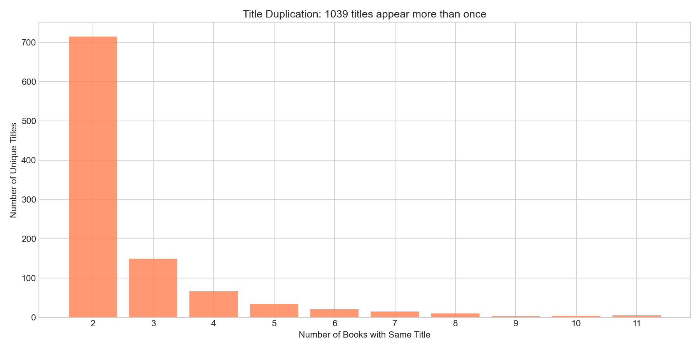

Most duplicated titles are generic terms like "Bulletin" (33 books), "Annual Report" (32 books), and "The Publishers Weekly" (23 books). These represent serial publications or very common titles shared by different books.

### Data Quality Issues

1. **Zero page counts**: 858 books (5.7%) have page_count = 0, which is likely a default/missing value indicator rather than actual data.

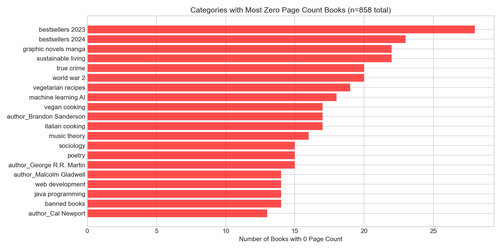

2. **Published date formats**: The `published_date` column contains mixed formats (full dates like "2020-06-22", partial dates like "2011-08", and year-only like "1984"). Year extraction is reliable but full date parsing requires careful handling.

3. **Future publication dates**: Some books have publication years 2025 or 2026, indicating pre-publication listings.

---

## 3. Distribution Analysis

### 3.1 Search Categories

The dataset includes **149 unique search categories**, though the folder name suggests "100 categories." Categories fall into four types:

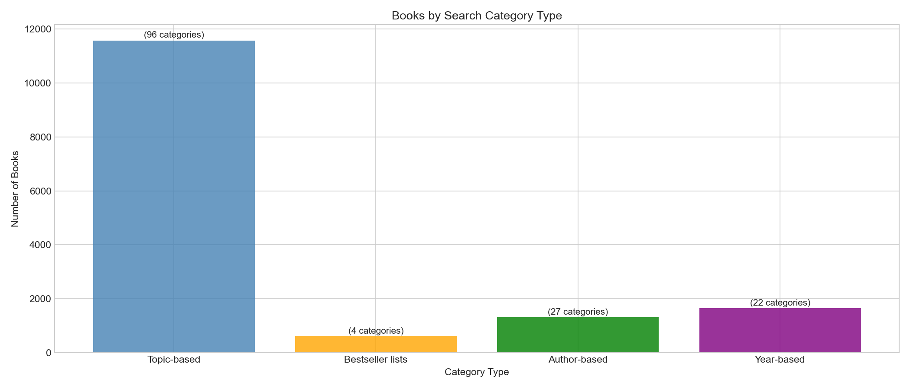

| Category Type | Number of Categories | Number of Books |
|--------------|---------------------|-----------------|
| Topic-based | 96 | 11,577 |
| Author-based | 27 | 1,320 |
| Year-based | 22 | 1,647 |
| Bestseller lists | 4 | 603 |

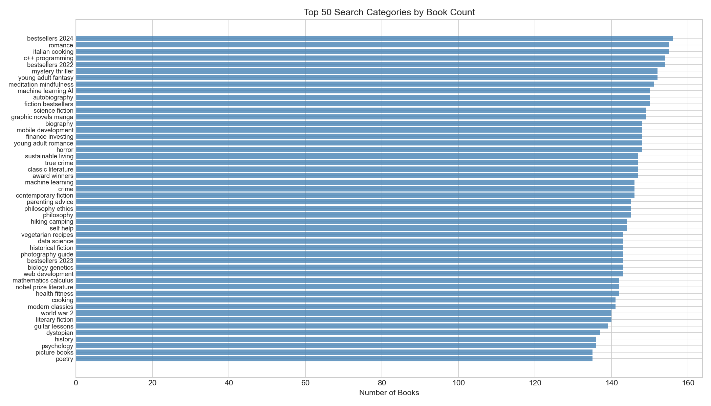

Books per category range from 16 to 156, with a median of 115 books per category. The distribution is relatively uniform, suggesting intentional sampling of ~100-150 books per category.

### 3.2 Page Count Distribution

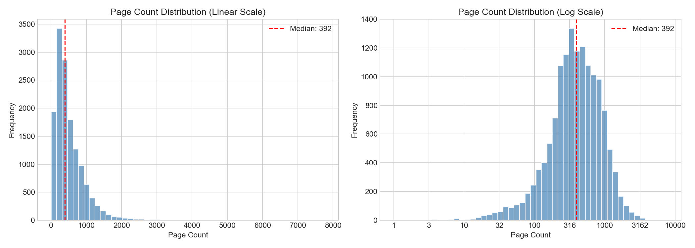

**Statistics (excluding 0 and missing):**
- Mean: 485 pages
- Median: 368 pages
- 25th percentile: 205 pages
- 75th percentile: 658 pages
- Maximum: 7,768 pages

The distribution is heavily right-skewed. The log-transformed histogram reveals an approximately log-normal shape, typical for book lengths. Most books fall between 100-1000 pages.

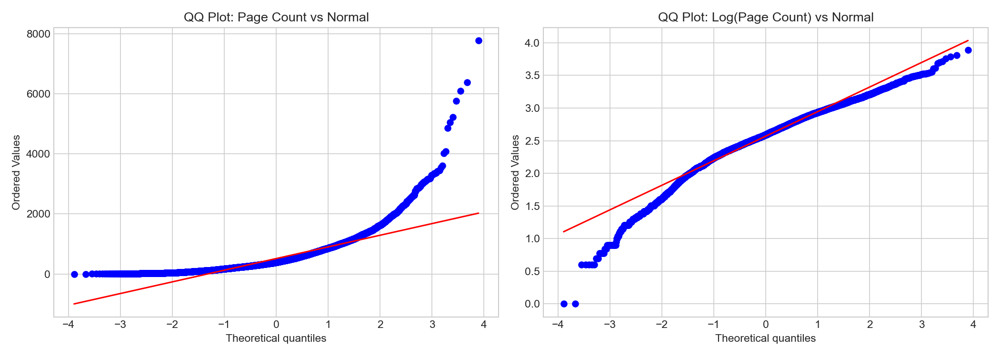

The QQ plot confirms heavy right-tail deviation from normality. Log transformation produces a more symmetric distribution but still shows some deviation at the tails.

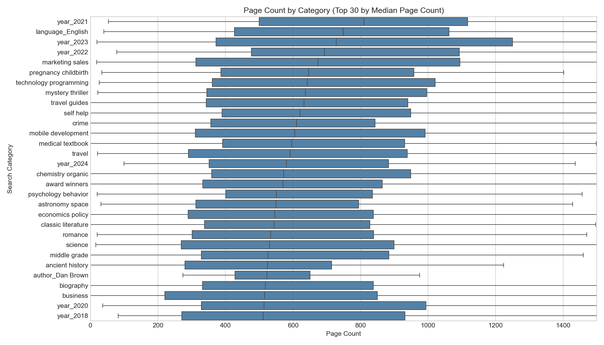

Categories with longest books include encyclopedias, historical compilations, and reference works. Categories with shortest books include children's picture books, poetry, and graphic novels.

### 3.3 List Price Distribution

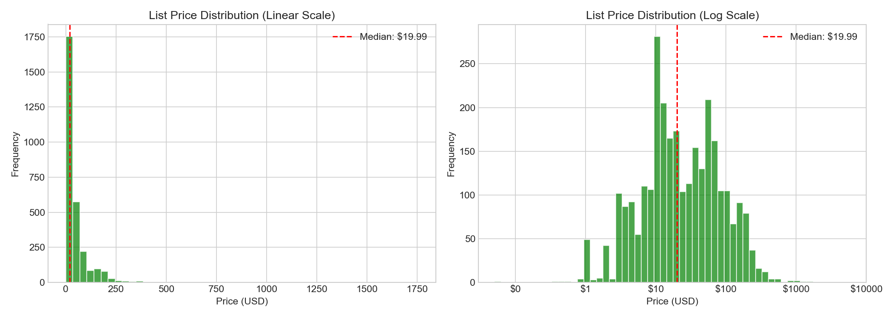

**Statistics (for 2,943 books with prices):**
- Mean: $48.17
- Median: $19.00
- 25th percentile: $9.98
- 75th percentile: $58.00
- Maximum: $1,755.00

The price distribution is extremely right-skewed with a long tail of expensive academic/reference books. Log transformation reveals a bimodal pattern: one cluster around $10-20 (typical retail books) and another around $50-100 (academic/professional books).

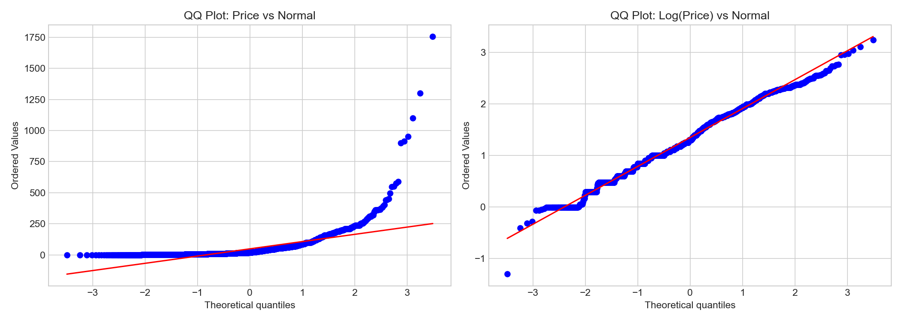

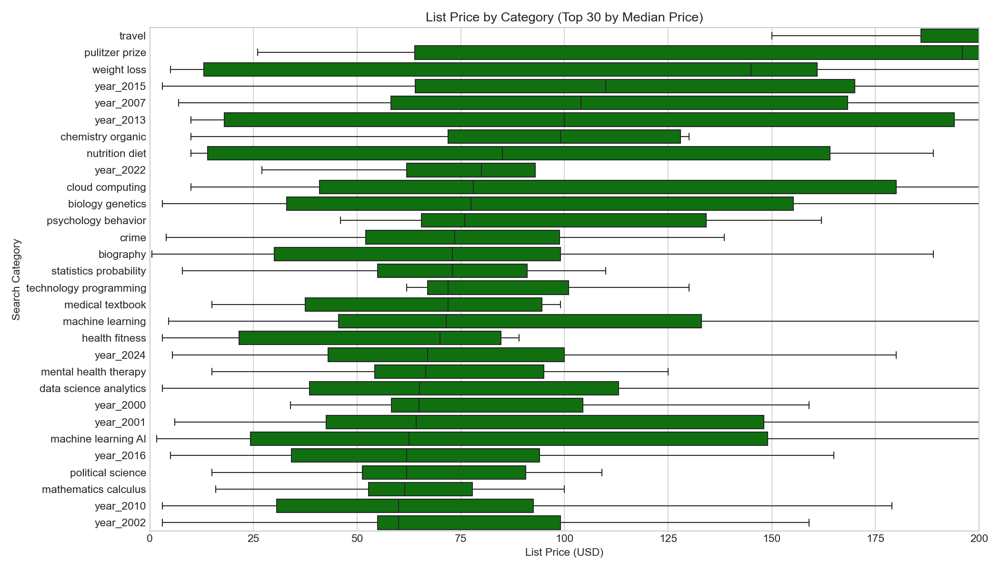

Higher-priced categories include machine learning, medical textbooks, and technology references. Lower-priced categories include romance, fiction bestsellers, and young adult genres.

### 3.4 Publication Year Distribution

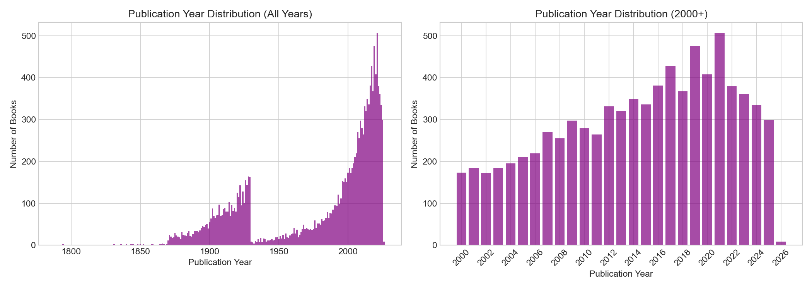

**Statistics:**
- Mean year: 1980
- Median year: 2002
- Range: 1789 to 2026

The distribution shows:
- A concentration of books from 2000-2024 (recent publications)
- A secondary bump around 1920-1930 (possibly classic literature, public domain works)
- Scattered older publications dating back to the late 1700s

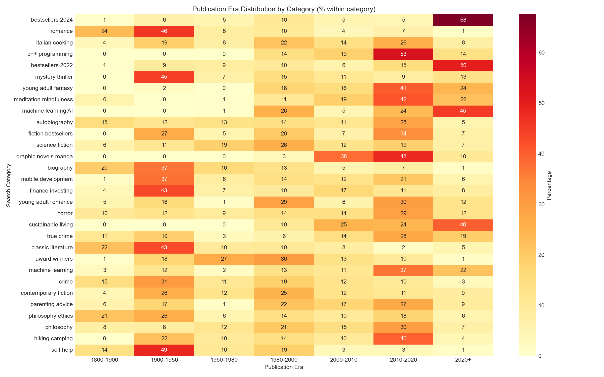

Categories show distinct temporal patterns:
- "c++ programming" and "machine learning AI" concentrate heavily in 2010-2020+
- "classic literature" and "award winners" spread across 1800s-1950s
- "bestsellers 2022/2023/2024" naturally cluster in recent years

### 3.5 Ratings Analysis

**Critical finding**: 94.3% of books have zero ratings, making the rating data extremely sparse.

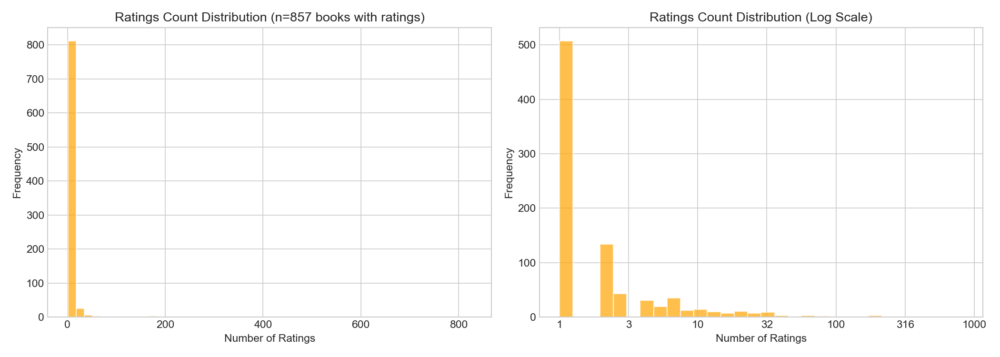

For the 857 books with at least one rating:

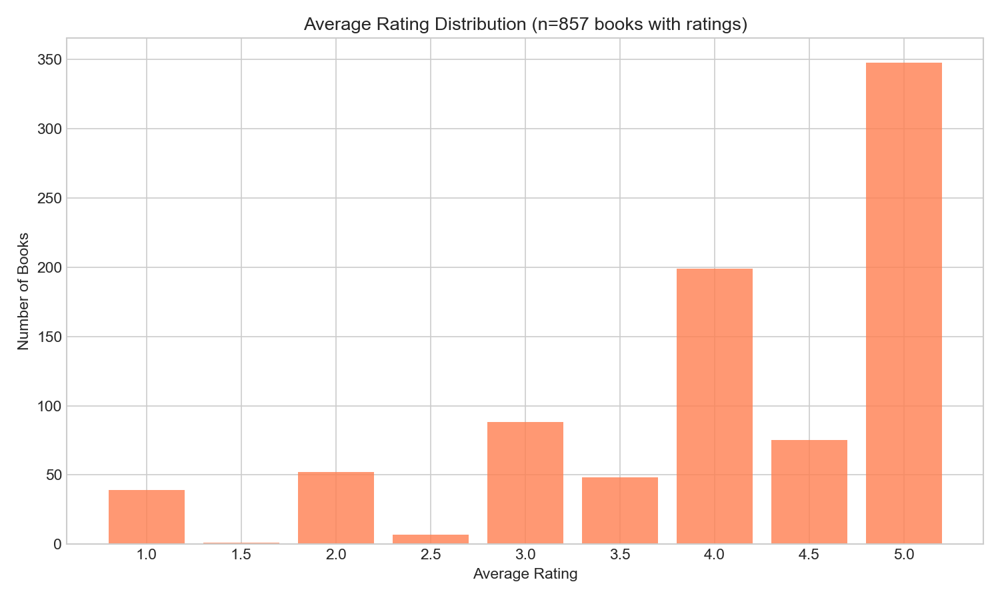

The average rating distribution shows:
- Ratings are discrete (1.0, 1.5, 2.0, ..., 5.0)
- Strong skew toward 5.0 (348 books = 41% of rated books)
- Very few low ratings (1.0: 39 books, 2.0: 52 books)

This pattern suggests J-shaped rating distributions typical of online reviews, where satisfied users rate more often than dissatisfied ones.

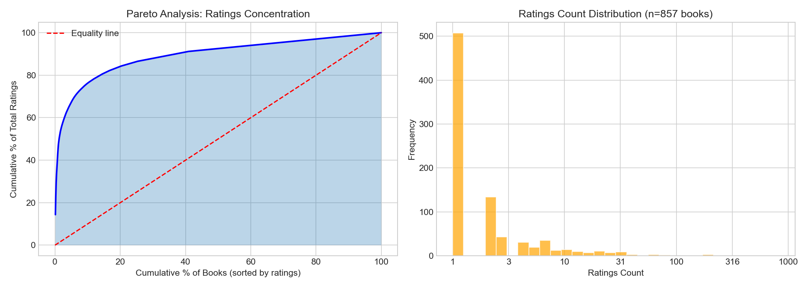

**Ratings concentration is extreme:**
- Top 10% of rated books account for 76.2% of all ratings
- Top 20% of rated books account for 84.1% of all ratings

This Pareto-like pattern indicates a few highly-rated popular books dominate the ratings while most books receive minimal attention.

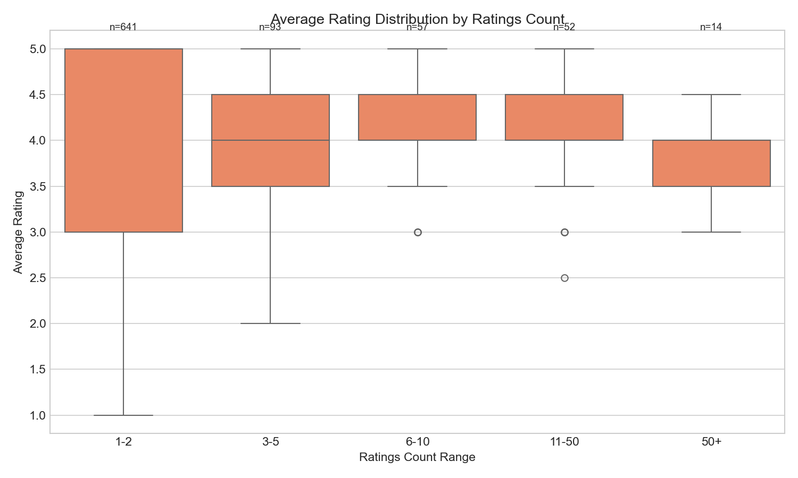

Books with more ratings appear to have slightly more moderate average ratings, though sample sizes are small.

### 3.6 Language Distribution

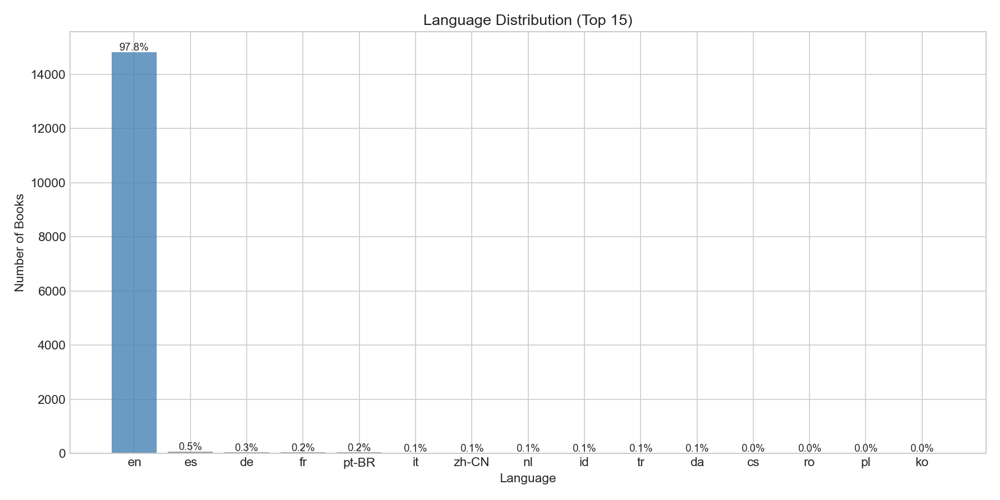

The dataset is overwhelmingly English-dominant:
- English: 14,821 books (97.8%)
- Spanish: 69 books (0.5%)
- German: 42 books (0.3%)
- French: 35 books (0.2%)
- Portuguese (BR): 34 books (0.2%)

37 languages are represented, but non-English books are rare.

### 3.7 Buyable Status

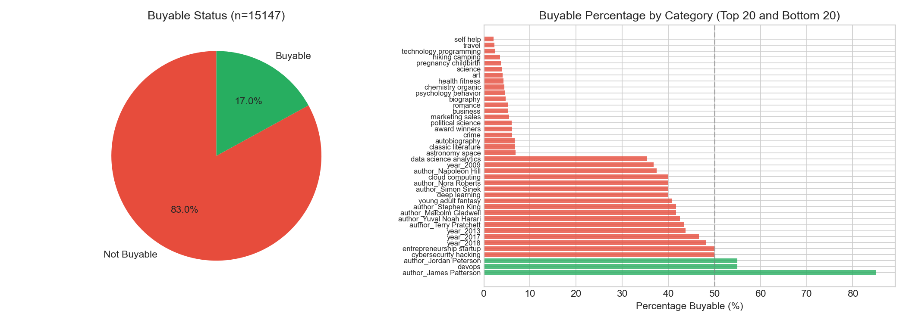

- Buyable: 2,577 books (17.0%)
- Not buyable: 12,570 books (83.0%)

Categories with highest buyable rates include year-based searches (bestsellers 2022-2024) and specific topics. Categories with lowest buyable rates tend to be older/classic literature or reference works.

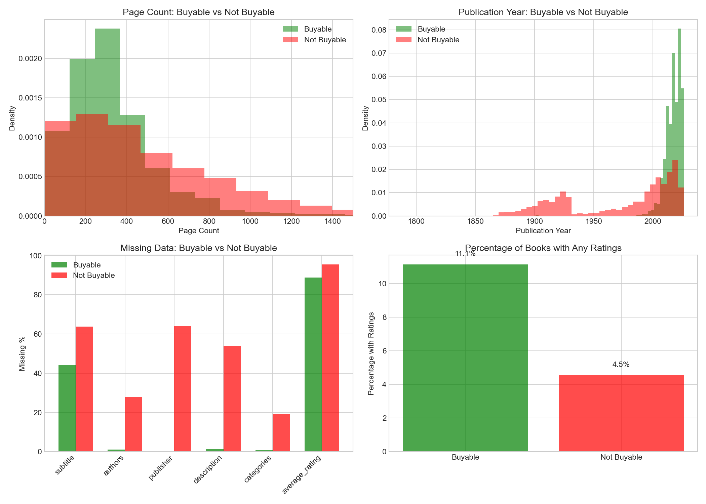

Comparing buyable vs. non-buyable books:
- Buyable books tend to be more recent (concentrated after 2010)
- Non-buyable books have higher missing data rates for metadata fields
- Buyable books are more likely to have ratings (though still rare)

---

## 4. Relationships and Correlations

### 4.1 Page Count vs. Price

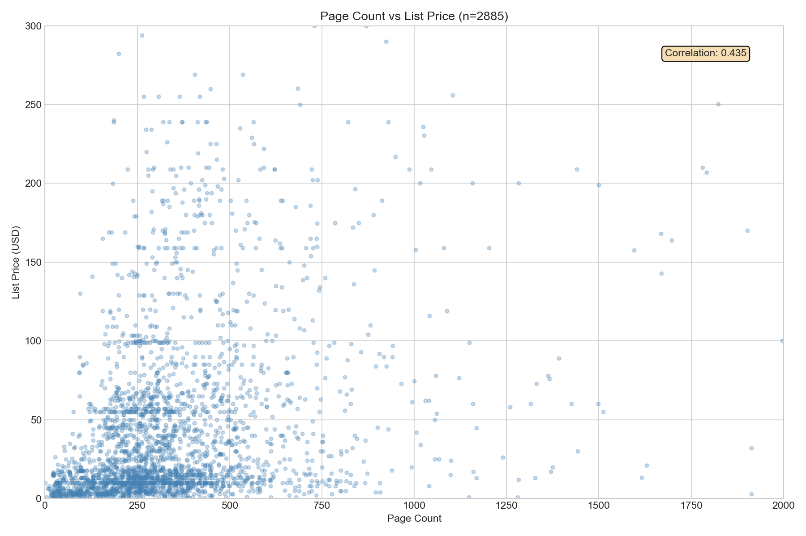

Correlation coefficient: **0.351** (weak positive)

There is a modest positive association between page count and price, as expected. However, the scatter shows substantial variance - many short books are expensive (academic articles, special editions) and many long books are cheap (classic literature compilations).

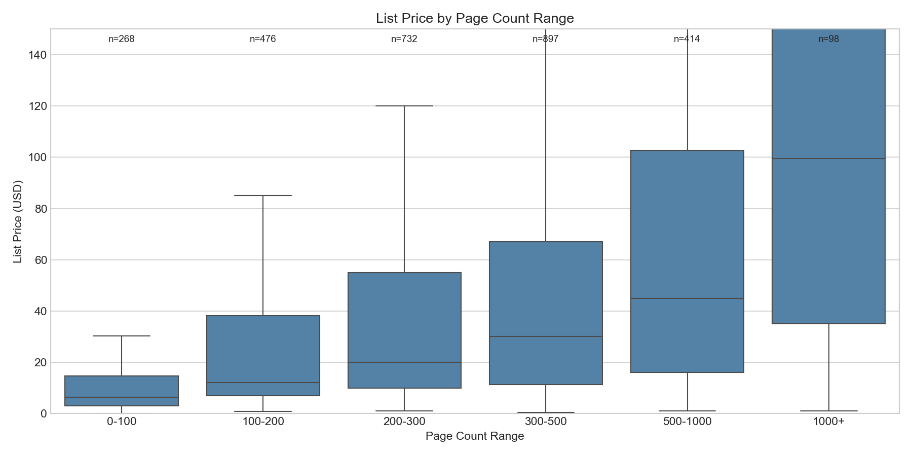

The boxplot reveals that median price increases with page count, but the relationship is not strictly monotonic for all ranges.

### 4.2 Price by Publication Decade

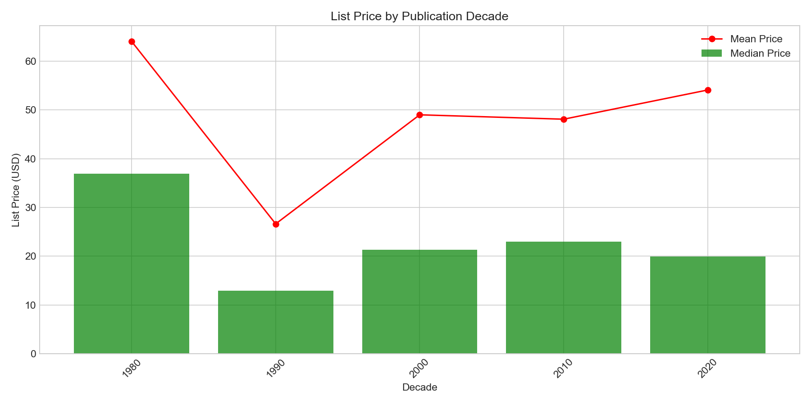

Interesting pattern: older books (pre-2000) with available prices tend to be more expensive on average. This may reflect that only specialized/academic reprints of older works remain in print and available for purchase.

### 4.3 Category Overlap Analysis

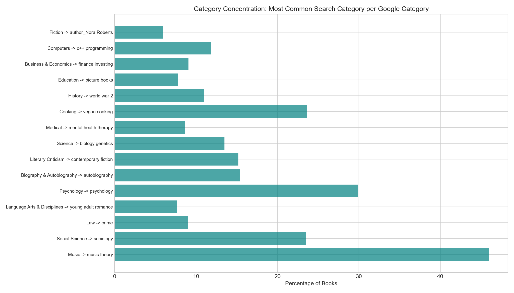

The `search_category` (user's search term) often differs from Google's assigned `categories`:
- "Music" category in Google maps well to "music theory" search (46%)
- "Psychology" maps well to "psychology" search (30%)
- "Fiction" is dispersed across many search categories (only 6% to top match)

This indicates Google's category system is coarser-grained than the search terms used to build this dataset.

---

## 5. Text Analysis

### 5.1 Title Length

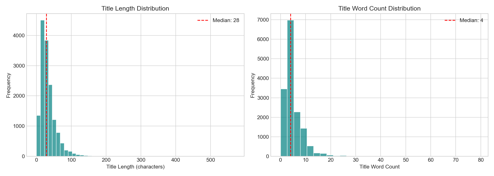

- Median title length: 30 characters
- Median word count: 5 words
- Right-skewed with some very long titles (encyclopedia entries, legal documents)

### 5.2 Description Length

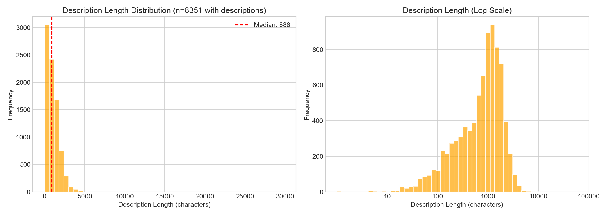

For books with descriptions (55% of dataset):
- Highly variable lengths (10 to 10,000+ characters)
- Log-transformed distribution is approximately normal

### 5.3 Word Cloud

Most frequent title words: "American", "History", "Book", "Guide", "New", "Journal", "Report", "Education", "Science", "Library"

These reflect the dataset's emphasis on non-fiction, reference, and academic works.

### 5.4 Publisher Analysis

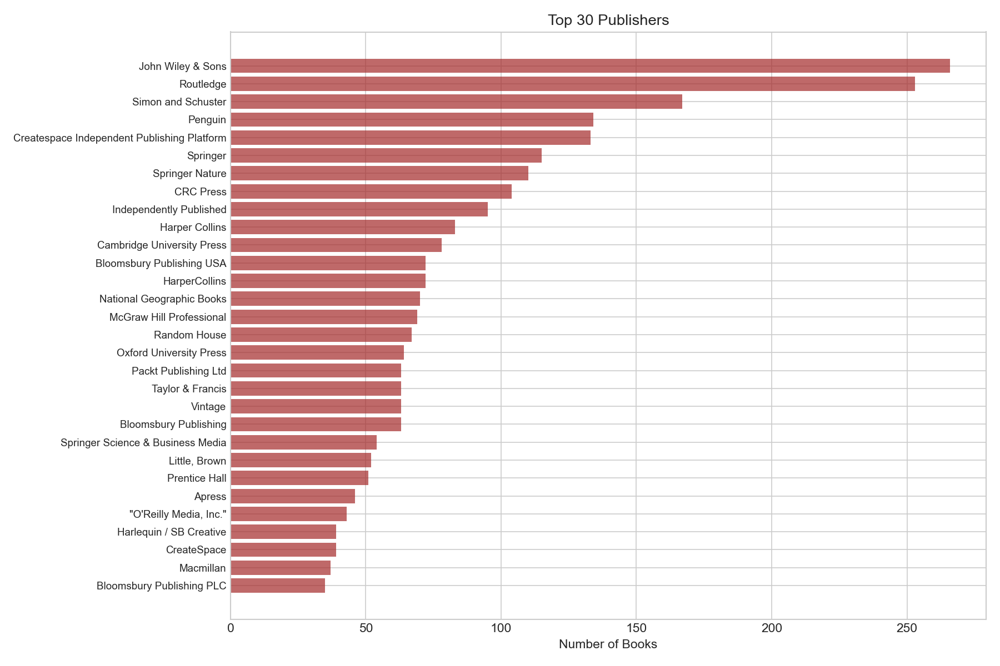

Top publishers include academic presses (Cambridge, Oxford), government agencies (U.S. Government Printing Office), and major commercial publishers (Random House, HarperCollins).

### 5.5 Author Analysis

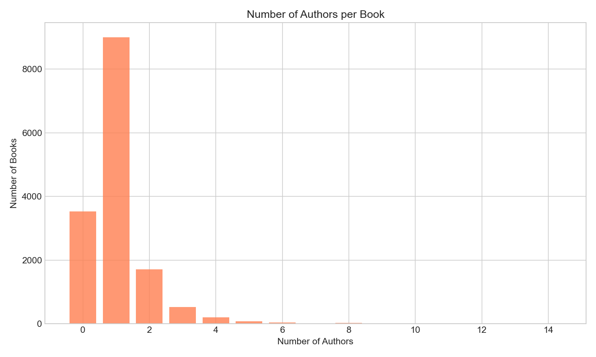

Most books have 1-2 authors listed. Multi-author works (3+) are less common but not rare, especially in academic fields.

---

## 6. Extreme Values and Notable Records

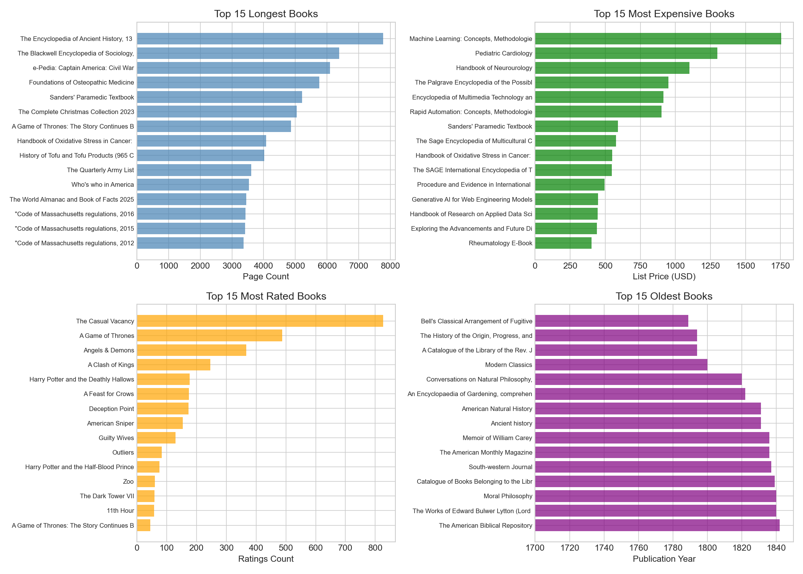

### Longest Books
1. "The Encyclopedia of Ancient History, 13 Volume Set" - 7,768 pages
2. "The Blackwell Encyclopedia of Sociology, 11 Volume Set" - 6,384 pages
3. "e-Pedia: Captain America: Civil War" - 6,089 pages

### Most Expensive Books
1. "Machine Learning: Concepts, Methodologies, Tools and Applications" - $1,755.00
2. "Pediatric Cardiology" - $1,299.99
3. "Handbook of Neurourology" - $1,099.99

### Most Rated Books
1. "The Casual Vacancy" - 826 ratings
2. "A Game of Thrones" - 472 ratings
3. "Angels & Demons" - 340 ratings

### Oldest Books
Books dating back to 1789 include historical documents and academic reprints of classical works.

---

## 7. Key Findings Summary

### Clear Findings

1. **Sparse ratings data**: 94% of books have zero ratings, limiting the usefulness of rating-based analysis. Among rated books, ratings are extremely concentrated (top 10% have 76% of all ratings).

2. **Strong recency bias**: The dataset is dominated by books published after 2000, with a secondary cluster of classic/public domain works from the early 20th century.

3. **English dominance**: 97.8% of books are in English, limiting cross-linguistic analysis.

4. **Log-normal distributions**: Both page count and price follow approximately log-normal distributions, suggesting multiplicative rather than additive processes govern these quantities.

5. **Category structure**: The 149 search categories include topic searches (~96), author-specific searches (~27), year/bestseller searches (~26). Each category contains roughly 100-150 books.

6. **Missing metadata**: Many fields have substantial missing data (price: 81%, description: 45%, publisher: 53%), which should be accounted for in downstream analysis.

### Observations Warranting Further Investigation

1. **Zero page counts** (5.7% of data): These likely represent missing values coded as 0 rather than actual zero-page books. Consider filtering or imputing.

2. **Price bimodality**: The log-price distribution suggests two distinct book populations (mass-market vs. academic/professional). Segmenting analysis by this dimension may yield insights.

3. **Category overlap**: Google's assigned categories differ substantially from search categories. Understanding this mapping could improve categorization tasks.

4. **Temporal patterns by category**: Different categories have very different publication year distributions. This reflects the nature of the topics (tech books are recent, classics are old).

---

## 8. Recommendations for Further Analysis

1. **Handle zero page counts**: Either filter books with page_count=0 or treat them as missing.

2. **Use log transforms**: For page_count and list_price, log transformation produces more symmetric distributions suitable for standard statistical methods.

3. **Be cautious with ratings**: Given 94% sparsity, avoid drawing conclusions about rating patterns. Focus on the 857 books with ratings only if analyzing user feedback.

4. **Consider category-specific analysis**: Given the diverse category types (topic vs. author vs. year), segment analysis by category type for more meaningful comparisons.

5. **Address missing data**: For modeling tasks, consider imputation strategies for description, publisher, and price based on category and other available features.

---

## Figures Index

| Figure | Description |
|--------|-------------|
| 01 | Top 50 Search Categories Distribution |
| 02 | Page Count Distribution (Linear and Log) |
| 03 | List Price Distribution (Linear and Log) |
| 04 | Publication Year Distribution |
| 05 | Ratings Count Distribution |
| 06 | Average Rating Distribution |
| 07 | Language Distribution |
| 08 | Missing Data by Column |
| 09 | Buyable Status Analysis |
| 10 | Page Count by Category |
| 11 | Google Categories Distribution |
| 12 | Price by Category |
| 13 | Zero Page Count by Category |
| 14 | Page Count Patterns (Last Digit) |
| 15 | Publication Era by Category Heatmap |
| 16 | Title Length Distribution |
| 17 | Description Length Distribution |
| 18 | Top Publishers |
| 19 | Title Word Cloud |
| 20 | Page Count vs Price Scatter |
| 21 | Price by Page Count Bins |
| 22 | Price by Publication Decade |
| 23 | Author Count Distribution |
| 24 | Buyable vs Non-Buyable Comparison |
| 25 | Category Mismatch Analysis |
| 26 | Ratings Concentration (Pareto) |
| 27 | Rating vs Count Scatter |
| 28 | Rating by Count Bin |
| 29 | Extreme Values |
| 30 | Duplicate Titles |
| 31 | Page Count QQ Plot |
| 32 | Price QQ Plot |
| 33 | Rating by Category |
| 34 | Category Types Distribution |
| 35 | Books per Category Distribution |

---

*Report generated by: Claude Opus 4.5 (claude-opus-4-5-20251101)*

*Date: 2024-12-31*
