# Los Angeles Crime Data: Exploratory Data Analysis Report

## 1. Dataset Overview

### Subject Matter
This dataset contains crime incident records from the City of Los Angeles, spanning from **January 1, 2020 to May 29, 2025**. The data appears to be sourced from the LA Police Department (LAPD) and includes detailed information about each reported crime incident.

### Data Structure
- **File**: `Crime_Data_from_2020_to_Present.parquet`
- **Total Records**: 1,004,991
- **Columns**: 28

### Key Variables

| Variable | Description | Type |
|----------|-------------|------|
| DR_NO | Division of Records Number (unique identifier) | Integer |
| Date Rptd | Date crime was reported | Datetime |
| DATE OCC | Date crime occurred | Datetime |
| TIME OCC | Time crime occurred | Time |
| AREA / AREA NAME | Geographic area (21 LAPD divisions) | Integer / String |
| Crm Cd / Crm Cd Desc | Crime code and description | Integer / String |
| Vict Age / Vict Sex / Vict Descent | Victim demographics | Integer / String |
| Premis Cd / Premis Desc | Premise type where crime occurred | Float / String |
| Weapon Used Cd / Weapon Desc | Weapon information | Float / String |
| Status / Status Desc | Case status | String |
| LAT / LON | Geographic coordinates | Float |
| Part 1-2 | Crime severity classification | Integer |

---

## 2. Data Quality Assessment

### Missing Values
The dataset has **no missing values** in any column (all 28 columns have 0 null values). However, "unknown" or placeholder values are encoded differently:

### Placeholder/Default Values Detected

**Victim Age Issues**:
- **269,222 records (26.8%)** have `Vict Age = 0`, which appears to represent unknown age
- An additional 137 records have negative ages (-4 to -1), which are invalid
- Only **73.2%** of records have valid ages (> 0)

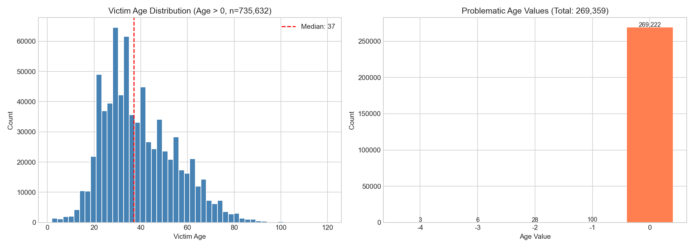

**Victim Sex Unknown**:
- **242,418 records (24.1%)** have `Vict Sex = Unknown`
- Among known values: Male 40.2%, Female 35.7%

**Time Recording Anomalies** (Major Finding):
- **39.1%** of all crimes have `minute = 0` (round hour times)
- **35,200 crimes (3.5%)** are recorded at exactly **12:00**
- This strongly suggests that when exact crime time is unknown, it is often recorded as noon or the nearest hour

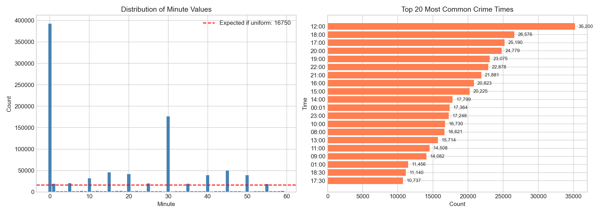

**Geographic Data**:
- Only **2,240 records (0.22%)** have zero coordinates - excellent geographic coverage

### Duplicate Records
- **No duplicate rows** found
- **No duplicate DR_NO values** - each record has a unique identifier

---

## 3. Crime Distribution Analysis

### By Geographic Area
The Central area has the highest crime count (69,670), followed by 77th Street (61,758) and Pacific (59,514). The distribution across 21 areas is relatively even, with most areas having 40,000-60,000 crimes.

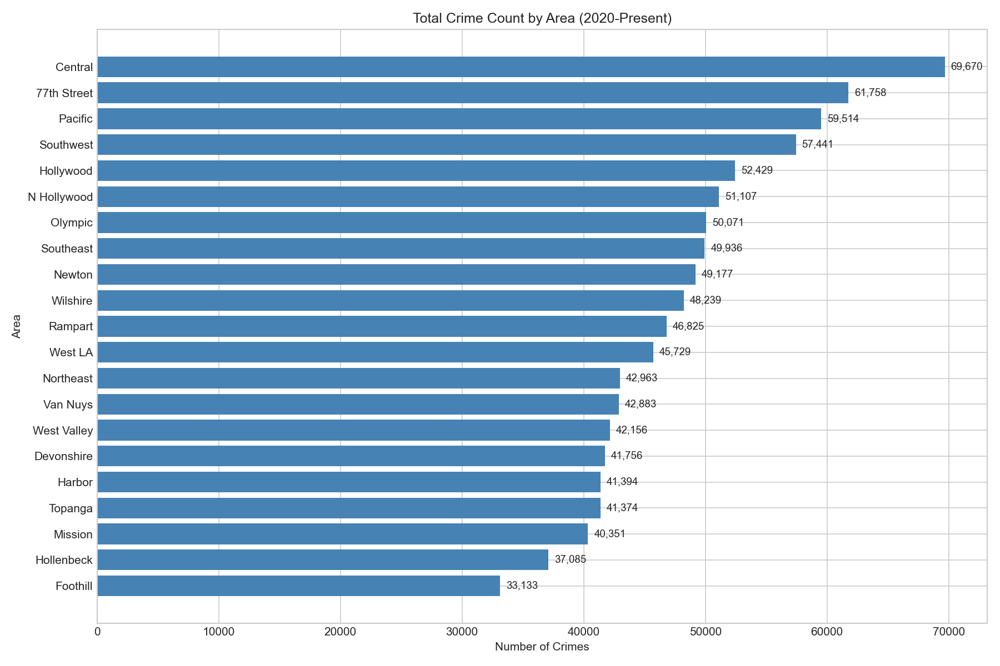

### By Crime Type
The top 5 crime types account for **37.5%** of all incidents:
1. **Vehicle Stolen**: 115,190 (11.5%)
2. **Battery - Simple Assault**: 74,839 (7.4%)
3. **Burglary from Vehicle**: 63,517 (6.3%)
4. **Theft of Identity**: 62,537 (6.2%)
5. **Vandalism (Felony)**: 61,092 (6.1%)

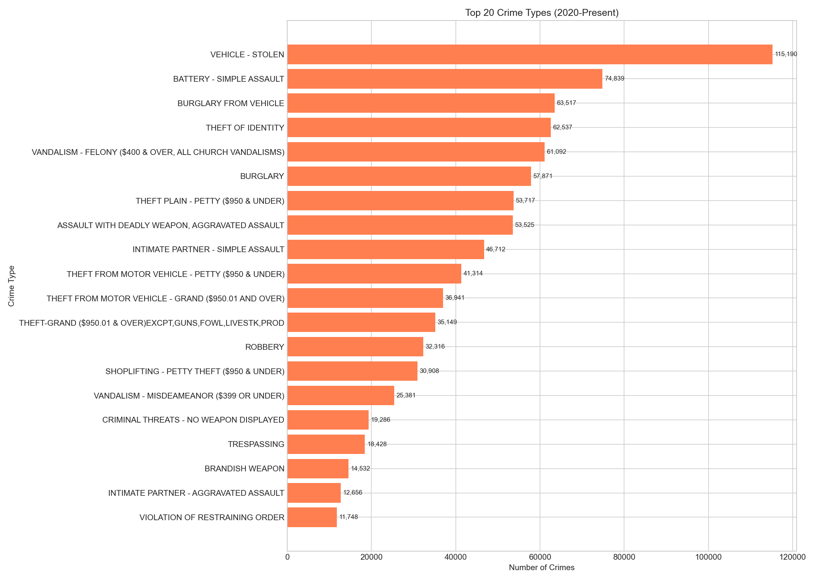

### Crime Severity (Part 1 vs Part 2)
- **Part 1 (Serious Crimes)**: 602,645 (60.0%)
- **Part 2 (Other Crimes)**: 402,346 (40.0%)

---

## 4. Temporal Patterns

### Daily Crime Trends Over Time
The daily crime count shows interesting patterns:
- Crime rates increased from early 2020 through mid-2022
- A notable peak occurred around late 2022 / early 2023
- **Important**: Data after mid-2024 shows significantly fewer records, suggesting incomplete data collection for recent months

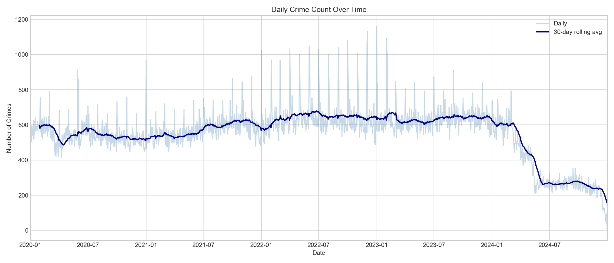

### Cumulative Trend
The cumulative crime count shows a relatively steady accumulation rate until mid-2024.

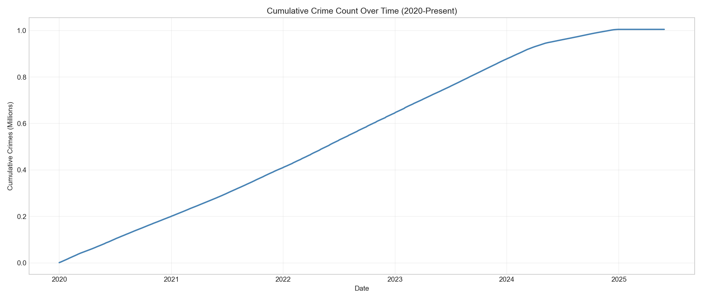

### Hourly Distribution
Crime occurrence varies significantly by hour:
- **Peak hours**: 12:00 (noon) - heavily inflated due to unknown times being recorded as noon
- **True peaks** (excluding noon artifact): Late afternoon/evening (17:00-20:00)
- **Lowest**: Early morning hours (3:00-6:00)

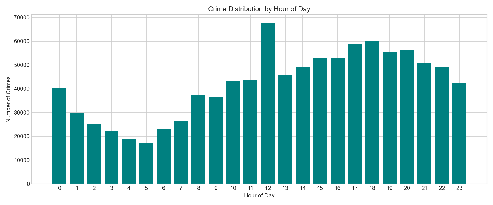

### Day of Week
- **Highest**: Friday (153,676 crimes)
- **Lowest**: Tuesday (138,141 crimes)
- Weekend days (Friday-Saturday) show slightly higher crime rates

### Monthly Distribution
- **Highest**: January (92,701)
- **Lowest**: December (78,226)
- The higher January count may reflect reporting patterns rather than actual crime rates

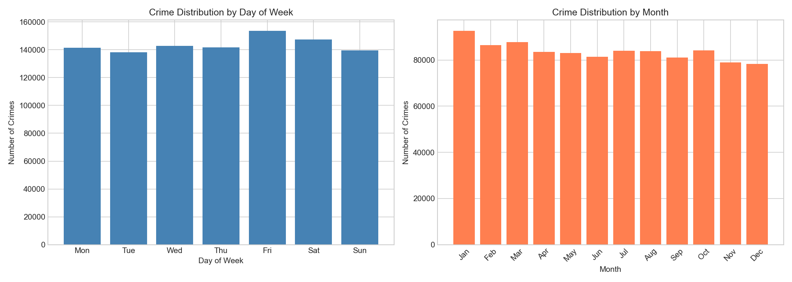

### Hour-Day Heatmap
The heatmap reveals that the 12:00 spike is consistent across all days of the week, confirming it as a data recording artifact rather than a true crime pattern.

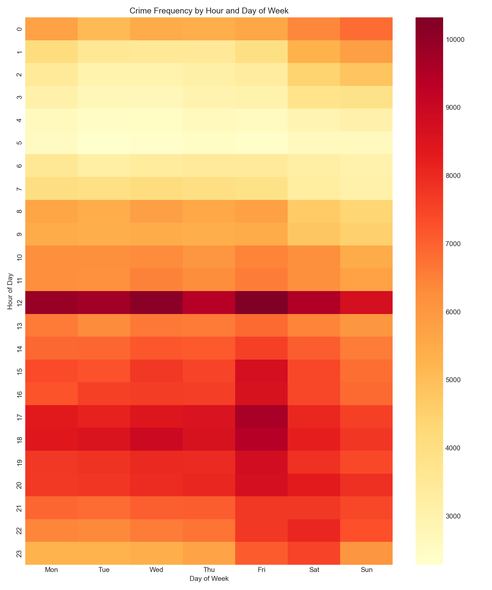

### Crime Type Trends Over Time
Vehicle theft shows the most dramatic trends, peaking in 2022 and declining since. Identity theft shows a generally increasing trend.

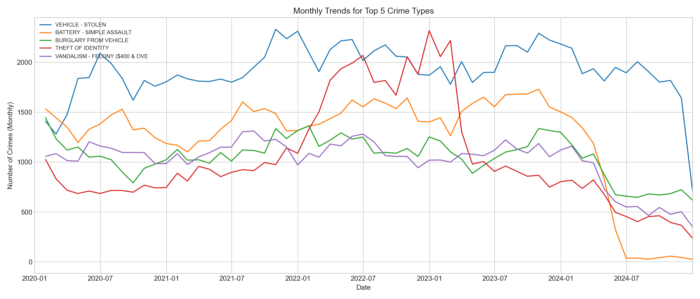

---

## 5. Victim Demographics

### Age Distribution
Among records with valid age (n=735,632):
- **Median age**: 37 years
- **Mean age**: 39.5 years
- Distribution is roughly symmetric with a slight right skew
- Most victims are between 20-50 years old

### Age by Crime Type
Different crime types affect different age groups:
- **Identity theft**: Higher median victim age (~40s)
- **Assault/violent crimes**: Younger median age (~30s)

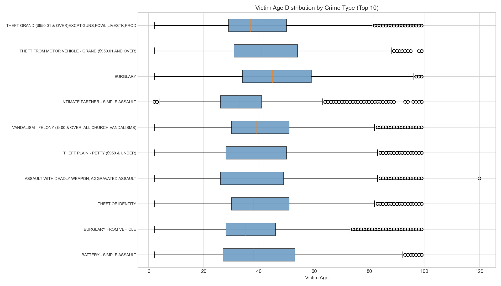

### Unknown Age by Crime Type
The rate of unknown victim age varies dramatically by crime type:
- **Vehicle-related crimes** (stolen vehicles, burglary from vehicle): 70-80% unknown age
- **Assault crimes**: Only 3-5% unknown age

This makes sense: property crimes often have no direct victim contact, while assault victims are directly interviewed.

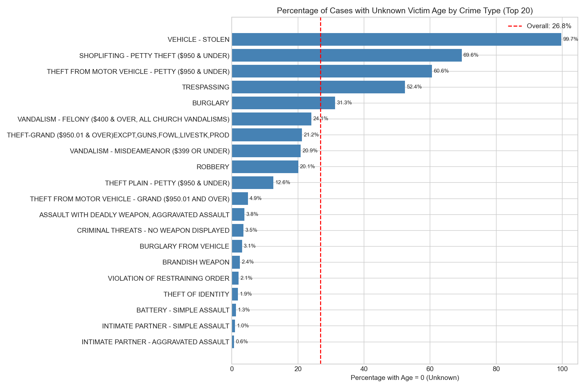

### Sex Distribution by Crime Type
Strong patterns emerge in victim sex by crime type:
- **Intimate partner assault**: 76% female victims
- **Identity theft**: 58% female victims
- **Aggravated assault / Robbery**: 72-73% male victims
- **Brandish weapon**: 67% male victims

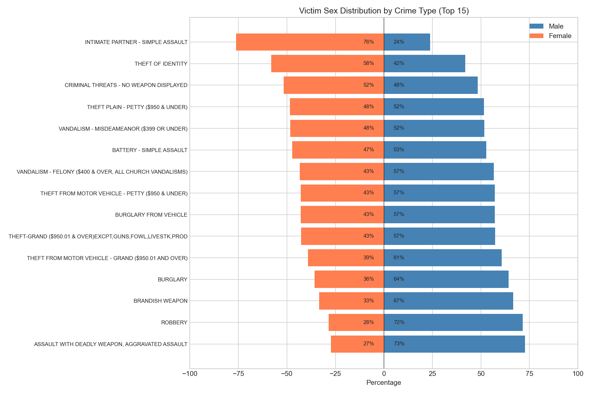

### Descent Distribution
Top victim descent categories:
1. Hispanic/Latin/Mexican: 296,404 (29.5%)
2. Unknown: 251,341 (25.0%)
3. White: 201,442 (20.0%)
4. Black: 135,816 (13.5%)
5. Other: 78,005 (7.8%)

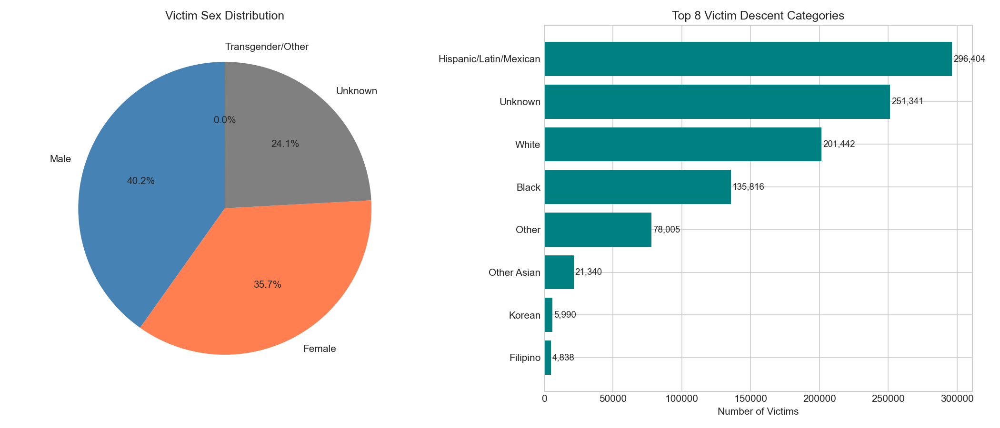

---

## 6. Case Resolution

### Overall Status
- **Investigation Continuing (IC)**: 802,862 (79.9%)
- **Adult Other (AO)**: 109,802 (10.9%)
- **Adult Arrest (AA)**: 87,155 (8.7%)
- **Juvenile Arrest/Other**: 5,165 (0.5%)

**Overall arrest rate**: Only **9.0%** of reported crimes result in an arrest.

### Arrest Rates by Crime Type
Arrest rates vary dramatically by crime type (Part 1 serious crimes only):
- **Intimate Partner Assault**: Highest arrest rate (~25-30%)
- **Property crimes** (burglary, theft from vehicle): Very low arrest rates (<5%)
- **Vehicle theft**: Extremely low arrest rate (~1-2%)

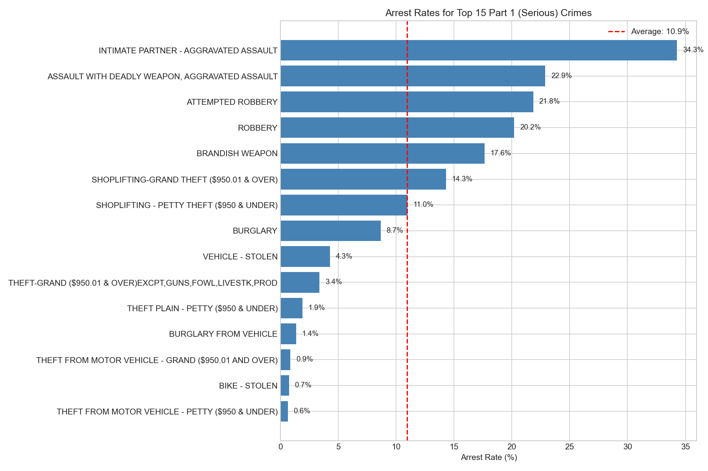

---

## 7. Reporting Delay Analysis

### Distribution
- **Same day**: 482,066 (48.0%)
- **Within 7 days**: 872,852 (86.9%)
- **Over 1 year**: 7,523 (0.7%)
- **Maximum delay**: 1,862 days (~5.1 years)

### Delay by Crime Type
Identity theft has by far the longest median reporting delay, which makes sense as victims often don't discover the theft immediately. In contrast, violent crimes (assault, robbery) are typically reported the same day.

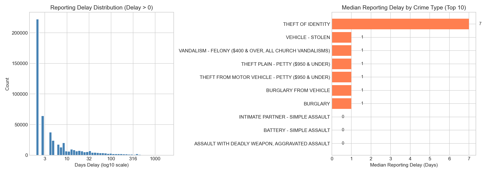

---

## 8. Weapon Analysis

### Overview
- **67.4%** of crimes have "Unknown" weapon (no weapon used or not recorded)
- Among known weapons, the most common is **Strong-arm** (hands/fists): 174,761

### Weapons in Violent Crimes
For violent crimes (assault, robbery, domestic violence):
- Strong-arm (hands/fists) is most common
- Handguns are the most common firearm
- Knives are the most common bladed weapon

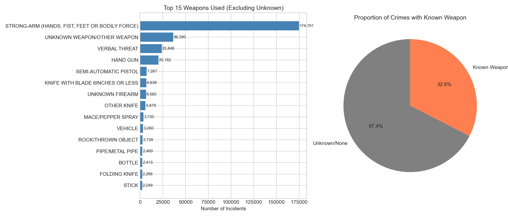

### Violent Crime Timing
Violent crimes occur more frequently in evening/night hours compared to overall crime patterns.

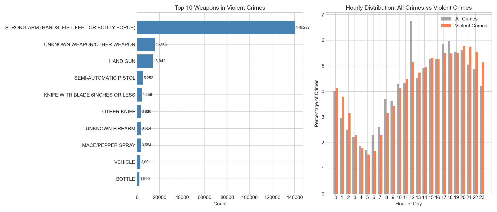

---

## 9. Geographic Analysis

### Location Distribution
The scatter plot of crime locations clearly shows the LA city boundaries and reveals clustering patterns in certain neighborhoods.

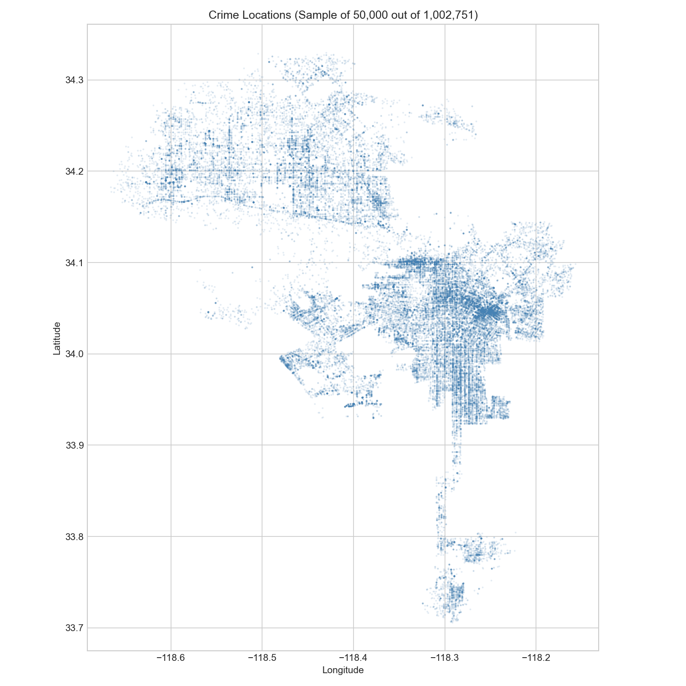

### Vehicle Theft Hotspots
Vehicle theft shows specific geographic patterns, with high concentrations in certain areas.

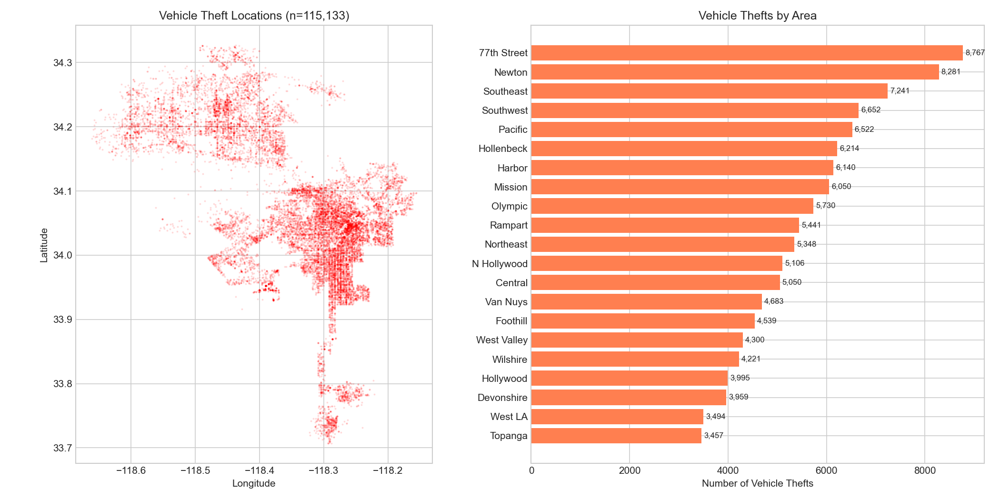

### Crime Type by Area
The heatmap shows that crime type distribution varies by area:
- **Central**: Higher proportion of vehicle theft
- **77th Street**: Higher proportion of simple assault
- **West LA**: Higher proportion of burglary from vehicle

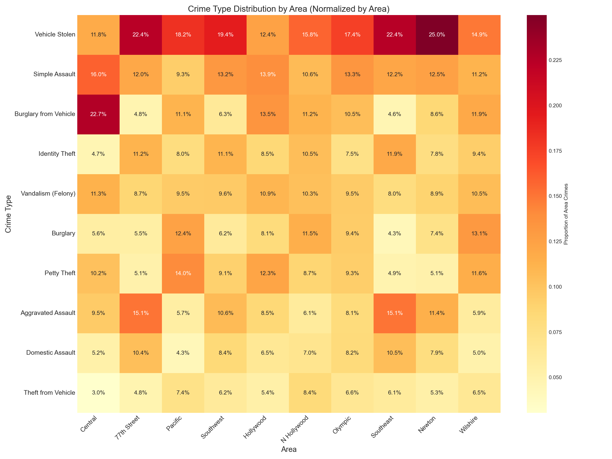

### Premises Analysis
Most crimes occur on streets (26%), followed by single family dwellings (16%) and multi-unit dwellings (12%).

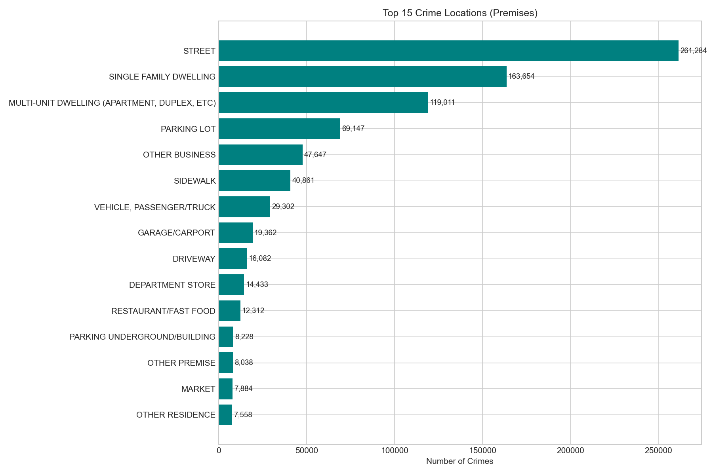

---

## 10. Year-over-Year Trends

### Annual Crime Counts
- **2020**: 199,847 (partial year affected by COVID)
- **2021**: 209,876
- **2022**: 235,259 (peak)
- **2023**: 232,345
- **2024**: 127,567 (incomplete data)
- **2025**: 97 (early year only)

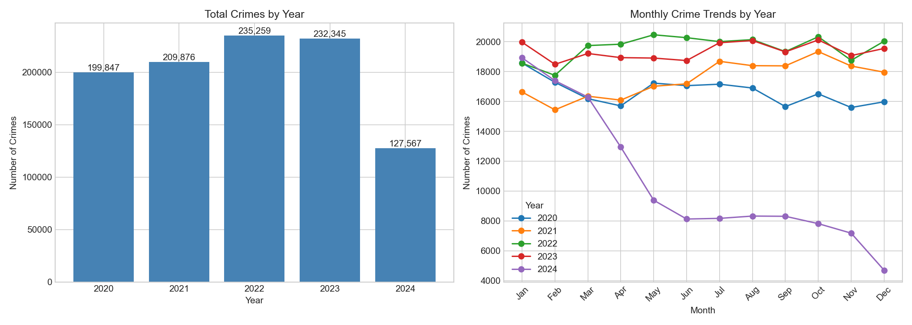

---

## 11. Key Findings Summary

### Clear Patterns

1. **Vehicle theft is the #1 crime type** in LA, accounting for 11.5% of all incidents

2. **Low arrest rate**: Only 9% of reported crimes result in an arrest, with property crimes having particularly low clearance rates

3. **Temporal patterns**: Crime peaks in late afternoon/evening hours and on Fridays

4. **Victim demographics vary by crime type**: Intimate partner violence predominantly affects women (76%), while aggravated assault and robbery predominantly affect men (72-73%)

5. **Geographic concentration**: Central LA has the highest crime count, but crime is fairly distributed across the 21 LAPD divisions

### Data Quality Issues

1. **Time recording artifact**: 39.1% of crimes have round hour times (minute = 0), and 3.5% are recorded at exactly 12:00 noon, suggesting unknown times are often recorded as defaults

2. **Unknown victim information**: 26.8% of records have unknown age (recorded as 0), and 24.1% have unknown sex. This is expected for property crimes without direct victim contact

3. **Incomplete recent data**: Records from mid-2024 onward appear incomplete - exercise caution when analyzing recent trends

### Recommendations for Analysis

1. **Filter by valid age** (> 0) when analyzing victim age patterns

2. **Be cautious with hourly analysis** - the noon spike is an artifact. Consider filtering out round hour times for genuine temporal analysis

3. **Account for incomplete 2024/2025 data** when making year-over-year comparisons

4. **Unknown victim demographics are not random** - they correlate strongly with crime type (property vs. violent crimes)

---

## 12. Files Generated

### Figures (in `figures/` directory)
- 01_crimes_by_area.png
- 02_top_crime_types.png
- 03_crimes_over_time.png
- 04_crimes_by_hour.png
- 05_victim_age_distribution.png
- 06_victim_demographics.png
- 07_day_month_distribution.png
- 08_case_status.png
- 09_reporting_delay.png
- 10_geographic_distribution.png
- 11_weapon_analysis.png
- 12_premises_analysis.png
- 13_yearly_trends.png
- 14_crime_area_heatmap.png
- 15_arrest_rates.png
- 16_hour_day_heatmap.png
- 17_age_by_crime.png
- 18_crime_type_trends.png
- 19_time_anomalies.png
- 20_age_zero_by_crime.png
- 21_vehicle_theft_analysis.png
- 22_violent_crimes_analysis.png
- 23_victim_sex_by_crime.png
- 24_cumulative_crimes.png

### Scripts (in `scripts/` directory)
- eda_analysis.py - Main analysis script

---

*Report generated by EDA Agent (Claude Opus 4.5, model ID: claude-opus-4-5-20251101)*
*Date: December 31, 2024*
