# Exploratory Data Analysis: GHCN Daily Climate Data (1901)

## 1. Dataset Overview

### Subject Matter
This dataset contains daily climate observations from the **Global Historical Climatology Network (GHCN)** for the year 1901. GHCN is a comprehensive database of weather station records maintained by NOAA, containing measurements from thousands of stations worldwide.

### File Structure
- **Single file**: `ghcn_daily_1901_kaggle.csv` (256 MB)
- **Format**: Long format (one observation per row)
- **Total observations**: 5,956,346 rows
- **Columns**: 9

### Data Schema
| Column | Type | Description |
|--------|------|-------------|
| station_id | string | Unique station identifier (country code + station number) |
| date | date | Observation date (1901-01-01 to 1901-12-31) |
| element | string | Measurement type (TMAX, TMIN, PRCP, etc.) |
| value | integer | Measurement value (units vary by element) |
| mflag | string | Measurement flag |
| qflag | string | Quality flag |
| sflag | string | Source flag |
| obstime | float | Observation time (mostly missing) |
| unit | string | Unit description |

### Key Statistics
- **Unique weather stations**: 8,749
- **Countries represented**: 52 (identified by 2-letter prefix in station_id)
- **Measurement types**: 30 different elements
- **Date coverage**: Full year 1901 (365 days)

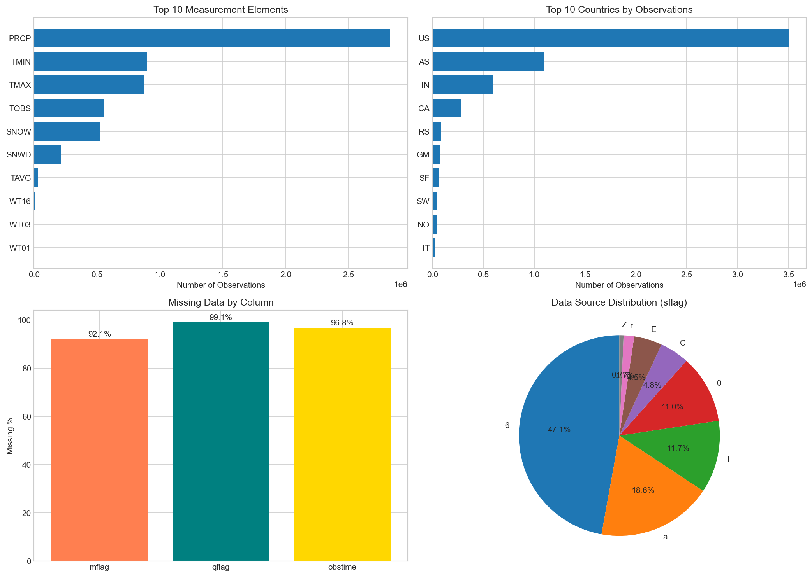

---

## 2. Distribution Analysis

### 2.1 Geographic Distribution

The dataset is dominated by observations from a few countries:

| Country Code | Observations | Percentage |
|--------------|--------------|------------|
| US | 3,500,557 | 58.8% |
| AS (Australia) | 1,099,711 | 18.5% |
| IN (India) | 598,378 | 10.0% |
| CA (Canada) | 281,802 | 4.7% |
| RS (Russia) | 82,613 | 1.4% |

The US dominates with nearly 59% of all observations, followed by Australia and India. This reflects the historical development of weather observation networks - the US had an established network by 1901, while many other regions had limited coverage.

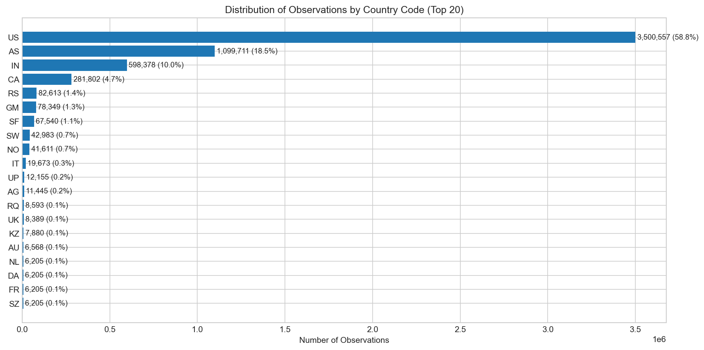

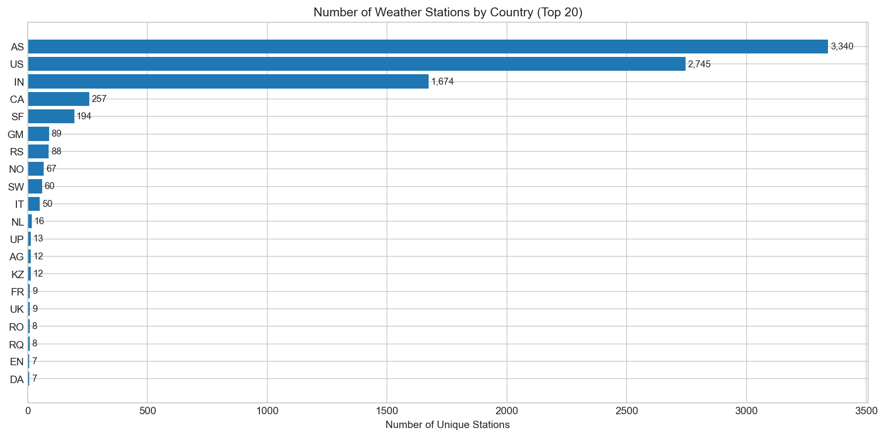

### 2.2 Measurement Element Distribution

The most common measurement types are:

| Element | Count | Percentage | Description |
|---------|-------|------------|-------------|
| PRCP | 2,827,990 | 47.5% | Precipitation |
| TMIN | 899,576 | 15.1% | Minimum temperature |
| TMAX | 870,665 | 14.6% | Maximum temperature |
| TOBS | 556,467 | 9.3% | Temperature at observation time |
| SNOW | 527,030 | 8.8% | Snowfall |
| SNWD | 216,592 | 3.6% | Snow depth |

Precipitation measurements account for nearly half of all observations. Weather type indicators (WT01-WT18) are rare, with WT16 (rain) being most common at only 6,610 records.

### 2.3 Element Coverage by Country

Different countries have different measurement profiles:

- **US**: Full suite of measurements (TMAX, TMIN, PRCP, SNOW, SNWD)
- **India**: Almost exclusively precipitation data (PRCP only)
- **Australia**: Primarily precipitation with limited temperature
- **Germany (GM)**: Temperature and snow depth, less precipitation

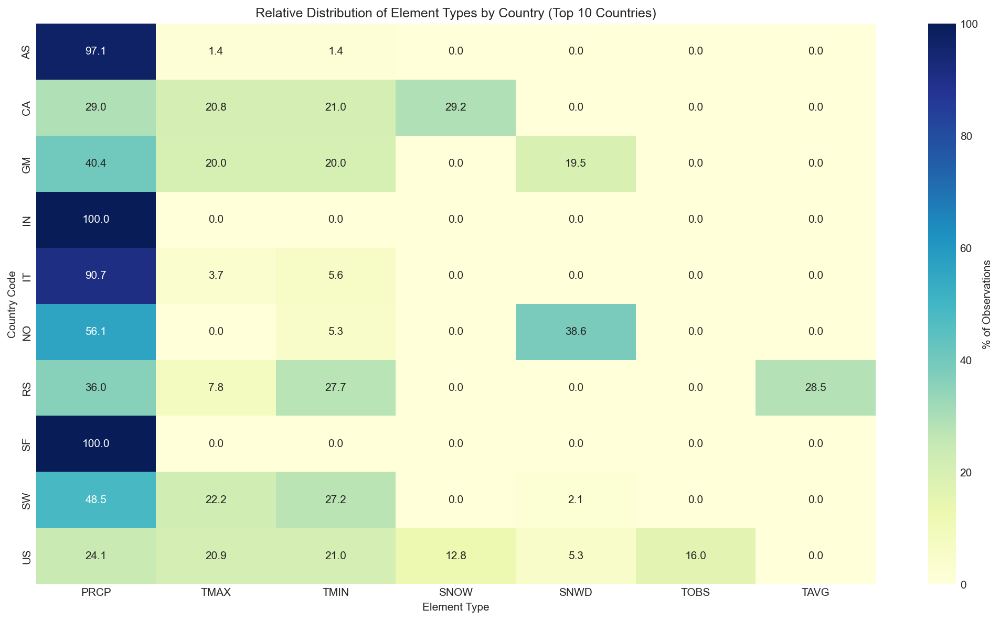

---

## 3. Temperature Analysis

### 3.1 Temperature Distribution

Temperature values are stored in **tenths of degrees Celsius**. After conversion:

**Maximum Temperature (TMAX)**:
- Mean: 17.1°C
- Median: 18.3°C
- Standard deviation: 12.4°C
- Range (filtered): -59.7°C to 50.0°C

**Minimum Temperature (TMIN)**:
- Mean: 4.4°C
- Median: 5.0°C
- Standard deviation: 11.3°C
- Range (filtered): -59.7°C to 44.4°C

The distributions show:
- TMAX is roughly symmetric with a slight left skew
- TMIN shows heavier left tail (more extreme cold readings)
- Both distributions deviate from normal in the tails (Q-Q plots show S-curve pattern)

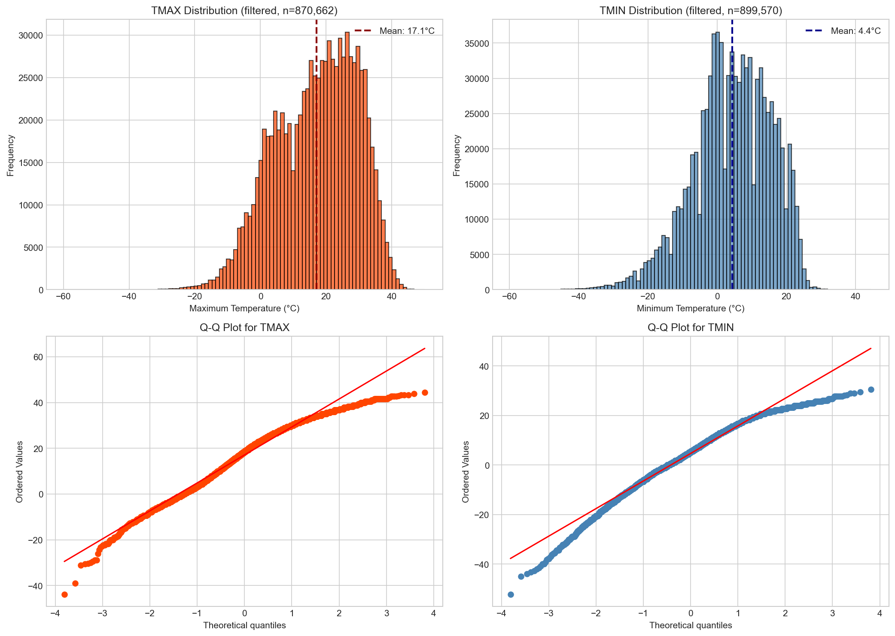

### 3.2 Seasonal Patterns

Monthly temperature patterns show expected Northern Hemisphere seasonality (since most data is from US):
- Winter months (Jan, Feb, Dec): TMAX around 5°C
- Summer months (Jun-Aug): TMAX around 30°C
- Temperature range peaks in July (14.0°C) and is lowest in December (10.4°C)

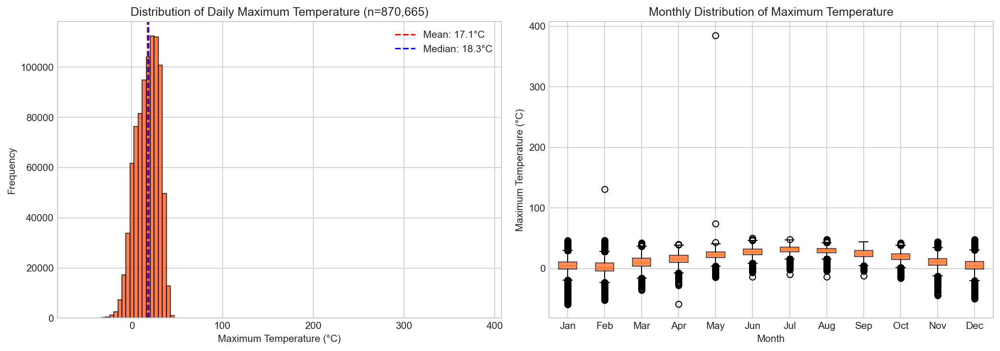

### 3.3 Hemisphere Comparison

Comparing US (Northern Hemisphere) vs Australia (Southern Hemisphere) reveals the expected inverted seasonal pattern:
- US peaks in July (~32°C), lowest in February (~3°C)
- Australia peaks in January (~32°C), lowest in July (~18°C)

Russia shows more extreme seasonality with winter temperatures averaging below -15°C.

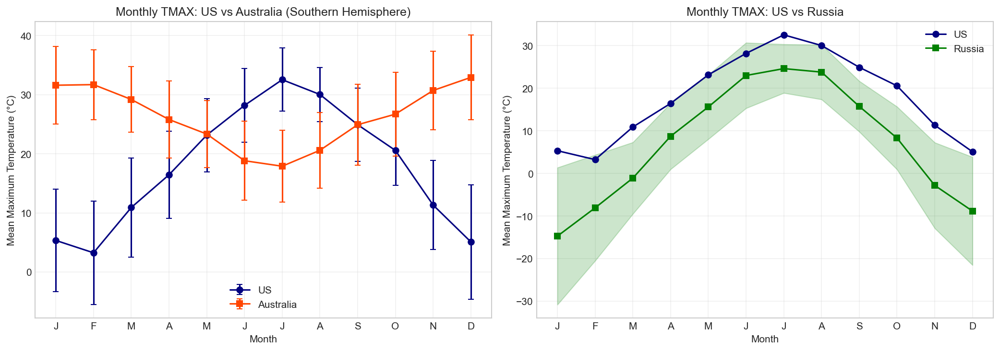

### 3.4 Temperature Consistency

For 860,333 station-days with both TMAX and TMIN:
- **Inconsistent records (TMAX < TMIN)**: 206 (0.02%)
- **Mean daily temperature range**: 12.4°C
- **Maximum valid range**: up to 40°C (arid regions)

The scatter plot of TMAX vs TMIN shows strong positive correlation, with nearly all points above the identity line (as expected).

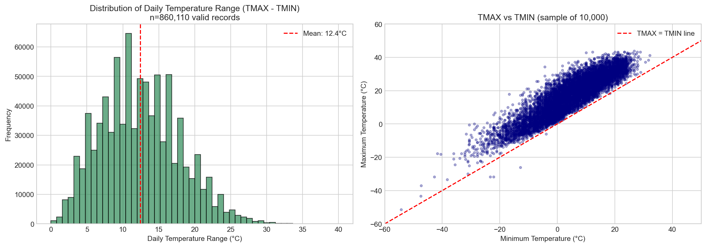

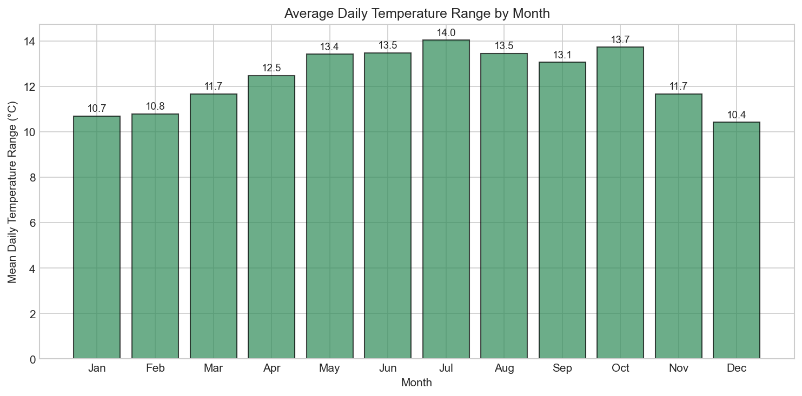

---

## 4. Precipitation Analysis

### 4.1 Overall Distribution

Precipitation is heavily zero-inflated:
- **Zero precipitation days**: 2,217,081 (78.4%)
- **Mean (all days)**: 21.4 mm
- **Median**: 0 mm
- **Maximum**: 18,542 mm (data error)

The non-zero precipitation follows a heavy-tailed distribution, appearing roughly log-normal.

### 4.2 Common Values

The most frequent non-zero precipitation values show interesting patterns:
- Values at round numbers (5, 10, 25, 50, 100 mm) are overrepresented
- Values at 127, 254, 508 mm appear frequently (likely inch-based measurements: 5, 10, 20 inches in tenths)
- This suggests mixed measurement systems and possible unit conversion issues

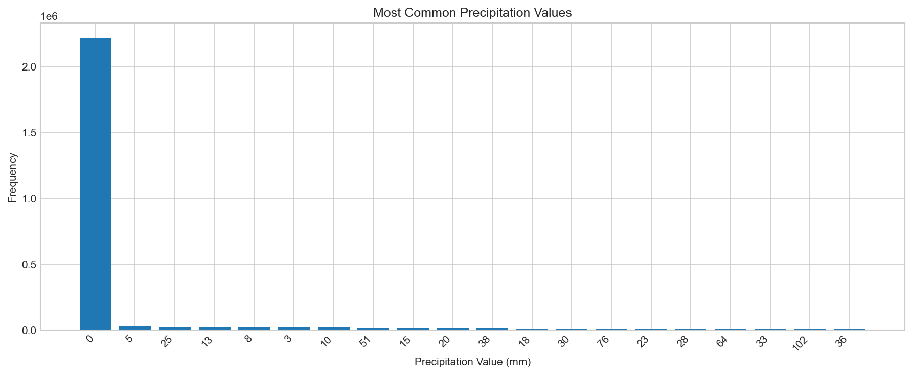

### 4.3 Monsoon Pattern (India)

India data shows a clear monsoon signal:
- Peak precipitation: July-August (82-87 mm/day average)
- Dry season: March-April and December (5-12 mm/day average)
- Monsoon season (Jun-Sep) accounts for approximately 65% of annual precipitation

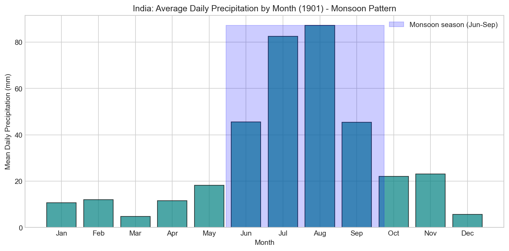

### 4.4 Monthly Pattern (Global)

Average daily precipitation shows weak seasonality globally, with slightly higher values in late spring/summer months.

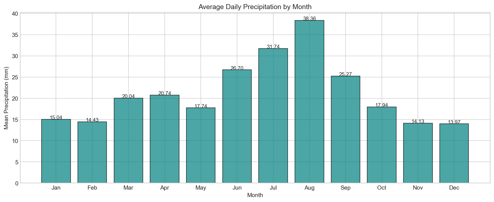

---

## 5. Snow Analysis

### 5.1 Snowfall Distribution

- **Total SNOW records**: 527,030
- **Zero snowfall days**: 489,131 (92.8%)
- **Mean (all)**: 3.7 mm
- **Maximum**: 2,743 mm (likely data error)

### 5.2 Snow Depth Distribution

- **Total SNWD records**: 216,592
- **Zero depth days**: Common (seasonal)
- **Mean**: 44.3 mm
- **Maximum**: 4,572 mm

Snow data is available almost exclusively from US and Canada stations.

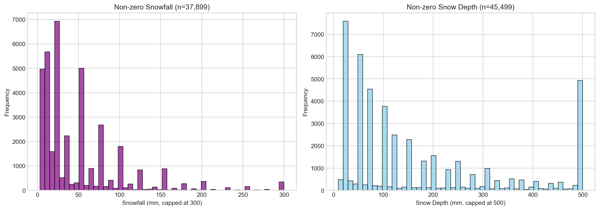

---

## 6. Data Quality Issues

### 6.1 Missing Data

| Column | Missing % | Interpretation |
|--------|-----------|----------------|
| mflag | 92.1% | Measurement flag rarely used |
| qflag | 99.1% | Quality issues are rare |
| obstime | 96.9% | Observation time not consistently recorded |
| station_id, date, element, value, sflag, unit | 0% | Core fields always present |

### 6.2 Unrealistic Values

**Temperature outliers identified**:
- TMAX > 50°C: 3 records (max 385°C - impossible)
- TMIN > 50°C: 3 records (max 1396°C - impossible)
- All extreme temperature errors are from US stations with sflag='6'

**Precipitation outliers**:
- Values > 1000 mm: 2,355 records
- Maximum 18,542 mm (impossible - world record is ~1,800 mm/day)
- Extreme values concentrated in India (sflag='I') and US stations
- 17 negative precipitation values (all -30, from station TSE00147775)

**Recommendation**: Filter temperatures to [-60, 60]°C and precipitation to [0, 500] mm for most analyses.

### 6.3 Duplicate Check

- **Exact duplicate rows**: 0
- **Duplicate (station, date, element) combinations**: 0

The data appears properly deduplicated.

### 6.4 Source Flag Analysis

The sflag indicates data source:
| sflag | Count | Percentage |
|-------|-------|------------|
| 6 | 2,795,162 | 47.1% |
| a | 1,099,711 | 18.6% |
| I | 691,456 | 11.7% |
| 0 | 651,846 | 11.0% |
| C | 281,802 | 4.8% |
| E | 267,476 | 4.5% |

Source '6' dominates (primarily US data). Source 'a' corresponds to Australia, 'I' to India.

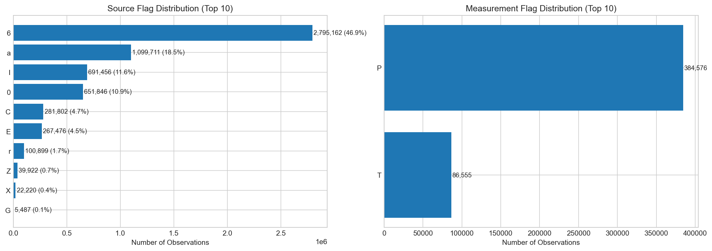

---

## 7. Temporal Coverage

### 7.1 Daily Observation Counts

- **Mean daily observations**: 16,319
- **Range**: 15,506 to 17,359
- Coverage is relatively stable throughout the year

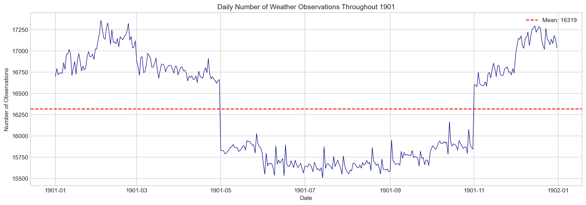

### 7.2 Station Activity

- **Stations active all 365 days**: 6,105 (70%)
- **Stations with <100 days of data**: 419 (5%)
- Most stations have complete annual coverage

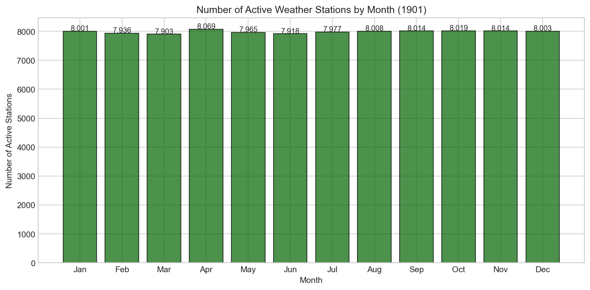

### 7.3 Observation Concentration

The observation distribution across stations is relatively even:
- Top 1% of stations: 3.2% of observations
- Top 5% of stations: 14.6% of observations
- Top 10% of stations: 26.7% of observations

This indicates no extreme concentration (unlike many user-engagement datasets).

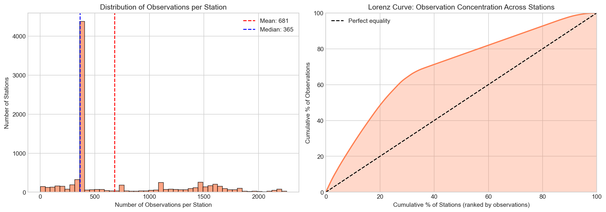

---

## 8. Weather Type Indicators

Weather type flags (WT01-WT18) are sparsely recorded:

| Code | Description | Count |
|------|-------------|-------|
| WT16 | Rain | 6,610 |
| WT03 | Thunder | 3,174 |
| WT01 | Fog | 3,112 |
| WT18 | Snow | 1,640 |
| WT11 | High winds | 767 |

These flags are present in less than 0.3% of records total.

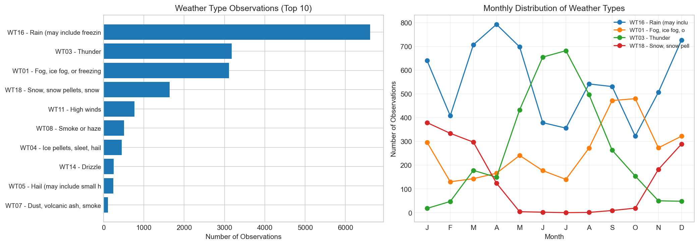

---

## 9. Data Completeness by Station

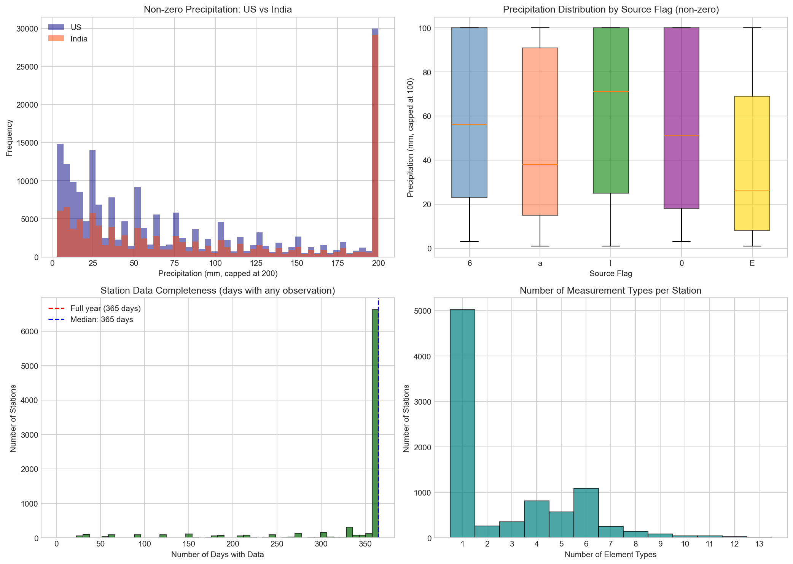

Most stations record 1-4 different measurement types:
- Stations with only 1 element: Many (precipitation-only stations)
- Stations with full suite (6+ elements): Primarily US cooperative stations

---

## 10. Recommendations for Analysis

### Data Cleaning
1. **Temperature**: Filter to [-60, 60]°C for TMAX and [-60, 50]°C for TMIN
2. **Precipitation**: Filter to [0, 500] mm; investigate values > 200 mm individually
3. **Remove station TSE00147775** for precipitation analysis (systematic -30 values)

### Unit Considerations
- Temperature: Stored as tenths of °C (divide by 10)
- Precipitation: Stored as mm, but some values suggest inch-based origins
- Snow: Stored as mm

### Geographic Bias
- Analysis is heavily biased toward US data (59%)
- India data is precipitation-only
- Southern Hemisphere representation is limited to Australia

### Temporal Considerations
- Data represents a single year (1901)
- Climate patterns may differ from modern conditions
- Seasonal analysis must account for hemisphere

---

## 11. Key Findings

### Clear Patterns
1. **Monsoon signal**: India precipitation shows textbook monsoon seasonality (Jul-Aug peak)
2. **Hemisphere seasonality**: US and Australia show inverted temperature patterns
3. **Zero-inflation**: 78% of precipitation days and 93% of snowfall days are zero
4. **High data completeness**: 70% of stations have full-year coverage

### Data Quality Concerns
1. **Impossible values**: ~10 temperature and ~2,400 precipitation records are physically impossible
2. **Unit mixing**: Precipitation values suggest mixed metric/imperial origins
3. **Systematic errors**: Station TSE00147775 has 17 records with -30 mm precipitation
4. **Missing metadata**: 92-99% missing rates for mflag, qflag, and obstime

### Geographic Coverage
1. **US dominance**: Nearly 60% of all observations
2. **Limited tropics**: Only India represents tropical regions, and only with precipitation
3. **Limited Southern Hemisphere**: Only Australia with significant representation

---

## 12. Conclusions

This 1901 GHCN daily dataset provides a valuable historical snapshot of global weather observations. The data is generally high quality with good temporal coverage, but users should be aware of:

1. **Geographic bias** toward the United States
2. **Measurement type limitations** varying by country (India = precipitation only)
3. **Outliers requiring filtering** (6 impossible temperature values, ~2,400 extreme precipitation values)
4. **Sparse quality metadata** (flags mostly unused)

The dataset is suitable for:
- Historical climate reconstruction (with appropriate filtering)
- Seasonal pattern analysis
- Comparative studies between regions
- Teaching/demonstration of climate data characteristics

---

*Report generated by Claude Opus 4.5 (claude-opus-4-5-20251101)*
*Analysis date: 2025-12-31*
