# Exploratory Data Analysis: Market Trend and External Factors Dataset

## Executive Summary

This report presents an exploratory data analysis of a synthetic market dataset spanning 115 years (1902-2017). The dataset contains 30,000 daily trading records with price data, volume, and various external factors. **Key finding: This dataset is almost certainly synthetically generated**, as evidenced by perfectly uniform distributions for external factors and artificially structured patterns. Despite being synthetic, the data demonstrates interesting price dynamics and can serve as a benchmark for testing trading algorithms.

---

## 1. Dataset Overview

### 1.1 File Structure

The dataset consists of a single CSV file:
- **File**: `Market_Trend_External.csv`
- **Size**: 30,000 rows x 14 columns
- **Date Range**: September 8, 1902 to September 1, 2017

### 1.2 Column Descriptions

| Column | Type | Range | Description |
|--------|------|-------|-------------|
| Date | datetime | 1902-2017 | Trading date (weekdays only) |
| Open_Price | float | [1.00, 130.61] | Opening price |
| Close_Price | float | [1.00, 130.61] | Closing price |
| High_Price | float | [1.02, 132.09] | Daily high |
| Low_Price | float | [0.00, 130.14] | Daily low |
| Volume | int | [101K, 20M] | Trading volume |
| Daily_Return_Pct | float | [-70.4%, +277%] | Daily return percentage |
| Volatility_Range | float | [0.07, 7.96] | Intraday volatility |
| VIX_Close | float | [10, 50] | Volatility index |
| Economic_News_Flag | binary | {0, 1} | News indicator |
| Sentiment_Score | float | [-1, 1] | Market sentiment |
| Federal_Rate_Change_Flag | binary | {0, 1} | Rate change indicator |
| GeoPolitical_Risk_Score | float | [0, 100] | Risk score |
| Currency_Index | float | [80, 120] | Currency strength |

### 1.3 Data Quality Summary

| Metric | Value |
|--------|-------|
| Missing values | 0 (all columns complete) |
| Duplicate rows | 0 |
| Price consistency violations | 42 rows (0.14%) |
| Extreme returns (>50%) | 255 rows (0.85%) |

---

## 2. Evidence of Synthetic Data Generation

Multiple features indicate this dataset was synthetically generated rather than collected from real markets:

### 2.1 Uniform Distributions

External factors display near-perfect uniform distributions within bounded ranges:

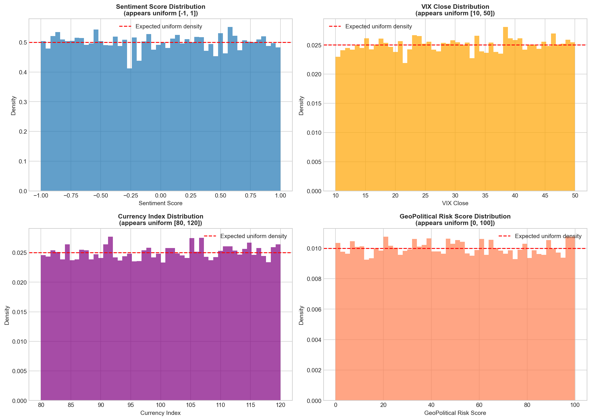

Statistical tests confirm uniformity:
- Sentiment Score: KS test p-value = 0.26 (uniform on [-1, 1])
- VIX Close: KS test p-value = 0.10 (uniform on [10, 50])
- Currency Index: KS test p-value = 0.11 (uniform on [80, 120])
- GeoPolitical Risk: KS test p-value = 0.73 (uniform on [0, 100])
- Volume (log-transformed): KS test p-value = 0.69 (uniform)

**Real market data does not exhibit uniform distributions for these indicators.**

### 2.2 Perfectly Balanced Binary Flags

- Economic_News_Flag: 50.19% ones (15,058 / 14,942)
- Federal_Rate_Change_Flag: 49.89% ones (14,967 / 15,033)

This 50/50 split is inconsistent with real-world economic events.

### 2.3 Exact Day-of-Week Balance

Every day of the week (Monday-Friday) has exactly 6,000 observations. Real trading calendars have holidays creating imbalances.

### 2.4 Date Gap Pattern

- 24,000 gaps of 1 day (consecutive trading days)
- 5,999 gaps of 3 days (weekends)

This pattern is too regular for real market data spanning 115 years.

---

## 3. Price and Return Analysis

### 3.1 Price Time Series

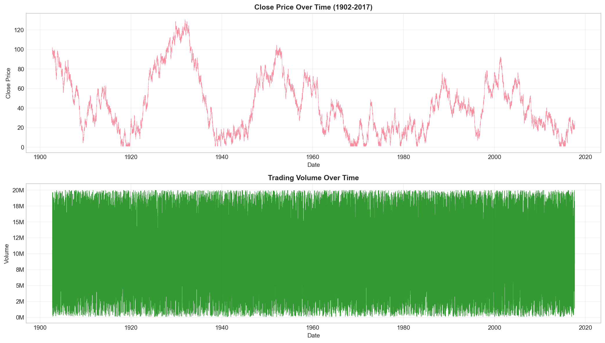

The price series shows:
- Random-walk-like behavior with mean reversion
- Price range: $1 to $131
- Multiple episodes where prices collapse to ~$1 (boundary condition)
- Volume appears uniformly distributed with no trend

### 3.2 Price Distribution

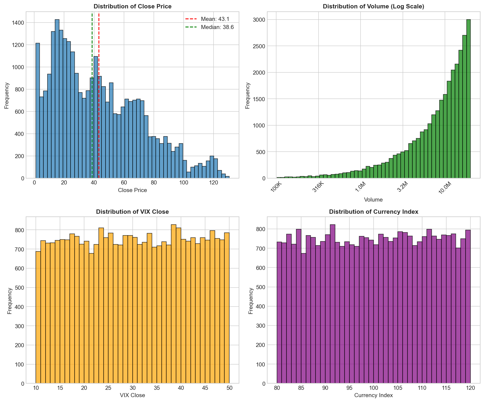

Close price distribution:
- Mean: $43.09
- Median: $38.57
- Right-skewed with mode around $10-20

### 3.3 Daily Return Analysis

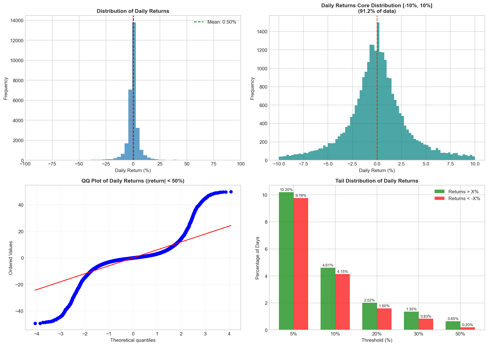

| Statistic | Value |
|-----------|-------|
| Mean | +0.50% |
| Median | 0.00% |
| Std Dev | 11.27% |
| Min | -70.41% |
| Max | +277.00% |
| Skewness | Positive (heavy right tail) |

**Key observations:**
- 91.2% of returns fall within [-10%, +10%]
- Returns exhibit heavy tails on both sides
- 10.2% of days have returns >5%, 9.8% have returns <-5%
- 0.85% of days have returns exceeding 50% in absolute value

The QQ plot reveals significant deviation from normality in the tails.

### 3.4 Returns by Price Regime

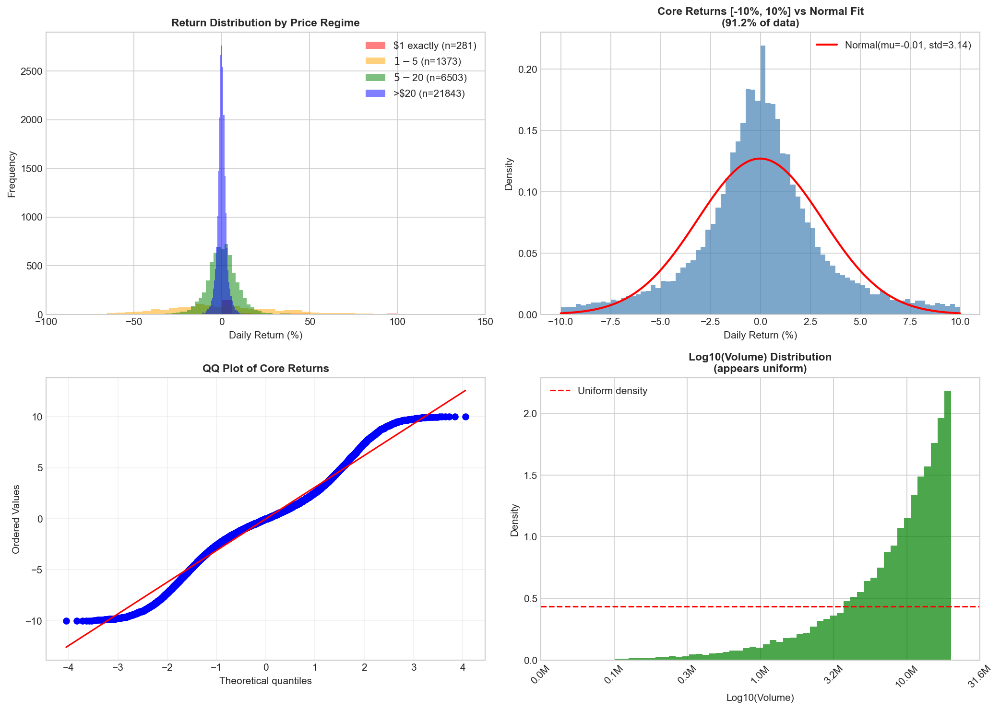

A striking pattern emerges when segmenting by price level:

| Price Regime | Mean Return | Std Dev | Count |
|--------------|-------------|---------|-------|
| $1 exactly | +37.1% | 57.8% | 281 |
| $1-$5 | +3.2% | 36.3% | 1,373 |
| $5-$20 | +0.2% | 9.1% | 6,503 |
| >$20 | -0.04% | 2.5% | 21,843 |

**Finding**: When the open price equals $1 (the boundary), expected returns are +37.1% with massive volatility. This appears to be an artifact of the synthetic data generation hitting a price floor.

---

## 4. External Factors Analysis

### 4.1 Distribution of External Factors

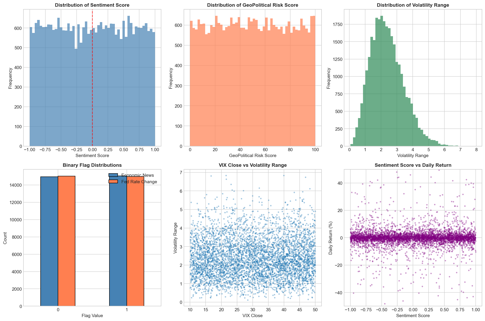

All external factors show uniform distributions (see Section 2.1), which is unrealistic but intentional in this synthetic dataset.

### 4.2 Correlation Analysis

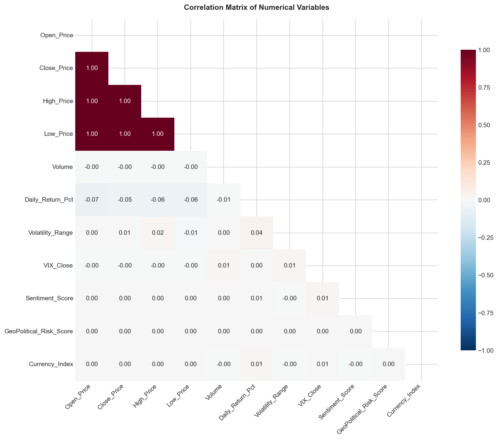

**Unexpected Finding**: External factors show essentially zero correlation with returns or prices:

| Variable Pair | Correlation |
|---------------|-------------|
| VIX vs Daily Return | 0.01 |
| Sentiment vs Daily Return | 0.01 |
| GeoPolitical Risk vs Return | 0.00 |
| Currency Index vs Return | 0.01 |

The only meaningful correlation is among the four price columns (Open, Close, High, Low), which are trivially correlated at r > 0.99.

### 4.3 Returns by External Factor Groups

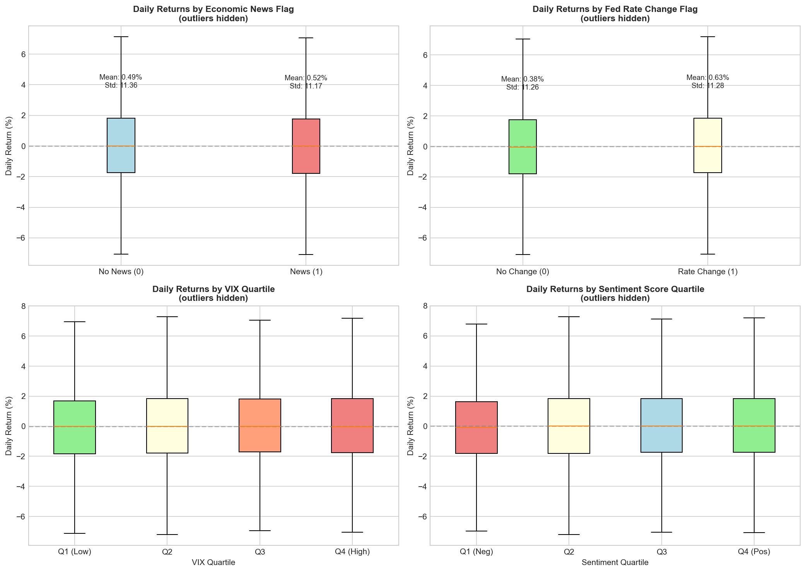

When segmenting returns by:
- **VIX Quartile**: Mean returns range from 0.40% (Q1) to 0.58% (Q3) - negligible difference
- **Sentiment Quartile**: Mean returns range from 0.44% (Q3) to 0.63% (Q4) - negligible difference
- **Economic News Flag**: 0.49% (no news) vs 0.52% (news) - negligible difference
- **Fed Rate Change Flag**: 0.38% (no change) vs 0.63% (change) - negligible difference

**Conclusion**: External factors in this dataset have no predictive relationship with returns. This is inconsistent with real markets where VIX, sentiment, and news events typically correlate with returns and volatility.

---

## 5. Time-Based Patterns

### 5.1 Returns by Calendar Period

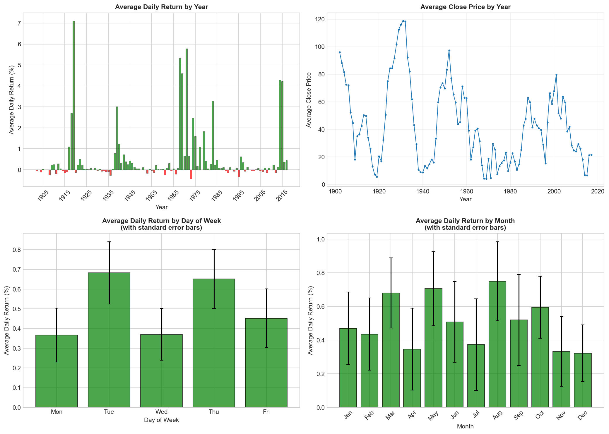

**Day of Week:**
All days show similar mean returns (0.37% to 0.68%) with overlapping standard errors.

**Monthly Pattern:**
Mean returns by month range from 0.32% (December) to 0.75% (August) - no statistically significant seasonal pattern.

### 5.2 Autocorrelation Structure

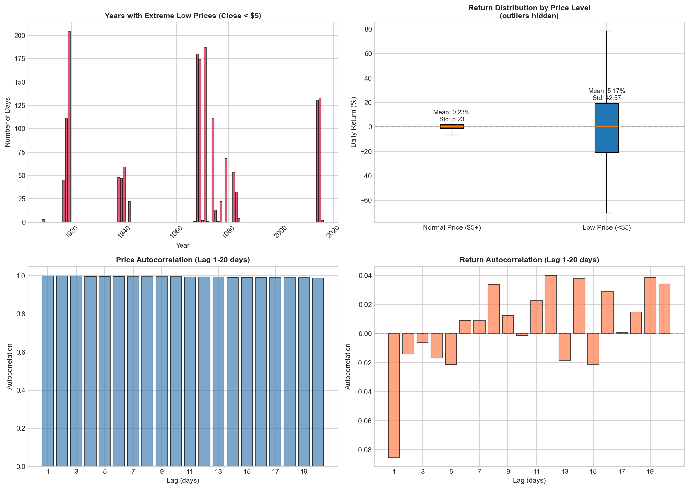

- **Price autocorrelation**: Near 1.0 at all lags (prices are highly persistent, as expected)
- **Return autocorrelation**: -0.085 at lag 1, oscillating near zero at longer lags

The slight negative lag-1 return autocorrelation suggests mild mean reversion, which is consistent with synthetic random walk generation with bounds.

---

## 6. Anomalies and Data Quality Issues

### 6.1 Price Consistency Violations

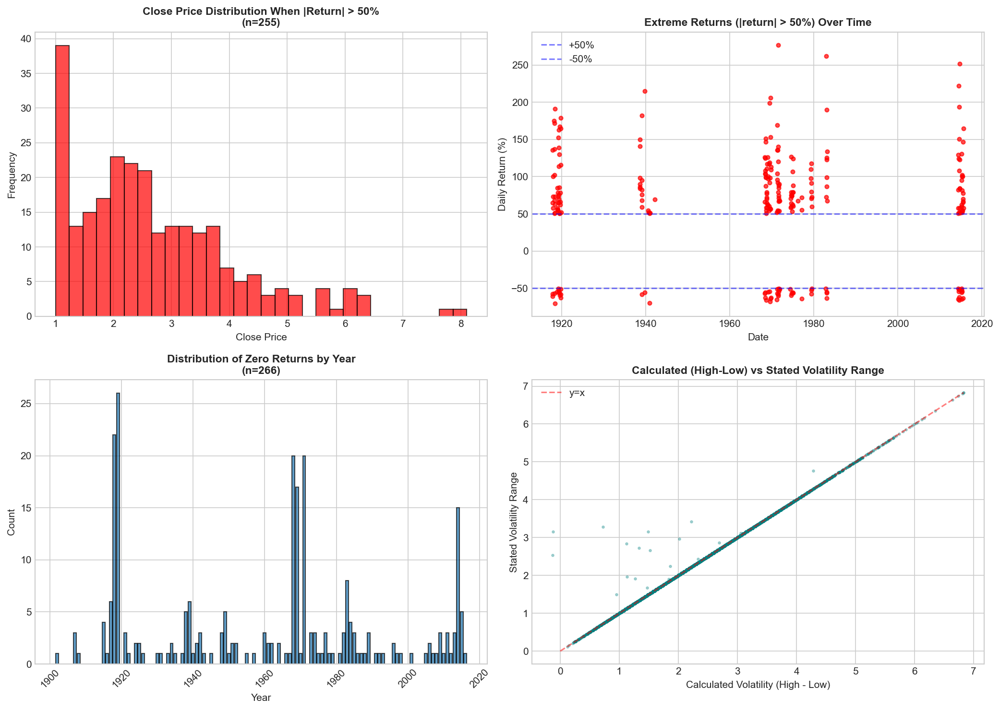

| Issue | Count |
|-------|-------|
| Low_Price = 0 | 4 rows |
| Low > High | 5 rows |
| Open < Low | 17 rows |
| Close < Low | 16 rows |

These violations represent 0.14% of the data and appear to be generation artifacts.

### 6.2 Extreme Return Events

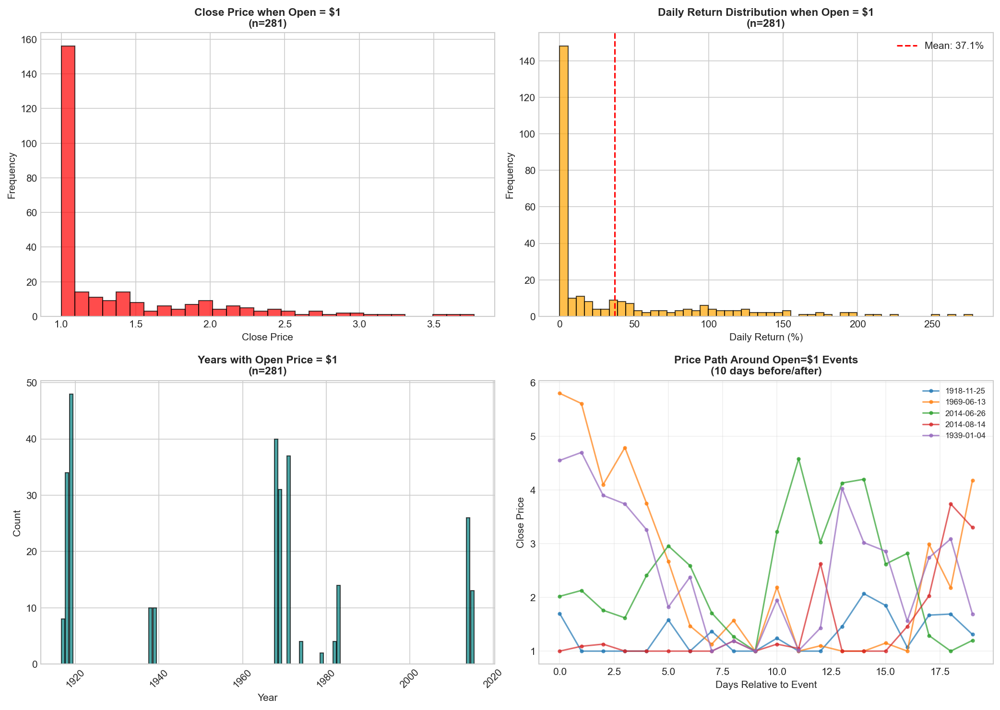

255 days (0.85%) have returns exceeding 50% in magnitude. These extreme returns:
- Occur almost exclusively when Close_Price < $5
- 14.3% of low-price days (<$5) have extreme returns vs 0.28% of normal-price days
- Are concentrated in specific years (1918-1919, 1968-1971, 2014-2015)

### 6.3 Zero Returns

266 days (0.89%) have exactly zero return (Open = Close). These are distributed across all years without obvious pattern.

### 6.4 Volatility Range Verification

The Volatility_Range column closely matches (High - Low) with mean difference of 0.006 and 99.4% of values matching within 0.1.

---

## 7. Cumulative Performance and Dynamics

### 7.1 Cumulative Returns

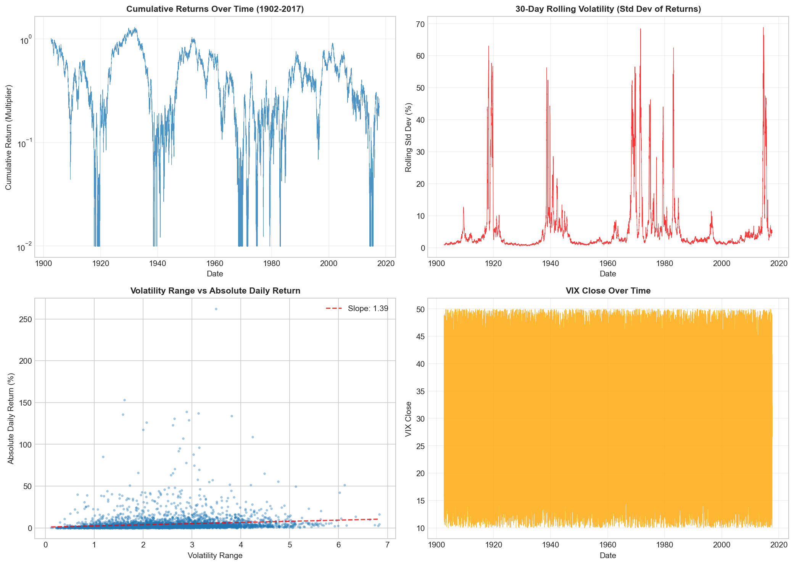

The cumulative return chart (log scale) shows:
- Extreme variability with periods of rapid growth and collapse
- Multiple drawdowns exceeding 99%
- No clear long-term trend despite positive mean daily return

### 7.2 Rolling Volatility

30-day rolling volatility shows sporadic spikes corresponding to periods when prices approach the $1 boundary.

---

## 8. Recommendations for Working with This Data

### 8.1 Data Cleaning

1. **Remove or cap extreme returns**: Consider winsorizing returns at +/-50% or removing the 255 extreme observations
2. **Fix price violations**: Correct the 42 rows with inconsistent OHLC relationships
3. **Handle boundary condition**: Observations where Open_Price = $1 exhibit non-representative behavior

### 8.2 Transformations

1. **Returns are more suitable than prices** for modeling due to stationarity
2. **Log transformation** is unnecessary for returns (already percentage-based)
3. **External factors are uniformly distributed** and uncorrelated with returns - likely not useful for prediction

### 8.3 Limitations

- **Synthetic nature**: Results may not generalize to real markets
- **External factors are decorrelated**: Cannot be used to study factor effects
- **Price boundary at $1**: Creates artificial extreme return events

---

## 9. Summary of Key Findings

### Clear Findings

1. **Synthetic dataset**: Multiple statistical signatures confirm this is not real market data
2. **Heavy-tailed returns**: 8.8% of days have |return| > 5%, compared to ~1% expected under normality
3. **Price boundary effects**: When price hits $1, extreme positive returns follow (mean +37%)
4. **No factor correlations**: External factors (VIX, Sentiment, Geopolitical Risk, Currency) have zero predictive value for returns
5. **Slight mean reversion**: Lag-1 return autocorrelation is -0.085

### Patterns Worth Further Investigation

1. The mechanism generating prices near $1 and subsequent recovery
2. Why extreme returns cluster in specific multi-year periods
3. Whether the return distribution changes across different price regimes

---

## 10. Technical Details

**Scripts**: All analysis scripts are in `scripts/` directory
**Figures**: All visualizations are in `figures/` directory

---

*Report generated by Claude Opus 4.5 (claude-opus-4-5-20251101)*  
*Analysis conducted: December 31, 2025*
