# Exploratory Data Analysis: Steam Games Dataset (2021-2025)

## 1. Dataset Overview

### Source and Structure

The dataset contains **65,521 games** released on the Steam platform between 2021 and 2025. The data was collected via the Steam Store API, as indicated by the accompanying `collect_data_v2.py` script.

**File:** `a_steam_data_2021_2025.csv`

**Columns (10 total):**

| Column | Type | Description |
|--------|------|-------------|
| appid | int64 | Unique Steam application identifier |
| name | object | Game title |
| release_year | int64 | Year of release (2021-2025) |
| release_date | object | Full release date string (e.g., "Jul 5, 2024") |
| genres | object | Semicolon-separated genre tags |
| categories | object | Semicolon-separated feature tags |
| price | float64 | Price in USD |
| recommendations | int64 | Number of user recommendations (reviews) |
| developer | object | Game developer(s) |
| publisher | object | Game publisher(s) |

### Data Quality

- **No duplicate rows** - All 65,521 rows have unique appid values
- **Minimal missing data:**
  - genres: 66 missing (0.1%)
  - categories: 7 missing (<0.01%)
  - developer: 53 missing (0.08%)
  - publisher: 183 missing (0.28%)

---

## 2. Release Volume Over Time

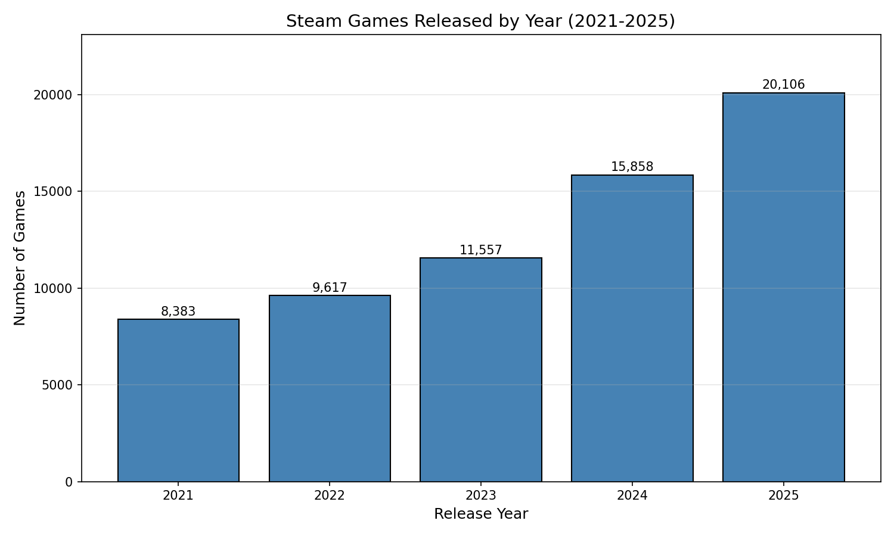

The number of games released on Steam has grown substantially over the 5-year period:

| Year | Games Released | Year-over-Year Growth |
|------|----------------|----------------------|
| 2021 | 8,383 | - |
| 2022 | 9,617 | +14.7% |
| 2023 | 11,557 | +20.2% |
| 2024 | 15,858 | +37.2% |
| 2025 | 20,106 | +26.8% |

**Key Finding:** The dataset shows 140% growth in annual releases from 2021 to 2025. The 2025 figure includes 355 games with quarterly release dates (e.g., "Q4 2025"), indicating these are announced but not yet released.

---

## 3. Price Analysis

### Distribution Characteristics

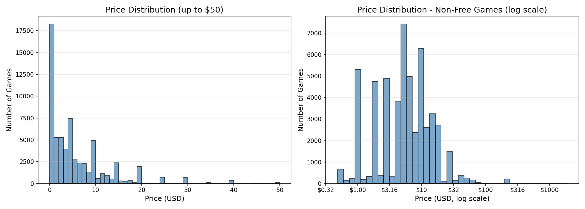

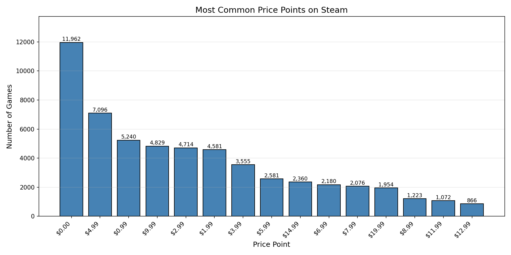

**Summary Statistics:**
- Mean: $7.20
- Median: $3.99
- Std Dev: $16.91
- Range: $0.00 - $1,900.00

**Key Observations:**

1. **Heavy concentration at standard price points:** The distribution shows strong clustering at psychological price points ($0.99, $1.99, $2.99, $4.99, $9.99, etc.)

2. **Free games are common:** 11,962 games (18.3%) are free-to-play, making $0.00 the most common price point

3. **Most games are inexpensive:** 75% of games are priced at $9.74 or below

4. **Price has remained stable:** Mean and median prices show minimal variation across years

| Year | Mean Price | Median Price |
|------|------------|--------------|
| 2021 | $6.62 | $3.99 |
| 2022 | $7.14 | $3.99 |
| 2023 | $7.68 | $4.67 |
| 2024 | $7.58 | $4.99 |
| 2025 | $6.91 | $4.99 |

### Extreme Prices

The dataset contains 227 games priced at $100 or more. Many of these appear to be from a small number of developers releasing similar products (e.g., "PUZZLE Games," "Top-Down Games," "Hede") with prices at $199.99. These may represent shovelware or placeholder pricing rather than genuine premium products, as none have received any user recommendations.

---

## 4. Recommendations Analysis

### The 101+ Threshold

A critical finding is that the minimum non-zero recommendation count is **101**. This indicates Steam does not publicly display recommendation counts below this threshold.

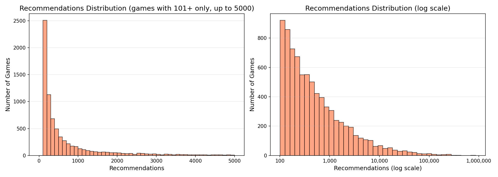

**Distribution:**
- Games with 0 displayed recommendations: 57,515 (87.8%)
- Games with 101+ recommendations: 8,006 (12.2%)

For games with displayed recommendations:
- Mean: 2,964
- Median: 349
- Max: 862,487 (Black Myth: Wukong)

### Extreme Concentration (Pareto Analysis)

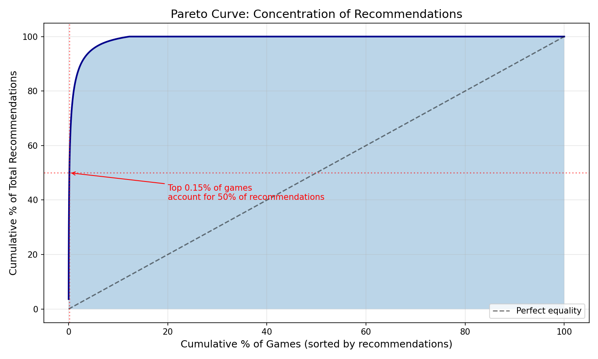

The recommendation distribution exhibits extreme concentration:

| Top % of Games | % of Total Recommendations |
|----------------|---------------------------|
| 0.15% (98 games) | 50% |
| 1.02% (668 games) | 80% |
| 2.49% (1,630 games) | 90% |
| 4.58% (3,002 games) | 95% |

**This is a classic power-law distribution** where a tiny fraction of games capture the vast majority of user engagement.

### Top Games by Recommendations

| Rank | Game | Recommendations | Price | Year |
|------|------|-----------------|-------|------|
| 1 | Black Myth: Wukong | 862,487 | $59.99 | 2024 |
| 2 | ELDEN RING | 793,463 | $59.99 | 2022 |
| 3 | Call of Duty | 402,294 | Free | 2022 |
| 4 | Lethal Company | 401,836 | $9.99 | 2023 |
| 5 | Palworld | 342,592 | $22.49 | 2024 |

### Price-Recommendations Relationship

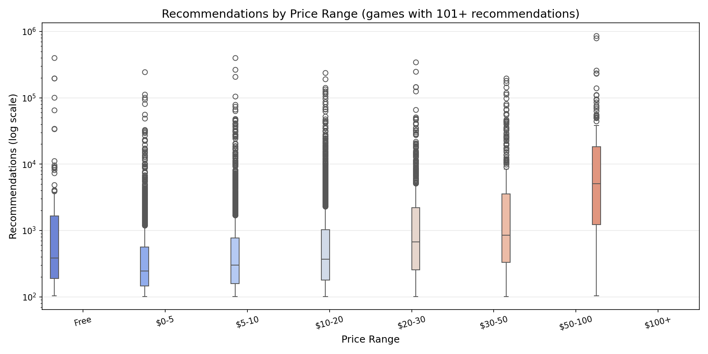

Among games that achieved 101+ recommendations, higher-priced games tend to have more recommendations:

| Price Range | Games with 101+ | Median Recs |
|-------------|-----------------|-------------|
| Free | 86 | varies |
| $0-5 | 1,910 | 232 |
| $5-10 | 2,023 | 302 |
| $10-20 | 2,698 | 367 |
| $20-30 | 743 | 671 |
| $30-50 | 384 | 850 |
| $50-100 | 162 | 5,048 |

**Note:** This association should not be interpreted causally. Higher-priced games may come from established studios with marketing budgets that affect both pricing decisions and user engagement.

---

## 5. Genre Analysis

### Genre Distribution

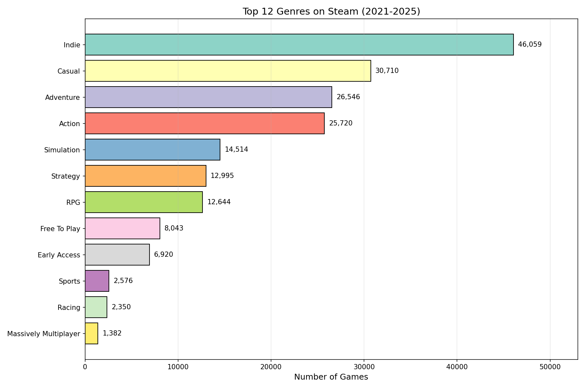

**Top Genres by Game Count:**

| Genre | Count | % of Games |
|-------|-------|------------|
| Indie | 46,059 | 70.3% |
| Casual | 30,710 | 46.9% |
| Adventure | 26,546 | 40.5% |
| Action | 25,720 | 39.3% |
| Simulation | 14,514 | 22.2% |
| Strategy | 12,995 | 19.8% |
| RPG | 12,644 | 19.3% |
| Free To Play | 8,043 | 12.3% |
| Early Access | 6,920 | 10.6% |

Games typically have multiple genre tags (mean: 2.9 genres per game).

### Genre Trends Over Time

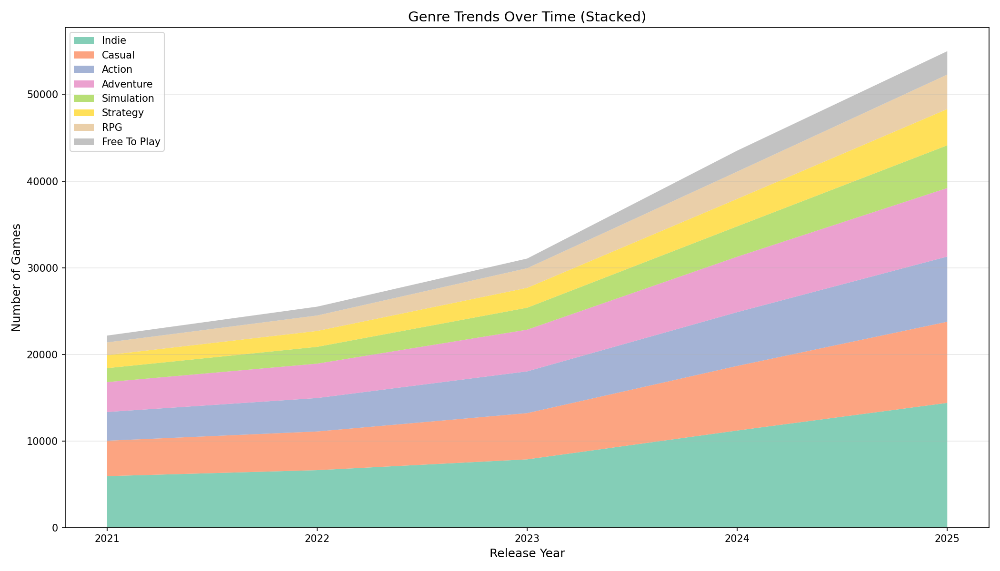

All major genres show growth proportional to overall market expansion. The relative composition has remained stable, with Indie, Casual, and Action maintaining their dominance.

### Success Rate by Genre

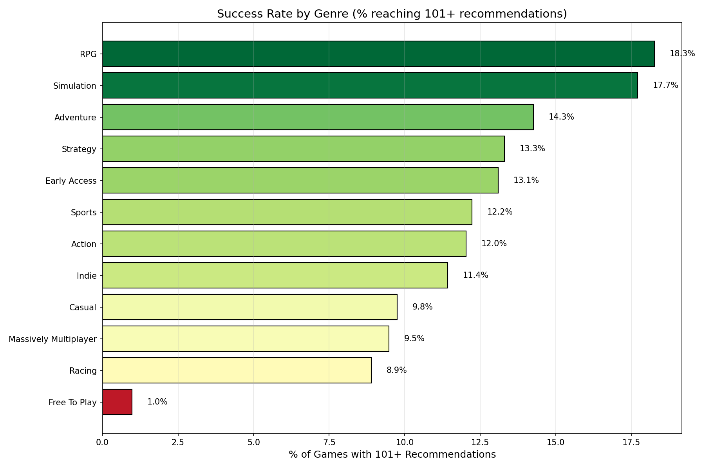

**Percentage of games reaching 101+ recommendations:**

| Genre | Success Rate |
|-------|--------------|
| RPG | 18.3% |
| Simulation | 17.7% |
| Adventure | 14.3% |
| Strategy | 13.3% |
| Early Access | 13.1% |
| Sports | 12.2% |
| Action | 12.0% |
| Indie | 11.4% |
| Casual | 9.8% |
| Free To Play | 1.0% |

**Notable:** Free To Play games have a dramatically lower success rate (1.0%) despite representing 12.3% of releases.

---

## 6. Category/Feature Analysis

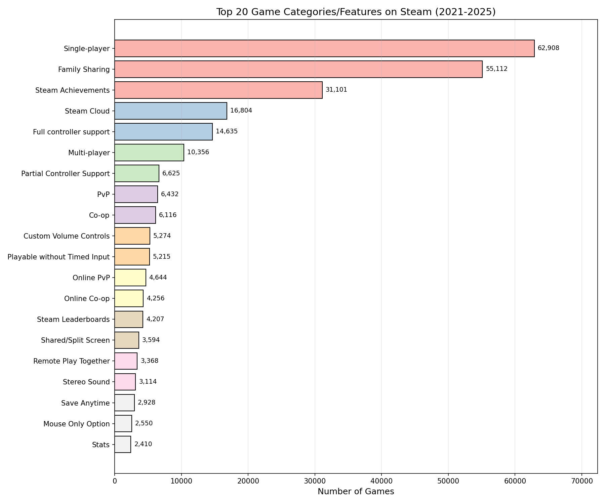

**Most Common Features:**
- Single-player: 62,908 games (96.0%)
- Family Sharing: 55,112 (84.1%)
- Steam Achievements: 31,101 (47.5%)
- Steam Cloud: 16,804 (25.6%)
- Full controller support: 14,635 (22.3%)

### Player Mode Distribution

- Single-player: 96.0%
- Multi-player: 15.8%
- PvP: 9.8%
- Co-op: 9.3%
- MMO: 0.6%

### VR Games

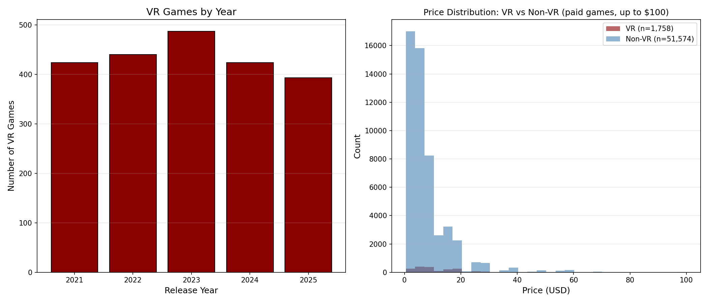

- Total VR games: 2,168 (3.3% of dataset)
- VR releases have remained relatively stable at 400-490 per year
- VR games tend to be priced higher (median: $7.99 vs $3.99 for non-VR)

---

## 7. Developer and Publisher Analysis

### Developer Statistics

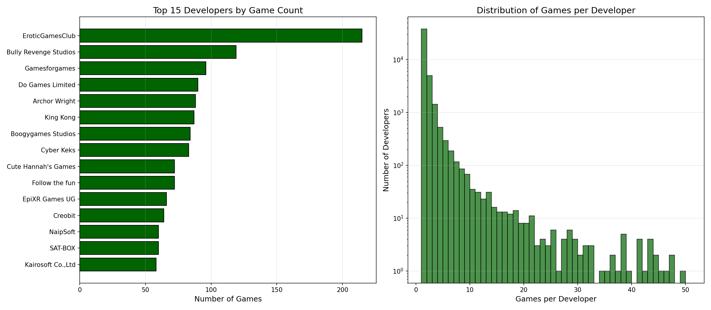

- Total unique developers: 45,679
- Mean games per developer: 1.43
- Median: 1 game (most developers release only one game)
- Maximum: 215 games (EroticGamesClub)

**Top developers by game count:**

| Developer | Games | Recommendations |
|-----------|-------|-----------------|
| EroticGamesClub | 215 | 0 |
| Bully Revenge Studios | 119 | limited |
| Gamesforgames | 96 | limited |
| Do Games Limited | 90 | limited |
| Archor Wright | 88 | limited |

**Note:** The most prolific developers by volume appear to produce low-engagement content.

### Self-Publishing Analysis

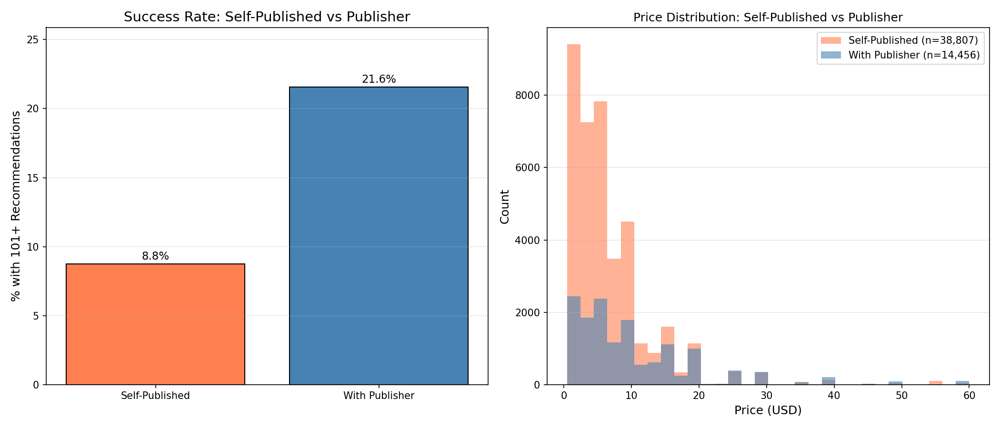

**Definition:** Games where developer name equals publisher name.

- Self-published: 47,819 games (73.0%)
- With separate publisher: 17,702 games (27.0%)

**Success rate comparison:**
- Self-published: 8.8% reach 101+ recommendations
- With publisher: 21.6% reach 101+ recommendations

Games with a separate publisher are 2.5x more likely to achieve recommendation visibility. However, this association should not be interpreted as demonstrating that publishers improve success rates - it may reflect selection effects where publishers choose to work with higher-quality games.

---

## 8. Temporal Patterns

### Success Rate by Release Year

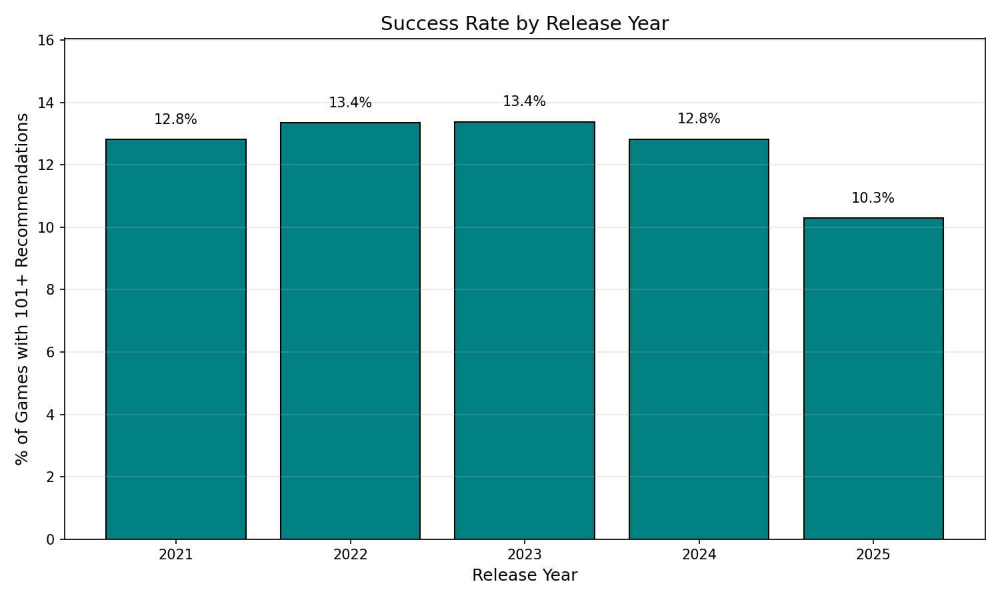

| Year | % with 101+ Recommendations |
|------|----------------------------|
| 2021 | 12.8% |
| 2022 | 13.4% |
| 2023 | 13.4% |
| 2024 | 12.8% |
| 2025 | 10.3% |

The lower rate for 2025 likely reflects that many recently released games have not yet accumulated enough recommendations to reach the 101+ display threshold.

### Release Month Distribution

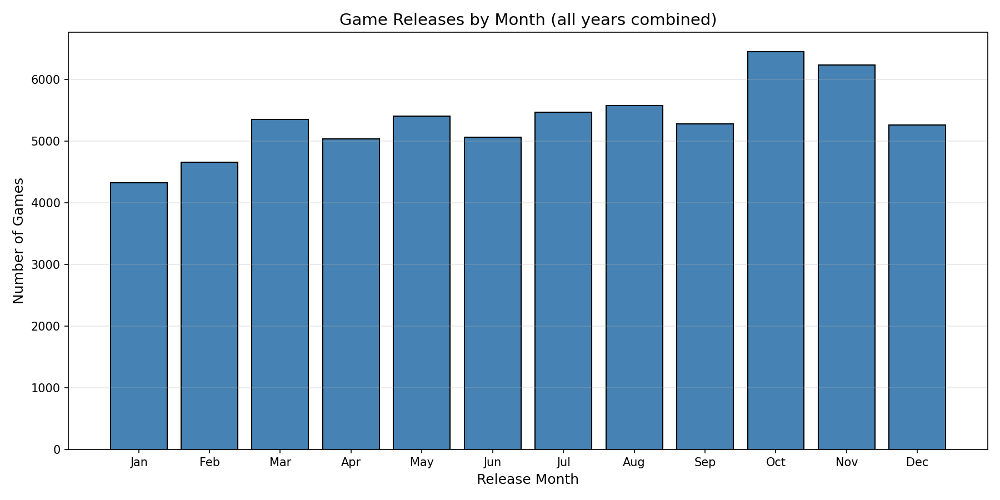

Game releases show relatively even distribution across months, with slight increases in summer months (June-August) and October.

---

## 9. Text Analysis

### Game Name Word Clouds

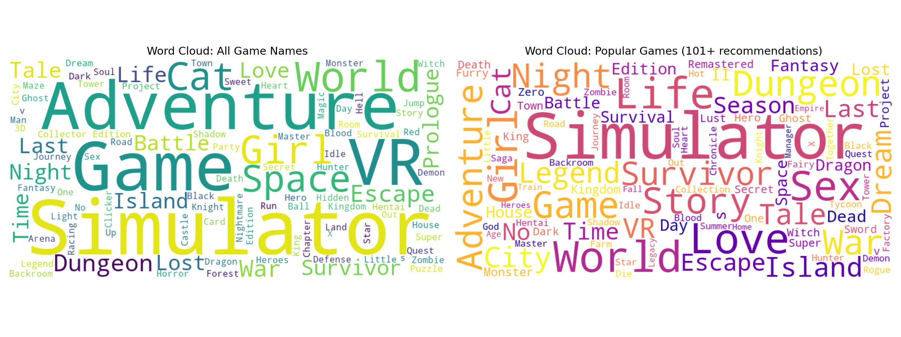

**Common words in all game names:** Simulator, Adventure, Game, VR, World, Dungeon, Escape, Island

**Common words in popular games (101+ recs):** Simulator, Survival, Story, Life, Fantasy, Legend, Dungeon

The word "Simulator" appears prominently in both categories, reflecting the popularity of this game type on Steam.

### Name Length Distribution

- Median game name length: 18 characters
- Names range from very short (single words) to very long titles with subtitles

---

## 10. Data Quality Issues and Anomalies

### Potential Shovelware

Several developers show patterns consistent with asset-flip or shovelware production:

| Developer | Games | Total Recs | Avg Price | Pattern |
|-----------|-------|------------|-----------|---------|
| PUZZLE Games | 41 | 0 | $188.89 | All priced at $199.99 |
| Top-Down Games | 31 | 0 | $199.99 | All priced at $199.99 |
| Hede | 57 | 0 | $174.29 | High prices, no engagement |
| EroticGamesClub | 215 | 0 | $2.82 | Adult content, high volume |

These developers' games all have identical genre tags and zero recommendations.

### Recommendations Threshold

The 101-recommendation display threshold creates a binary visibility effect - games with fewer than 101 recommendations show as having zero. This affects:
- 87.8% of all games
- Makes it impossible to distinguish between games with 1-100 recommendations and games with truly zero engagement

### Free Game Pricing Inconsistency

- 11,962 games have price = $0.00
- Only 7,953 of these (66.5%) have the "Free To Play" genre tag
- The remaining 4,009 free games may be promotional offers, demos categorized as games, or data collection inconsistencies

---

## 11. Recommendations for Data Usage

### For Analysis

1. **Consider filtering extreme price outliers** (games >$100 with 0 recommendations) as these appear to be placeholder or shovelware pricing

2. **Be aware of the 101+ threshold** when analyzing recommendations - zero does not necessarily mean no engagement

3. **Genre tags are multi-valued** - use appropriate methods for analyzing multi-label categorical data

4. **Self-publishing vs. publisher status** should be treated as observational, not causal

### For Machine Learning

1. **Log-transform recommendations** - the distribution is heavy-tailed and spans 6 orders of magnitude

2. **Price clustering** - consider binning prices into standard price points rather than treating as continuous

3. **Text features from names/genres** may be predictive of success

4. **Temporal features** - year of release affects visible recommendations due to accumulation time

---

## 12. Summary of Key Findings

### Clear Findings

1. **Steam game releases are growing rapidly** - 140% increase from 2021 to 2025

2. **Extreme winner-take-all dynamics** - 0.15% of games account for 50% of all recommendations

3. **Standard pricing dominates** - games cluster heavily at $0.99, $4.99, $9.99, etc.

4. **Most games are invisible** - 87.8% do not meet the 101-recommendation display threshold

5. **Indie dominates by volume** - 70% of games carry the Indie tag

### Patterns Worth Further Investigation

1. **Publisher association with success** - games with separate publishers are 2.5x more likely to reach 101+ recommendations (requires investigation of selection effects)

2. **RPG and Simulation genres** show higher success rates than Action and Casual

3. **Free To Play games** have dramatically lower success rates (1.0%) despite their prevalence

4. **Shovelware patterns** - some developers produce dozens of high-priced games with zero engagement

---

## Appendix: Figures Index

1. `01_games_by_year.png` - Bar chart of releases by year
2. `02_price_distribution.png` - Price histograms (linear and log scale)
3. `03_common_prices.png` - Most common price points
4. `04_recommendations_dist.png` - Recommendations distribution
5. `05_genre_distribution.png` - Top genres bar chart
6. `06_category_distribution.png` - Game categories/features
7. `07_genres_per_game.png` - Number of genres per game
8. `08_pareto_recommendations.png` - Lorenz curve of recommendations
9. `09_price_by_year_box.png` - Price boxplots by year
10. `10_recommendations_by_year.png` - Recommendations violin plots
11. `11_price_vs_recommendations.png` - Scatter plot
12. `12_recommendations_by_price_bucket.png` - Recommendations by price range
13. `13_genre_trends.png` - Stacked area chart of genres over time
14. `14_indie_comparison.png` - Indie vs non-Indie comparison
15. `15_developer_stats.png` - Developer statistics
16. `16_free_vs_paid.png` - Free vs paid games by year
17. `17_early_access.png` - Early Access analysis
18. `18_player_modes.png` - Single/multiplayer distribution
19. `19_vr_analysis.png` - VR games analysis
20. `20_name_length.png` - Game name length distribution
21. `21_genre_recommendations_heatmap.png` - Genre combination heatmap
22. `22_success_rate_by_genre.png` - Success rate by genre
23. `23_name_wordclouds.png` - Word clouds from game names
24. `24_release_month.png` - Release month distribution
25. `25_success_rate_by_year.png` - Success rate over time
26. `26_self_published_analysis.png` - Self-publishing analysis

---

*Report generated by Claude Opus 4.5 (claude-opus-4-5-20251101)*
*Date: December 31, 2025*
