# Exploratory Data Analysis: Tokopedia Product Reviews Dataset

## 1. Dataset Overview

### 1.1 Subject Matter

This dataset contains **65,543 product reviews** from **Tokopedia**, Indonesia's largest e-commerce platform. The reviews span from **November 2015 to December 2025** (approximately 10 years), covering **5,521 unique products** sold by **856 shops**.

### 1.2 File Structure

The dataset consists of a single CSV file:
- **tokopedia_product_reviews_2025.csv** (24 MB)

### 1.3 Schema

| Column | Type | Description |
|--------|------|-------------|
| review_text | string | Text content of the review (in Indonesian) |
| review_date | date | Date when review was posted |
| review_id | integer | Unique identifier for each review |
| product_name | string | Name of the reviewed product |
| product_category | string | Category classification (6 categories) |
| product_variant | string | Product variant/option (often missing) |
| product_price | integer | Price in Indonesian Rupiah (IDR) |
| product_url | string | Link to product page |
| product_id | integer | Unique product identifier |
| rating | integer | Star rating (1-5) |
| sold_count | integer | Number of units sold |
| shop_id | integer | Unique shop identifier |
| sentiment_label | string | Sentiment classification (positive/neutral/negative) |

---

## 2. Data Quality Assessment

### 2.1 Missing Values

Only one column has missing values:
- **product_variant**: 38,794 missing (59.2%)

This appears to be expected - not all products have variants/options.

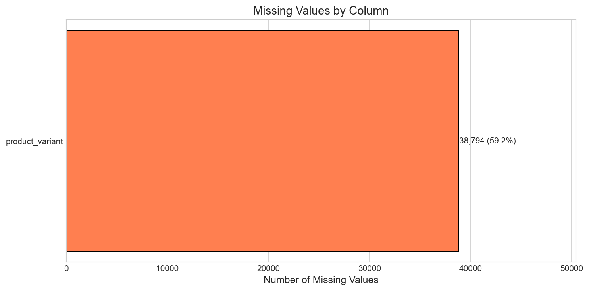

### 2.2 Duplicates

- **Exact row duplicates**: 0 (none)
- **Duplicate review_ids**: 0 (all unique)
- **Duplicate review texts**: 7,475 reviews share identical text with at least one other review

The duplicate texts are primarily short, generic positive phrases like "Bagus..." (323 occurrences), "mantap..." (288 occurrences), and "Good..." (127 occurrences). These appear across different products from different shops, suggesting they are legitimate generic positive reviews rather than spam.

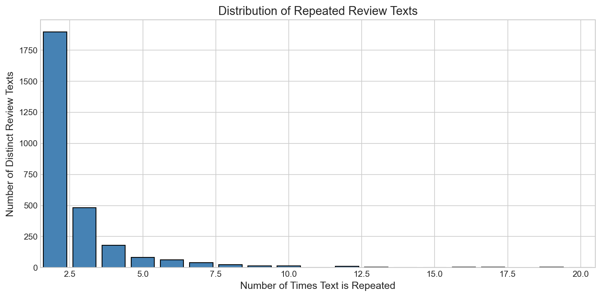

### 2.3 Data Consistency

**Critical Finding: Perfect Rating-Sentiment Mapping**

The sentiment_label column exhibits a deterministic 1:1 mapping with the rating column:
- Rating 1-2 -> negative
- Rating 3 -> neutral  
- Rating 4-5 -> positive

This means the sentiment_label is **derived from the rating** rather than being an independent NLP-based sentiment analysis. The sentiment column provides no additional information beyond what rating already captures.

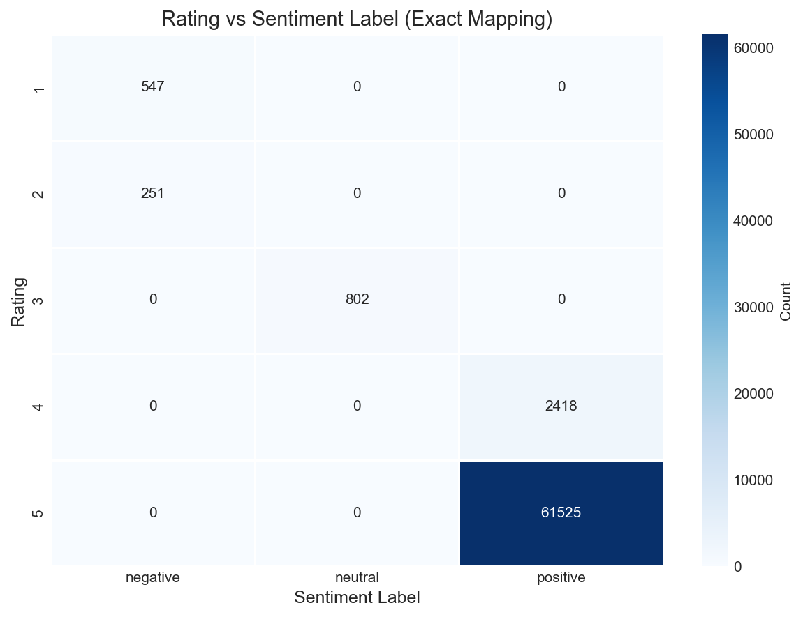

### 2.4 Sold Count Anomaly

**97.5% of sold_count values are round numbers** (multiples of 10, 50, 100, 250, 500, 1000, etc.)

The most common values are:
- 100: 17.5% of reviews
- 250: 16.9% of reviews
- 1,000: 15.0% of reviews
- 500: 12.1% of reviews

This extreme concentration at convenient numbers strongly suggests the sold_count values are **binned, estimated, or displayed values** rather than exact sales figures. This is common in e-commerce platforms where exact sales are approximated for display purposes.

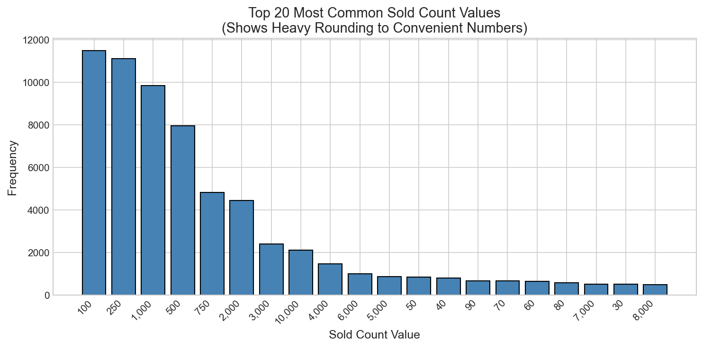

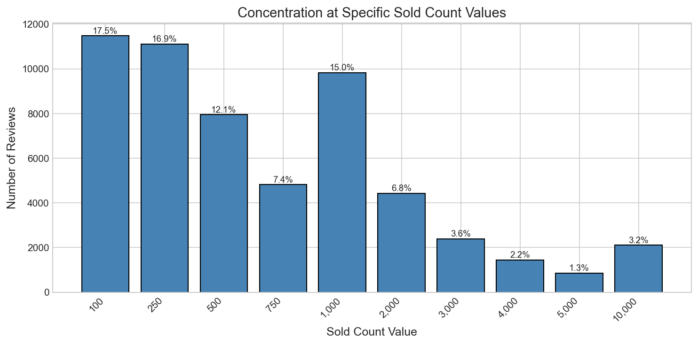

---

## 3. Distribution Analysis

### 3.1 Rating Distribution

The ratings are **extremely positively skewed**:
- 5 stars: 61,525 reviews (93.9%)
- 4 stars: 2,418 reviews (3.7%)
- 3 stars: 802 reviews (1.2%)
- 2 stars: 251 reviews (0.4%)
- 1 star: 547 reviews (0.8%)

**Mean rating: 4.89** | **Std: 0.49**

This extreme positive skew is typical of e-commerce review systems where satisfied customers are more likely to leave reviews.

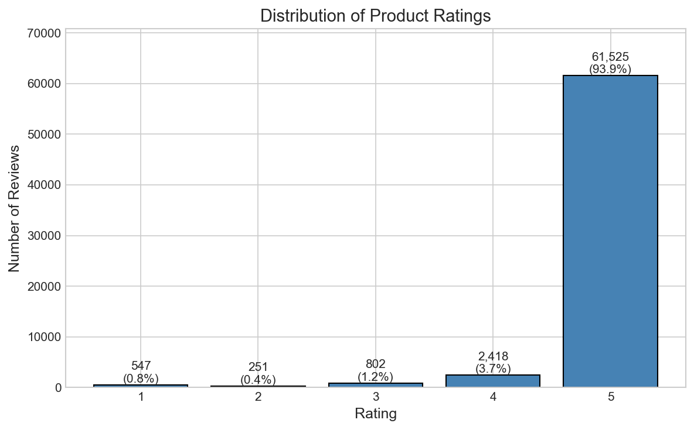

### 3.2 Sentiment Distribution

Following from the rating-sentiment mapping:
- Positive: 63,943 (97.6%)
- Neutral: 802 (1.2%)
- Negative: 798 (1.2%)

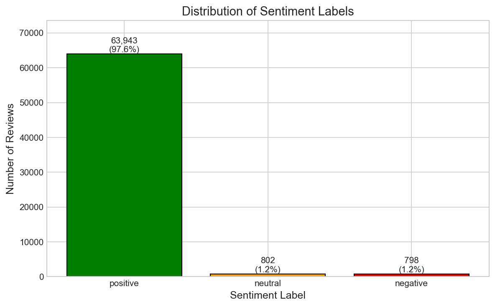

### 3.3 Category Distribution

| Category | Count | Percentage |
|----------|-------|------------|
| Makanan & Minuman (Food & Beverage) | 17,859 | 27.2% |
| Olahraga (Sports) | 15,600 | 23.8% |
| Pertukangan (Tools/Hardware) | 11,500 | 17.5% |
| Kesehatan (Health) | 8,959 | 13.7% |
| Handphone & Tablet | 7,423 | 11.3% |
| Elektronik (Electronics) | 4,202 | 6.4% |

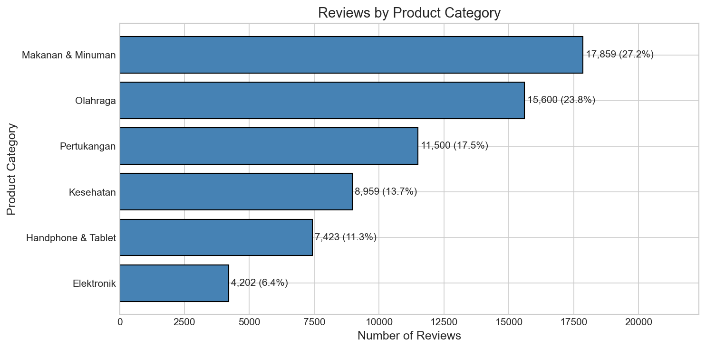

### 3.4 Price Distribution

- **Range**: 100 - 99,999,000 IDR (~$0.01 - $6,500 USD)
- **Median**: 80,000 IDR (~$5 USD)
- **Mean**: 542,130 IDR (~$35 USD)

The distribution is heavily right-skewed with a few high-priced electronics pulling up the mean. The log-transformed histogram reveals a roughly log-normal distribution.

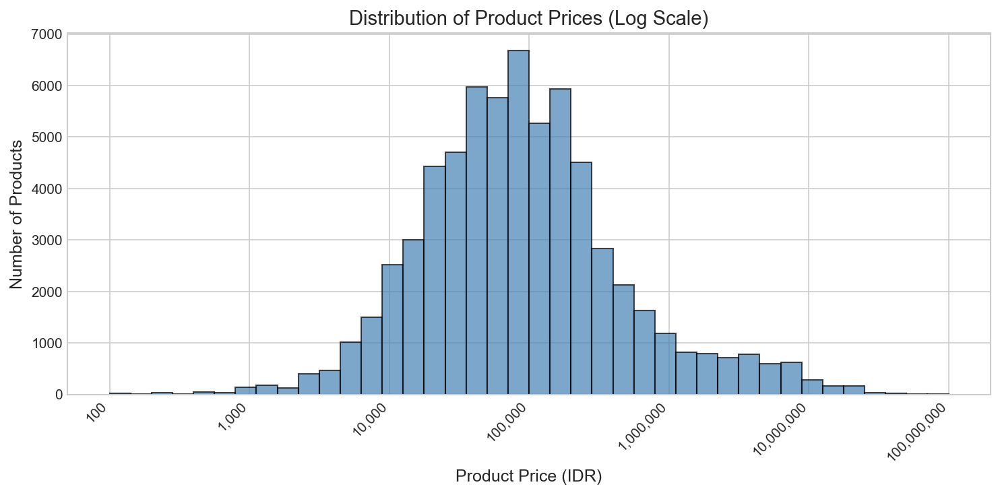

### 3.5 Price by Category

Electronics and Handphone & Tablet have the highest median prices, while Pertukangan (Tools) and Makanan (Food) have the lowest.

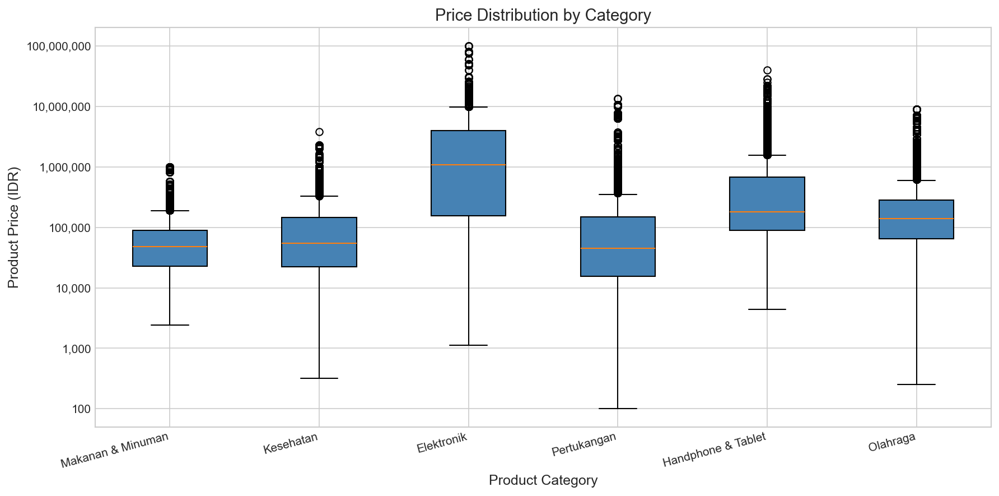

### 3.6 Review Length Distribution

- **Mean**: 78.6 characters
- **Median**: 59.0 characters
- **Range**: 4 - 32,857 characters

**Finding**: Negative reviews are significantly longer on average (144 chars) compared to positive reviews (77 chars). This may suggest that dissatisfied customers provide more detailed explanations of their issues.

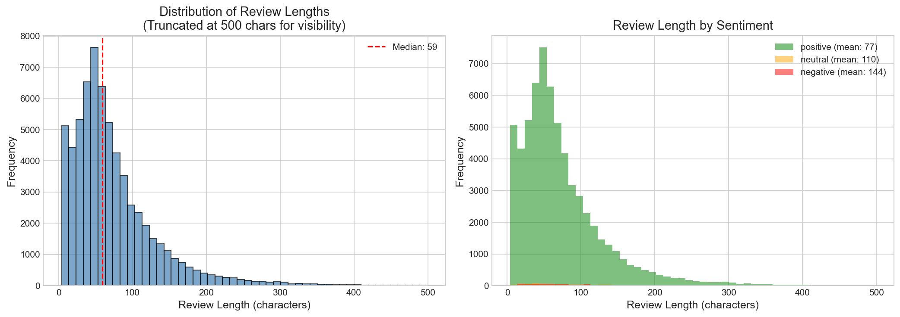

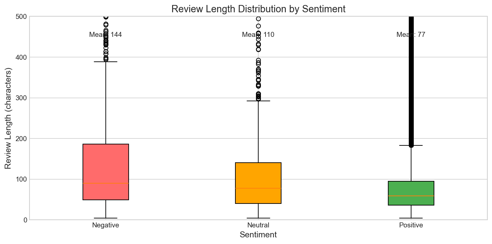

---

## 4. Temporal Analysis

### 4.1 Reviews Over Time

The dataset shows strong growth from 2015-2025:
- 2015-2019: Minimal activity (~1,300 total reviews)
- 2020: 2,708 reviews (COVID e-commerce boost)
- 2021-2025: 10,000-16,000 reviews per year

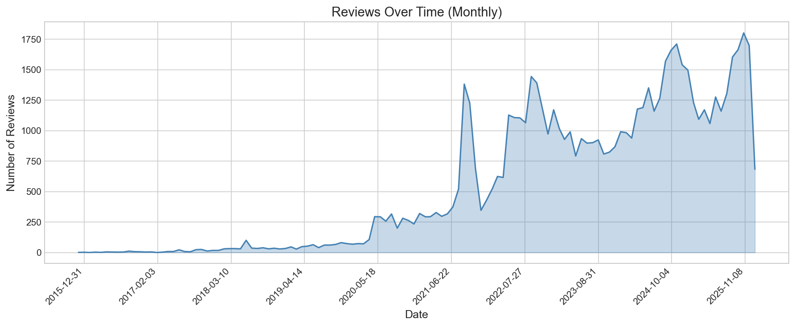

### 4.2 Rating Stability Over Time

Average ratings have remained remarkably stable (4.85-4.95) throughout the entire period, with no significant temporal trends.

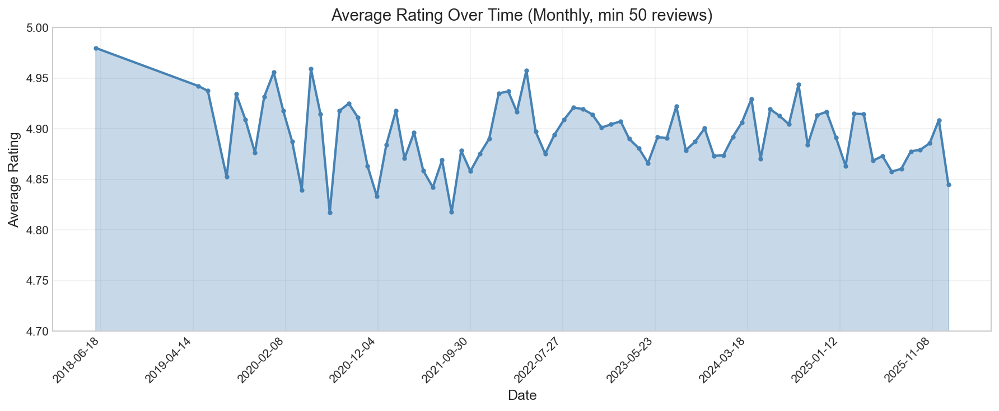

### 4.3 Rating by Year

The proportion of 5-star ratings has remained consistently dominant (>90%) across all years.

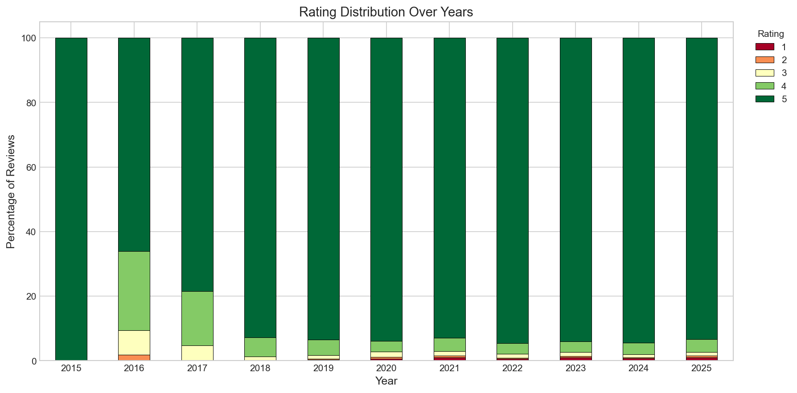

### 4.4 Seasonality

Reviews are relatively evenly distributed across days of the week and months, with no strong seasonal patterns detected.

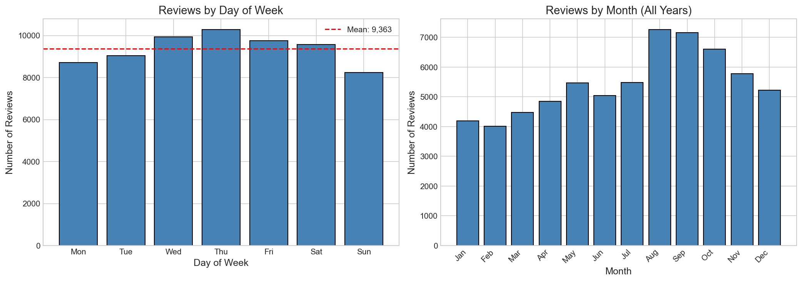

---

## 5. Category and Shop Analysis

### 5.1 Rating by Category

All categories show high average ratings (4.85-4.95), with minor variations:
- Elektronik: 4.95 (highest)
- Olahraga: 4.85 (lowest, but still very high)

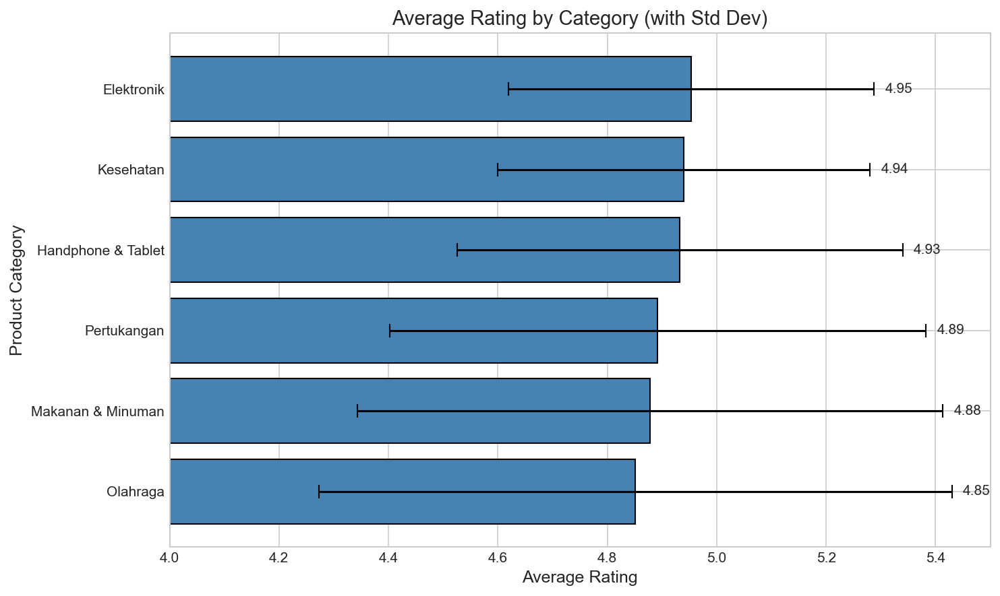

### 5.2 Sentiment by Category

Food & Beverage (Makanan & Minuman) shows slightly higher negative sentiment rate (1.8%) compared to other categories (~1%), possibly related to perishable product quality issues.

### 5.3 Shop Concentration

- Top 10 shops account for 15.2% of all reviews
- Top 1% of shops (~9 shops) account for 14.2% of reviews

This moderate concentration is typical for marketplace platforms.

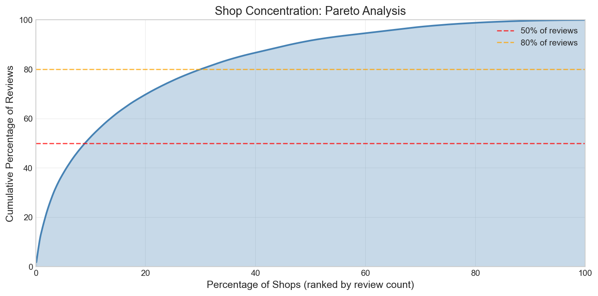

### 5.4 Reviews per Product/Shop

- **Reviews per product**: Mean=11.9, Median=12.0 (uniform distribution)
- **Reviews per shop**: Mean=76.6, Median=31.0 (right-skewed)

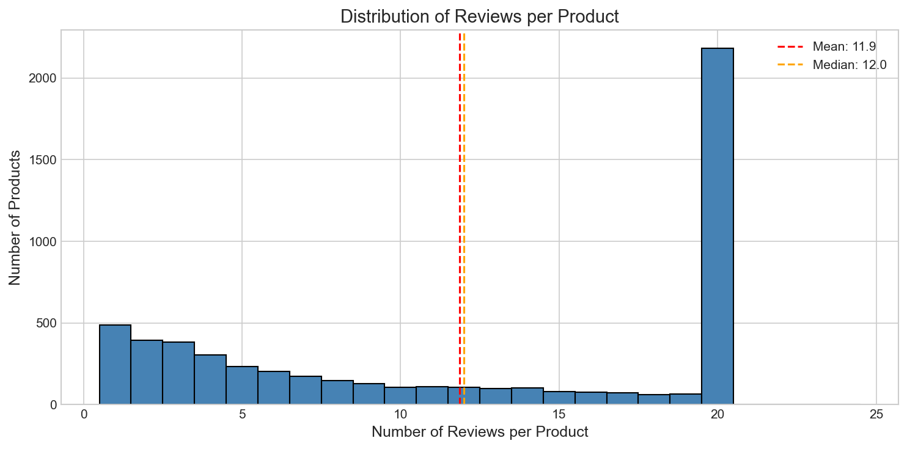

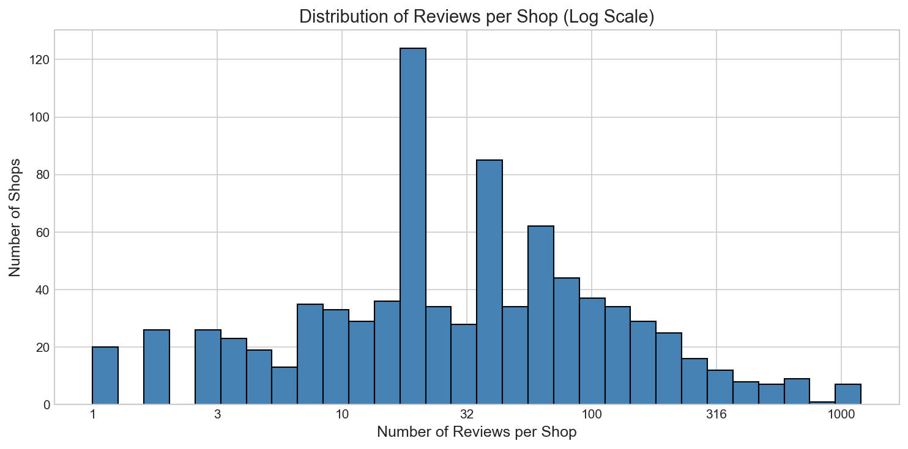

---

## 6. Text Analysis

### 6.1 Word Clouds by Sentiment

**Positive reviews** contain common Indonesian words like "bagus" (good), "sesuai" (as expected), "pengiriman cepat" (fast delivery).

**Negative reviews** feature words like "tidak" (no/not), "kecewa" (disappointed), "pecah" (broken).

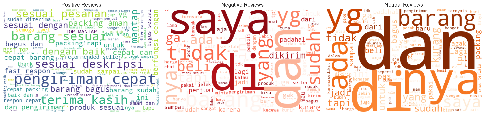

### 6.2 Common Review Patterns

The most common review texts are generic short phrases:
1. "Bagus..." (323x)
2. "mantap..." (288x)
3. "bagus..." (226x)
4. "Good..." (127x)
5. "sesuai pesanan..." (77x)

---

## 7. Relationships and Correlations

### 7.1 Price vs Sold Count

The scatter plot shows no strong correlation between price and sold count. Products at various price points can have high or low sales.

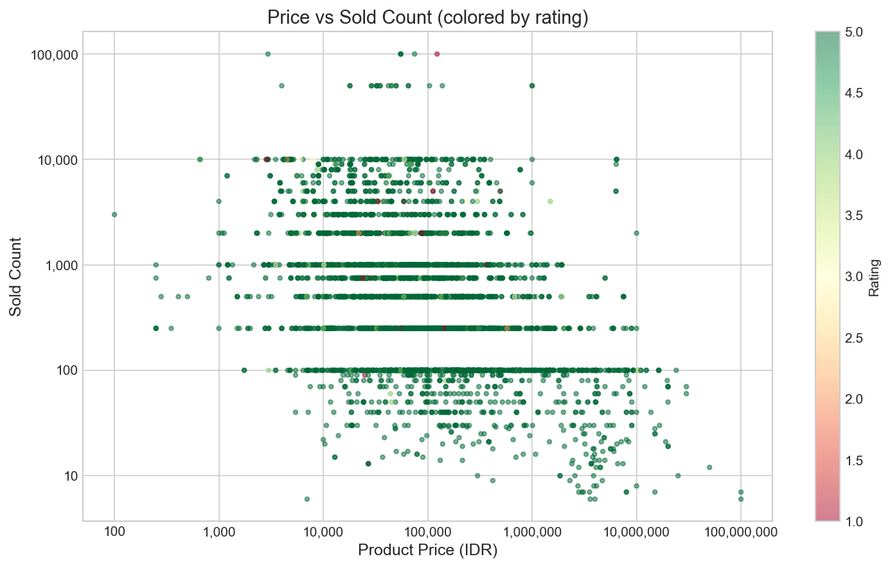

### 7.2 Rating by Price Quartile

There appears to be minimal relationship between price and rating. All price quartiles have average ratings between 4.87-4.90.

### 7.3 Sold Count by Rating

Products with lower ratings (1-2 stars) tend to have lower sold counts on average, but this could reflect either selection effects or actual relationship between quality and sales.

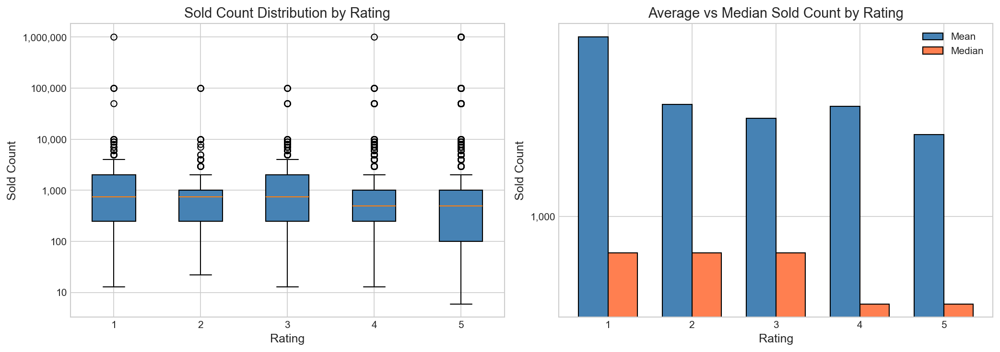

---

## 8. Key Findings

### 8.1 Clear Findings

1. **Extreme positive skew in ratings**: 93.9% of reviews are 5-star ratings, making this dataset unsuitable for fine-grained sentiment analysis without addressing class imbalance.

2. **Sentiment is derived from rating**: The sentiment_label column is a deterministic function of rating (1-2=negative, 3=neutral, 4-5=positive), providing no additional information.

3. **Sold count is heavily rounded**: 97.5% of values are round numbers, indicating these are display/estimated values rather than exact sales figures.

4. **Product variant is optional**: 59.2% missing values in product_variant is expected - not all products have variants.

5. **Negative reviews are longer**: Average 144 characters vs 77 for positive reviews.

### 8.2 Patterns Worth Further Investigation

1. **Food & Beverage has slightly higher negative sentiment rate**: May warrant investigation into specific product quality issues.

2. **No correlation between price and rating**: Counter to assumptions that higher-priced products might receive different rating patterns.

3. **Stable ratings over time**: Despite massive growth in review volume (2015-2025), average ratings remained constant, which may warrant investigation.

---

## 9. Recommendations for Data Use

### 9.1 Transformations

- **Price**: Use log transformation for modeling due to heavy right skew
- **Review length**: Consider capping or log transformation for outliers
- **Sold count**: Treat as ordinal/binned variable rather than continuous due to rounding

### 9.2 Feature Engineering Suggestions

- Create binary positive/negative target (combine ratings 1-3 vs 4-5)
- Extract review length as a feature
- Consider n-gram features from Indonesian text
- Create temporal features (year, month, day of week)

### 9.3 Caveats

- The **sentiment_label** column should be dropped or regenerated using NLP, as it currently provides no independent information
- The **sold_count** values are estimates and should not be used for precise sales analysis
- The extreme class imbalance (97.6% positive) requires careful handling in any classification task

---

## 10. Appendix: All Generated Figures

| Figure | Description |
|--------|-------------|
| 01_rating_distribution.png | Distribution of product ratings (1-5 stars) |
| 02_sentiment_distribution.png | Distribution of sentiment labels |
| 03_category_distribution.png | Reviews by product category |
| 04_rating_sentiment_heatmap.png | Cross-tabulation of rating vs sentiment |
| 05_price_distribution.png | Log-transformed price distribution |
| 06_sold_count_top_values.png | Most common sold count values |
| 07_reviews_over_time.png | Monthly review counts over time |
| 08_review_length_distribution.png | Review length distribution by sentiment |
| 09_rating_by_category.png | Average rating by category |
| 10_price_by_category.png | Price distribution by category |
| 11_shop_concentration.png | Pareto analysis of shop concentration |
| 12_missing_values.png | Missing values by column |
| 13_rating_by_year.png | Rating distribution over years |
| 14_duplicate_text_distribution.png | Distribution of repeated review texts |
| 15_sold_count_by_rating.png | Sold count distribution by rating |
| 16_wordclouds_by_sentiment.png | Word clouds for each sentiment |
| 17_price_vs_sold_count.png | Scatter plot of price vs sold count |
| 18_reviews_per_product.png | Distribution of reviews per product |
| 19_reviews_per_shop.png | Distribution of reviews per shop |
| 20_sentiment_by_category.png | Sentiment percentage by category |
| 21_reviews_by_day_month.png | Reviews by day of week and month |
| 22_rating_by_variant.png | Rating distribution by variant presence |
| 23_sold_count_concentration.png | Concentration at specific sold count values |
| 24_cumulative_by_sold_count.png | Cumulative reviews by sold count threshold |
| 25_price_by_sentiment.png | Price distribution by sentiment |
| 26_avg_rating_over_time.png | Average rating trend over time |
| 27_review_length_by_sentiment_box.png | Review length boxplot by sentiment |
| 28_rating_by_price_quartile.png | Rating by price quartile |

---

*Report generated by Claude Opus 4.5 (model: claude-opus-4-5-20251101)*

*Date: 2025-12-31*
