# Exploratory Data Analysis: Google Books Dataset

## 1. Dataset Overview

### 1.1 Subject Matter

This dataset contains metadata for 15,147 books collected from the Google Books API across 100 different search categories. Each book entry represents a distinct item in Google's catalog, with information ranging from basic bibliographic details to pricing and user ratings.

### 1.2 Data Structure

The dataset is provided as a single CSV file (`google_books_dataset.csv`) with 15,147 rows and 21 columns:

**Identifier columns:**
- `book_id`: Unique Google Books identifier
- `isbn_13`, `isbn_10`: International Standard Book Numbers

**Bibliographic information:**
- `title`, `subtitle`: Book titles (8 missing titles, 60.5% missing subtitles)
- `authors`: Author names, can be multiple comma-separated (23.3% missing)
- `publisher`: Publishing house (53.2% missing)
- `published_date`: Publication date in YYYY-MM-DD format (1.4% missing)
- `categories`: Primary book category (16.2% missing)
- `search_category`: The search query used to find this book (complete)

**Content metadata:**
- `description`: Book description text (44.9% missing)
- `page_count`: Number of pages (1.4% missing, but 5.7% are zero)
- `language`: Language code (complete, 97.8% English)

**Rating information:**
- `average_rating`: Average user rating 1-5 (94.3% missing - only 857 books rated)
- `ratings_count`: Number of ratings (complete, but 94.3% are zero)

**Commercial information:**
- `list_price`: Price in USD (80.6% missing)
- `currency`: Currency code (80.6% missing, all USD when present)
- `buyable`: Boolean indicating if book is available for purchase (complete)

**Links:**
- `preview_link`, `info_link`, `thumbnail`: URLs to Google Books resources

**Data Quality:**
- No duplicate book_ids
- No fully duplicate rows
- Total memory usage: 27.90 MB

## 2. General Statistics and Distributions

### 2.1 Numerical Variables

**Page Count** (n=14,933 with data):
- Mean: 485 pages, Median: 368 pages
- Range: 0 to 7,768 pages
- Notable: 858 books (5.7%) have page_count=0, suggesting missing or unavailable data
- Distribution is right-skewed with heavy tail (see Figure 1)

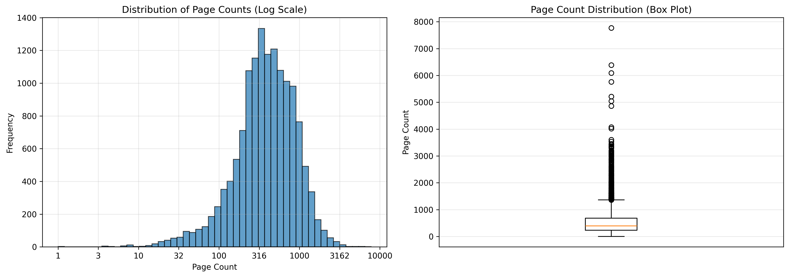
*Figure 1: Page count follows a log-normal distribution with median around 368 pages*

**Default Value Pattern in Page Counts:**
The value 0 dominates the page count data, accounting for 858 books (5.7% of all books with page_count data). This appears to be a placeholder for missing information rather than truly 0-page books. Interestingly, books with page_count=0 have **lower** missing description rates (12.8%) compared to books with page_count>0 (46.5%), suggesting these are not low-quality records but rather cases where page count was unavailable during data collection.

*Figure 2: Top 20 most frequent page count values, dominated by 0 (placeholder value)*

**Publication Year** (n=6,045 with valid years 1800-2025):
- Range: 1928 to 2025
- Mean: 2016, Median: 2017
- The dataset is heavily skewed toward recent publications, with most books from 2012-2021
- Strong concentration in 2017 (peak year)

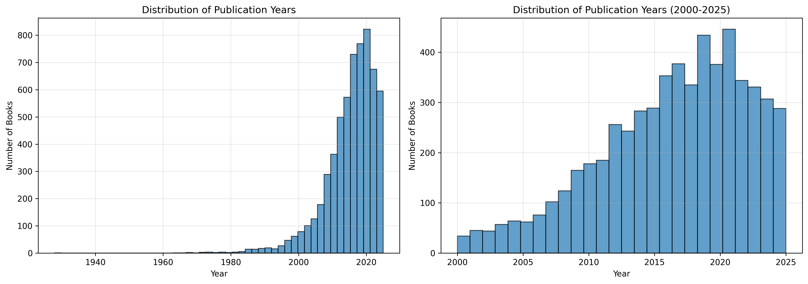
*Figure 3: Most books in the dataset were published in the 2010s-2020s*

**Average Rating** (n=857 books with ratings):
- Mean: 4.05, Median: 4.0
- Range: 1.0 to 5.0
- Distribution shows clustering at integer and half-integer values
- **Heavily skewed toward 5.0**: 348 books (40.6% of rated books) have perfect 5.0 rating

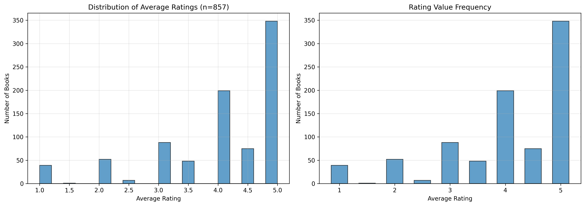
*Figure 4: Rating distribution shows high concentration at 5.0*

**Ratings Count**:
- 14,290 books (94.3%) have zero ratings
- Only 857 books (5.7%) have been rated
- Among rated books: mean=10.4 ratings, median=2 ratings
- Maximum: 826 ratings
- Distribution is heavily right-skewed

*Figure 5: Only 5.7% of books have any ratings; among those, most have very few*

**List Price** (n=2,943 books):
- Mean: $48.17, Median: $19.00
- Range: $0 to $1,755
- Only 17% of books have price information (all buyable books)
- Distribution is right-skewed with long tail

*Figure 6: Price distribution and buyability status*

### 2.2 Categorical Variables

**Categories** (1,829 unique values):
- Top category: Fiction (994 books, 6.6%)
- Top 20 categories cover only 28.4% of books
- High diversity suggests broad topic coverage

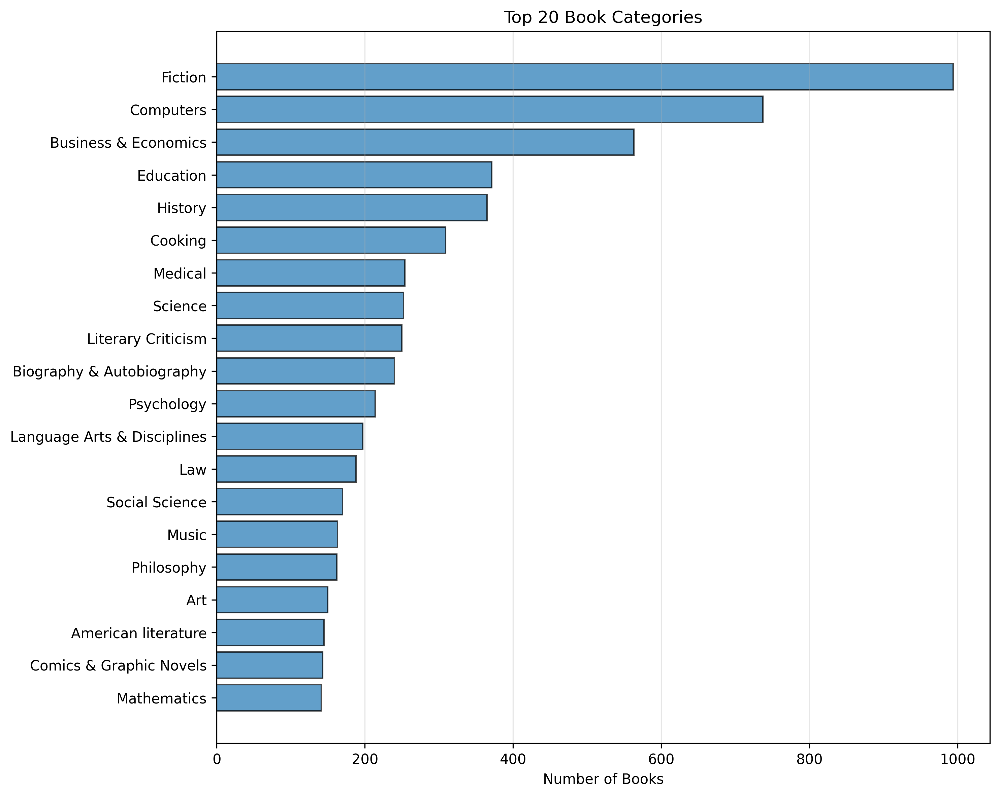
*Figure 7: Fiction, Computers, and Business & Economics dominate*

**Search Categories** (149 unique values):
- Fairly uniform distribution across categories
- Top category: "bestsellers 2024" (156 books, 1.0%)
- Top 20 categories cover only 19.9% of books
- Top 53 categories needed to cover 50% of books

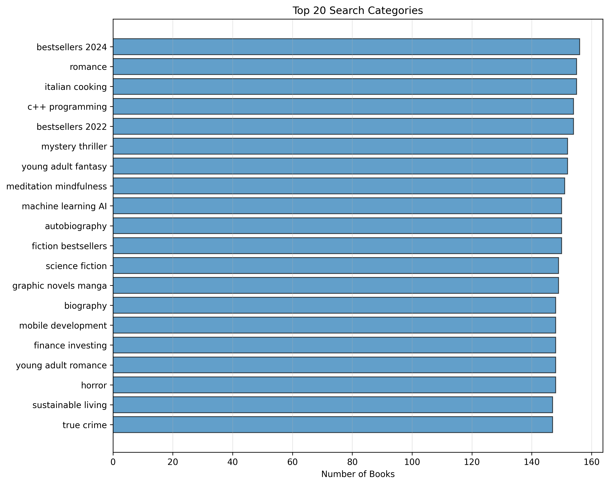
*Figure 8: Search categories are evenly distributed*

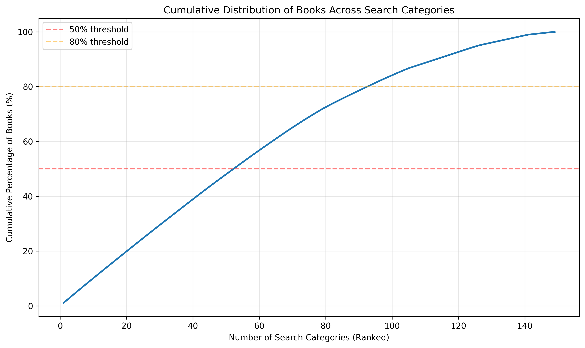
*Figure 9: Cumulative distribution shows low concentration - 80% of books require 93 different search categories*

**Language**:
- English dominates: 14,821 books (97.8%)
- Other languages: Spanish (69), German (42), French (35), Portuguese-BR (34)
- 15 languages total

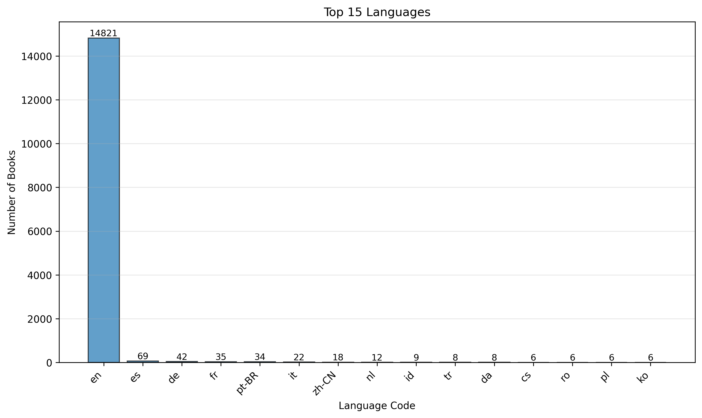
*Figure 10: English is the dominant language by far*

**Top Authors** (most prolific):
- Stephen King: 64 books
- James Patterson: 64 books
- Terry Pratchett: 61 books
- Brandon Sanderson: 60 books
- Nora Roberts: 60 books
- 2,618 books (17.3%) have multiple authors

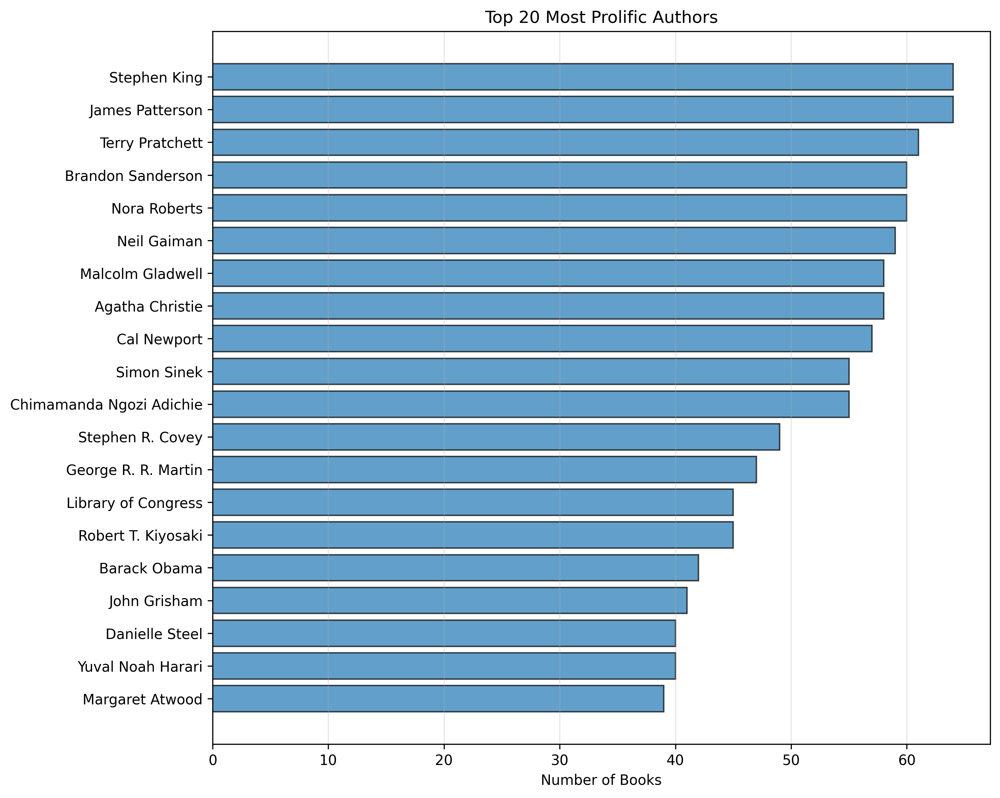
*Figure 11: Most prolific authors in the dataset*

**Publishers**:
- Only 46.8% of books have publisher information
- Top publisher: John Wiley & Sons (266 books)
- Followed by Routledge (253), Simon and Schuster (167)
- Mix of traditional publishers and self-publishing platforms

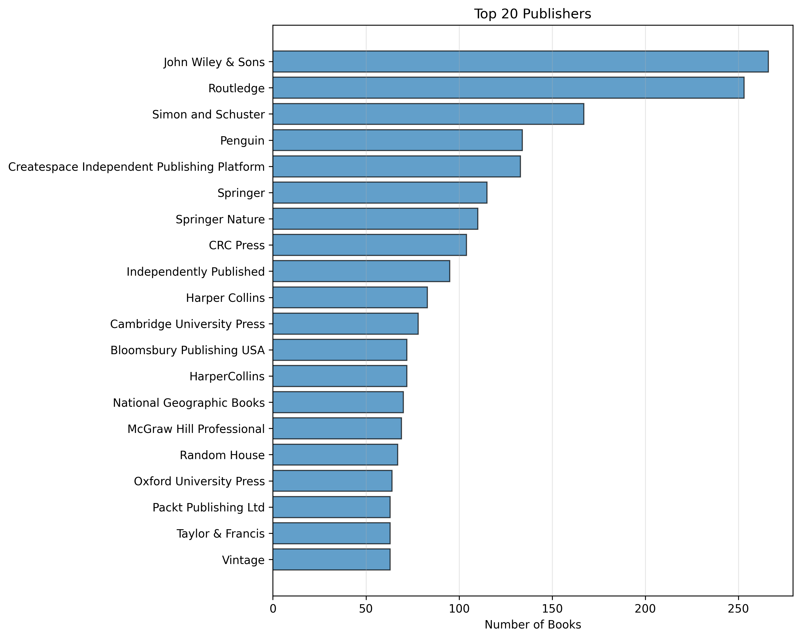
*Figure 12: Top publishers are dominated by academic and technical publishers*

## 3. Key Findings

### 3.1 Missing Data Patterns

The dataset has substantial missing data, with clear patterns:

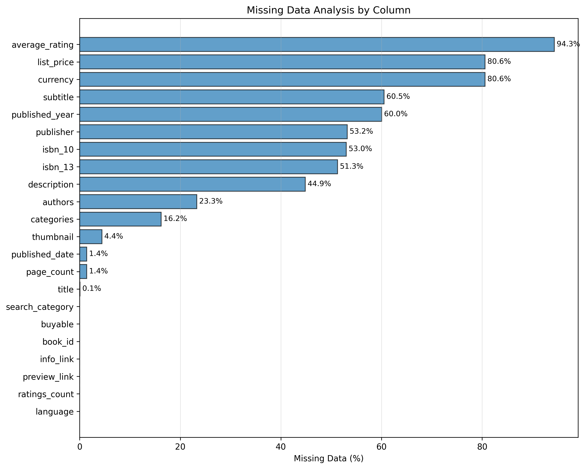
*Figure 13: Missing data varies dramatically by column*

**Highly incomplete (>80% missing):**
- `average_rating`: 94.3% missing (only rated books have this)
- `list_price` and `currency`: 80.6% missing (only buyable books)

**Moderately incomplete (40-60% missing):**
- `subtitle`: 60.5% missing (many books don't have subtitles)
- `publisher`: 53.2% missing
- `isbn_13` and `isbn_10`: ~51-53% missing
- `description`: 44.9% missing

**Well-populated (<25% missing):**
- `title`, `page_count`, `published_date`: <2% missing
- `categories`, `authors`: 16-23% missing
- `language`, `book_id`, `search_category`, `buyable`: complete

The missing data appears to reflect data availability in Google Books API rather than collection errors, as even books with extensive metadata may lack ISBNs or ratings.

### 3.2 Commercial Characteristics

**Buyability:**
- Only 2,577 books (17.0%) are buyable through Google Books
- All buyable books have price information (100% coverage)
- All prices are in USD

**Buyable vs Non-buyable Books:**
- Buyable books are **shorter**: mean=360 pages vs 511 pages for non-buyable
- Buyable books: median=290 pages
- Non-buyable books: median=400 pages
- Both groups share similar top categories (Fiction, Computers, Business)

**Price by Category:**
The most expensive categories (by mean price) are technical and professional:
- Technology & Engineering: $150.06
- Medical: $145.96
- Science: $110.42
- Law: $88.82
- Psychology: $70.84

The least expensive are consumer-oriented:
- House & Home: $8.53
- Juvenile Fiction: $8.09
- Comics & Graphic Novels: $8.78
- Young Adult Fiction: $8.78
- Fiction: $9.27

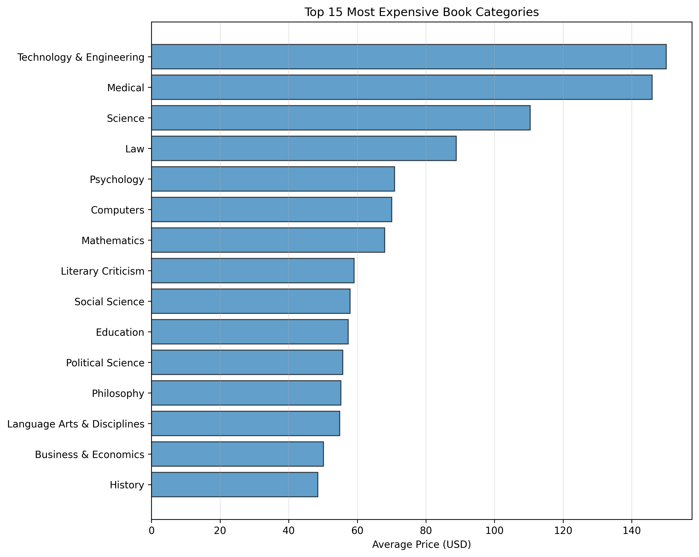
*Figure 14: Technical and academic categories command highest prices*

### 3.3 Relationship Between Variables

**Page Count vs Price:**
There is a positive relationship between page count and price, though with substantial variation. The relationship is approximately linear in log-log space, suggesting power-law scaling.

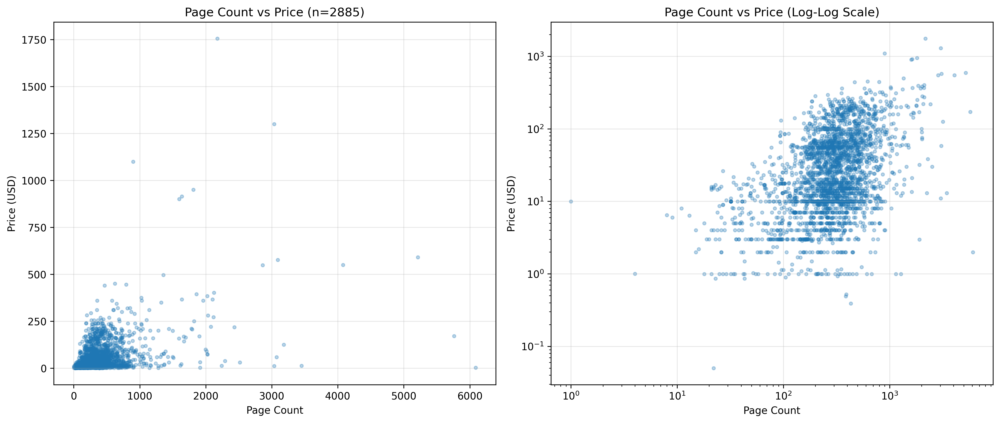
*Figure 15: Longer books tend to be more expensive, with high variation*

Price increases with page count ranges:
- 0-100 pages: median ~$10
- 100-200 pages: median ~$15
- 200-300 pages: median ~$18
- 300-500 pages: median ~$25
- 500-1000 pages: median ~$40

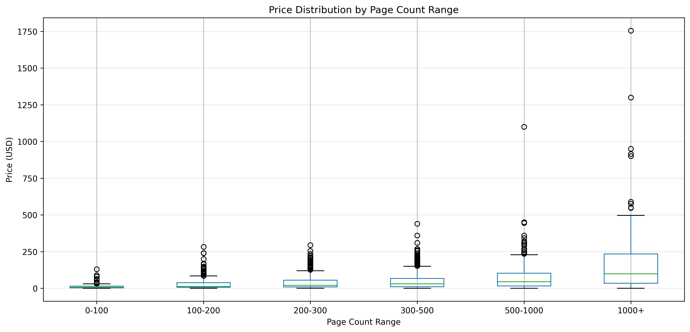
*Figure 16: Box plots reveal increasing price with page count, but wide variation*

**Ratings Count vs Average Rating:**
An **unexpected negative correlation** was observed (Spearman ρ = -0.147, p < 0.0001). This counterintuitive finding warrants investigation.

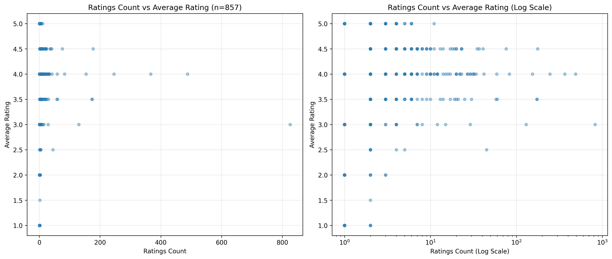
*Figure 17: Negative correlation between number of ratings and average rating*

**Investigation reveals:**
- Books with rating=5.0 have very few ratings: mean=1.4, median=1
- Books with rating<5.0 have more ratings: mean=10.4, median=2
- 325 out of 348 five-star books (93%) have ≤2 ratings
- Books with >50 ratings: **none** have 5.0 rating, most cluster at 3.5-4.0

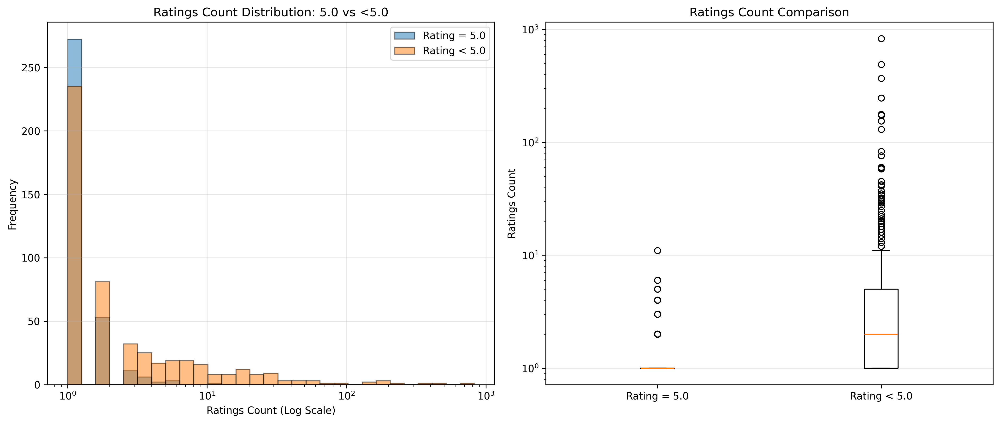
*Figure 18: Books with 5.0 rating have dramatically fewer ratings*

This pattern suggests that books with very few ratings are more likely to have extreme (5.0) scores, while books with many ratings regress toward more moderate values around 3.5-4.0. This is consistent with statistical expectation: small samples have higher variance.

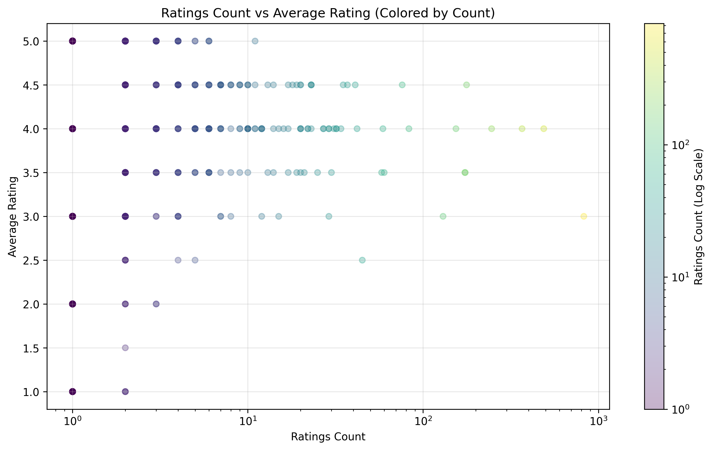
*Figure 19: Higher rating counts (darker colors) associate with lower average ratings*

Breaking down by ratings count bins:
- (0, 1] ratings: mean rating=4.03, median=5.0 (n=507)
- (1, 2] ratings: mean rating=4.11, median=4.5 (n=134)
- (2, 5] ratings: mean rating=4.10, median=4.0 (n=93)
- (50, 1000] ratings: mean rating=3.79, median=4.0 (n=14)

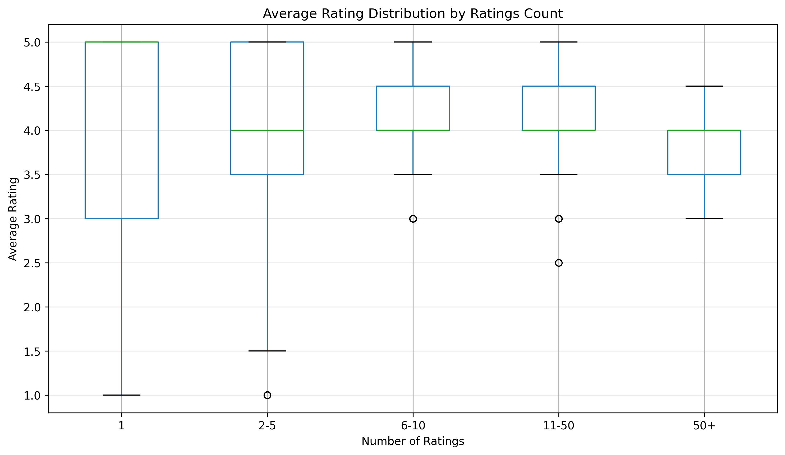
*Figure 20: Average rating decreases slightly as the number of ratings increases*

### 3.4 Temporal Trends

The dataset shows clear temporal patterns in publication years:

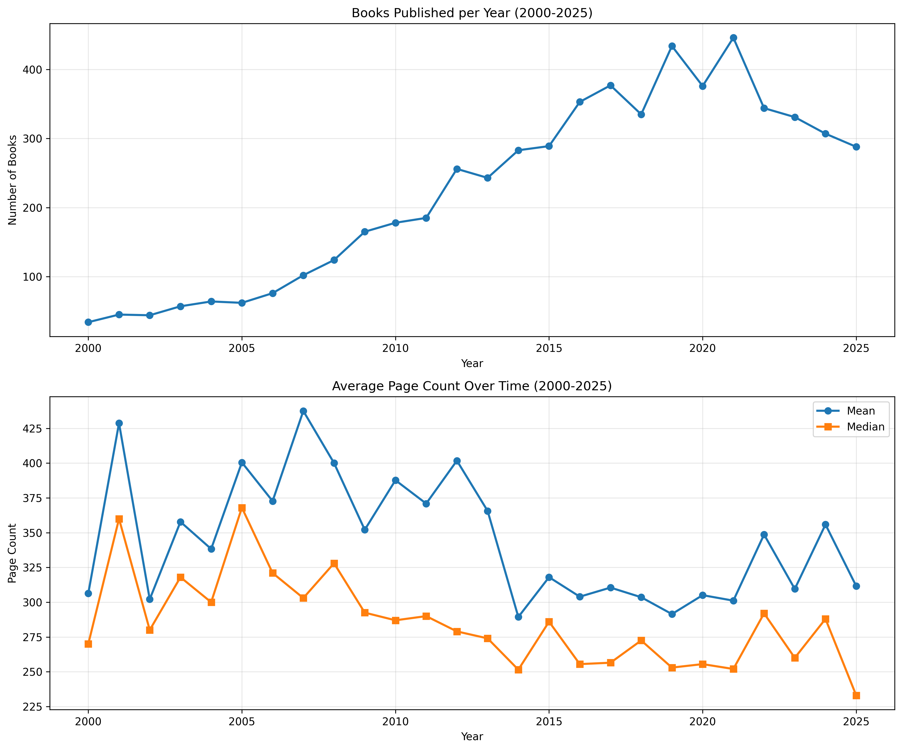
*Figure 21: Number of books and average page count over time*

**Books per Year (2000-2025):**
- Sharp increase from 2000-2017
- Peak around 2017-2019
- Slight decline in 2020-2022 (possibly COVID-19 related)
- Small uptick in 2023-2024

**Page Count Over Time:**
- Mean page count fluctuates between 400-600 pages
- No clear long-term trend
- Median consistently lower than mean (300-400 pages), confirming right-skew
- High year-to-year variation, especially in earlier years (smaller sample)

### 3.5 ISBN Coverage

- 48.7% of books have ISBN-13
- 47.0% of books have ISBN-10
- 47.0% have both ISBNs
- 51.3% have no ISBN at all

The lack of ISBNs for >50% of books suggests:
1. Many books may be digital-only or self-published
2. Older books (pre-ISBN era)
3. Non-book content (magazines, periodicals)

## 4. Data Quality and Recommendations for Further Work

### 4.1 Data Quality Issues

**1. Page Count = 0:**
- 858 books (5.7%) have page_count=0
- This is clearly a placeholder for missing data
- **Recommendation**: Treat as missing; do not include in analyses requiring page count

**2. Ratings Sparsity:**
- 94.3% of books have no ratings
- Only 857 books (5.7%) have any rating data
- Of rated books, 59% have ≤2 ratings
- **Recommendation**: Any ratings-based analysis should explicitly acknowledge severe sample selection; only 14 books have >50 ratings

**3. High Missing Data for Commercial Information:**
- 83% of books are not buyable
- Only 17% have pricing information
- **Recommendation**: Price-based analyses will have limited scope and may not generalize to full catalog

**4. Publisher and ISBN Coverage:**
- ~50% missing publisher information
- ~50% missing ISBN information
- **Recommendation**: These fields cannot be relied upon for comprehensive analyses

### 4.2 Potential Data Transformations

**Page Count:**
- Use log transformation for modeling (distribution is log-normal)
- Remove or separately handle page_count=0 values
- Consider capping extreme outliers (>5000 pages) or investigating them individually

**Price:**
- Use log transformation (heavy right tail)
- All prices are in USD, no currency conversion needed
- Consider analyzing price per page as a normalized metric

**Ratings:**
- Given sparsity, consider binary classification (rated vs unrated) rather than regression on rating values
- For books with ratings, consider weighting by ratings_count to reduce impact of single-rating books
- Minimum threshold (e.g., ≥5 ratings) for reliability

**Publication Year:**
- Focus analyses on 2000-2025 period (94% of books with valid years)
- Handle pre-2000 books separately if temporal analysis is needed

**Missing Data Handling:**
- Multiple imputation unlikely to work well given >80% missingness in some fields
- Use complete-case analysis for specific research questions
- Explicitly report sample sizes after filtering

### 4.3 Suggested Transformations Summary

| Variable | Transformation | Reason |
|----------|---------------|---------|
| page_count | log10, exclude 0 | Log-normal distribution, 0 is placeholder |
| list_price | log10 | Heavy right tail |
| ratings_count | log10 (when >0) | Heavy right tail |
| published_year | No transform, filter to 2000+ | Recent years have better coverage |
| average_rating | Treat with caution | Most values are 5.0 with 1 rating |

## 5. Conclusions

### 5.1 Clear Findings

1. **Dataset Scope**: This is a comprehensive catalog of 15,147 books from Google Books, heavily weighted toward recent English-language publications (2012-2021).

2. **Commercial Availability**: Only 17% of books are buyable through Google Books. Buyable books are shorter (median 290 vs 400 pages) and have complete pricing in USD.

3. **Category Diversity**: High diversity in both categories (1,829 unique) and search categories (149 unique), with Fiction, Computers, and Business & Economics being most common.

4. **Price Stratification**: Technical and academic books (Medicine, Technology, Science, Law) cost 10-20x more than consumer books (Fiction, Comics, Young Adult).

5. **Page Count Pattern**: Books follow log-normal distribution with median 368 pages; 5.7% have placeholder value of 0.

6. **Language Homogeneity**: 97.8% English, suggesting either data collection bias or genuine market dominance.

7. **Ratings Scarcity**: 94.3% of books have no ratings. The 5.7% that do are heavily skewed toward books with only 1-2 ratings.

8. **Prolific Authors**: Top authors have 60-64 books each (King, Patterson, Pratchett, Sanderson, Roberts).

### 5.2 Interesting but Uncertain Findings

1. **Negative Ratings Correlation**: Books with more ratings have lower average ratings (ρ=-0.147). This appears to be driven by regression to the mean - books with few ratings (1-2) often have perfect 5.0 scores, while books with many ratings (50+) cluster around 3.5-4.0. However, the mechanism behind this pattern (sample size effect, selection bias, or genuine quality differences) requires additional data to establish.

2. **Page Count = 0 Paradox**: Books with page_count=0 have **less** missing description data than books with valid page counts (12.8% vs 46.5%). This is counterintuitive - one might expect books missing page count to be lower-quality records. This pattern suggests data collection occurred in multiple stages or from multiple sources with different metadata completeness.

3. **Publication Spike 2017-2019**: The dataset shows a peak in publications around 2017-2019, followed by a decline. Whether this reflects actual publishing trends, Google Books digitization priorities, or data collection methodology is unclear.

4. **Buyable Books Are Shorter**: Median page count for buyable books (290) is notably lower than non-buyable (400). This could reflect market preferences for shorter ebooks, pricing strategies, or selection bias in what Google offers for sale.

### 5.3 Motivating Questions for Further Investigation

1. **What explains the low rating coverage?** Is this because most books in Google Books are never read/rated, or is rating data simply not exposed via the API for most books?

2. **Can we predict which books become buyable?** Is it publisher-driven, genre-driven, or based on other factors?

3. **Why do technical books cost so much more?** Is it purely market segmentation, or do production costs (equations, diagrams) differ substantially?

4. **What distinguishes books that get many ratings?** The 66 books with >10 ratings are a tiny elite (0.4% of dataset). What makes them different?

5. **Can we improve page count data?** The 858 books with page_count=0 have descriptions; could page count be estimated from description length or other features?

6. **Are self-published books distinguishable?** Publishers like "Independently Published" and "Createspace" appear frequently. Can we identify patterns in pricing, length, or ratings for self-published vs traditionally published books?

---

**Report generated by:** EDA Agent (Claude Sonnet 4.5)  
**Date:** December 31, 2024  
**Dataset:** google_books_dataset.csv (15,147 books, 21 features)
