# Exploratory Data Analysis: Los Angeles Crime Data (2020-Present)

## 1. Dataset Description

### 1.1 Subject Matter
This dataset contains crime incident reports from the Los Angeles Police Department (LAPD) covering the period from January 1, 2020 to May 29, 2025. The data includes detailed information about each crime incident, including temporal information, crime classification, victim demographics, location details, and case status.

### 1.2 Data Structure
- **Single file**: `Crime_Data_from_2020_to_Present.parquet`
- **Total records**: 1,004,991 crime incidents
- **Columns**: 28 original columns plus derived time fields
- **No missing values**: All fields are populated (though many use coded values like 0 or "Unknown" for missing information)
- **No duplicate records**: Zero exact duplicates found

### 1.3 Key Data Fields

**Identification and Temporal:**
- `DR_NO`: Division of Records Number (unique identifier)
- `Date Rptd`: Date crime was reported
- `DATE OCC`: Date crime occurred
- `TIME OCC`: Time crime occurred (datetime.time objects)
- Derived fields: `occ_year`, `occ_month`, `occ_date`, `occ_day`

**Classification:**
- `Crm Cd` / `Crm Cd Desc`: Crime code and description
- `Part 1-2`: Crime severity (1 = serious crimes, 2 = less serious)
- `Status` / `Status Desc`: Case status
- `Mocodes`: Modus operandi codes

**Victim Information:**
- `Vict Age`: Victim age (includes 0 for unknown, negative values present)
- `Vict Sex`: Male, Female, Unknown, Transgender/Other
- `Vict Descent`: Ethnicity/descent

**Location:**
- `AREA` / `AREA NAME`: LAPD area code and name (21 areas)
- `Rpt Dist No`: Reporting district
- `Premis Cd` / `Premis Desc`: Premise code and description
- `LOCATION`: Street address
- `LAT` / `LON`: Geographic coordinates

**Weapon:**
- `Weapon Used Cd` / `Weapon Desc`: Weapon code and description

---

## 2. General Statistics and Distributions

### 2.1 Temporal Patterns

**Annual Trends:**
The dataset shows an increasing trend in reported crimes from 2020 through 2022, followed by a slight decline. Note that 2024 data appears incomplete (only 127,567 records), and 2025 has minimal data (97 records through May 29).

- 2020: 199,847 crimes
- 2021: 209,876 crimes (5.0% increase)
- 2022: 235,259 crimes (12.1% increase)
- 2023: 232,345 crimes (1.2% decrease)
- 2024: 127,567 crimes (incomplete year)

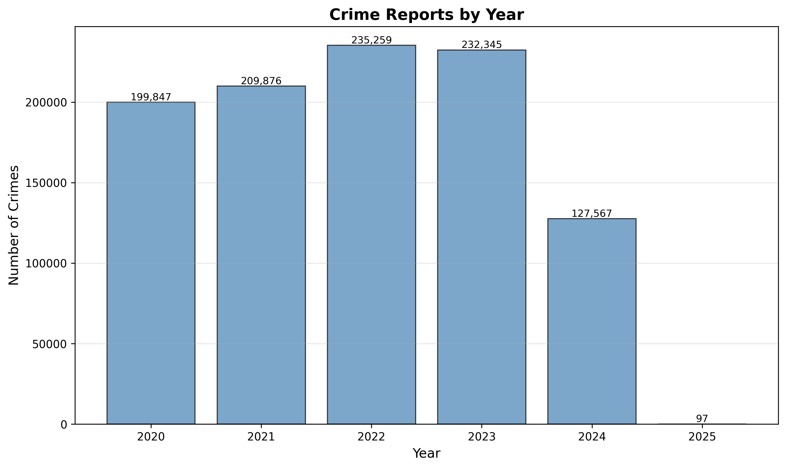

**Seasonal Patterns:**
Crime distribution across months appears relatively uniform, with slight variations. The monthly time series shows some volatility but no dramatic seasonal patterns.

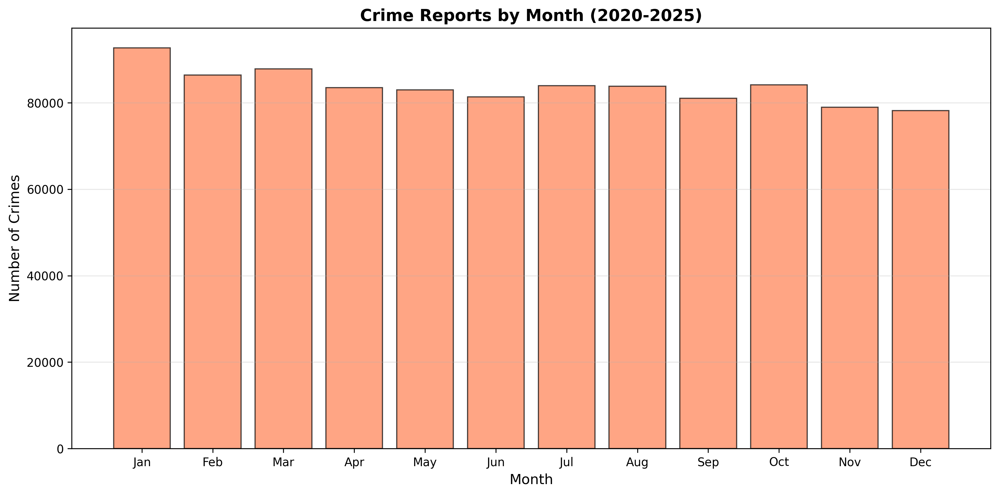
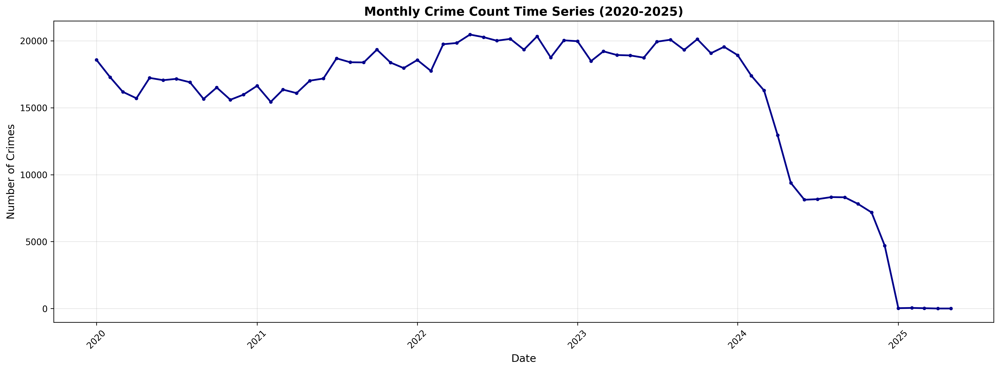

**Weekly Patterns:**
Friday has the highest crime count (153,676), while Tuesday has the lowest (138,141). The difference between highest and lowest is approximately 11.2%, showing relatively modest weekly variation.

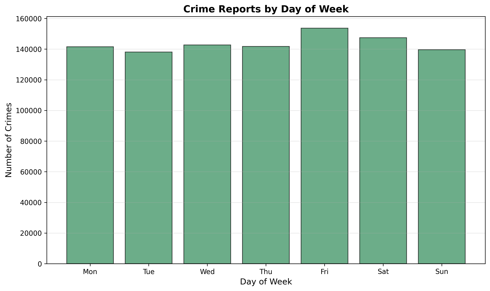

**Hourly Patterns:**
Crime distribution by hour shows a pronounced peak at noon (12:00) with 67,813 crimes, which is substantially higher than other hours. This is 3.9 times higher than the lowest hour (5:00 AM with 17,290 crimes). The data shows increased activity during daytime and evening hours (10:00-23:00) compared to early morning hours (1:00-6:00).

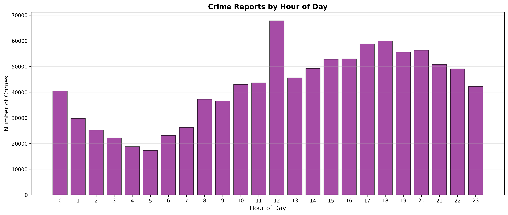

The heatmap of crimes by day and hour reveals that the noon peak is consistent across all days of the week, though slightly more pronounced on weekdays.

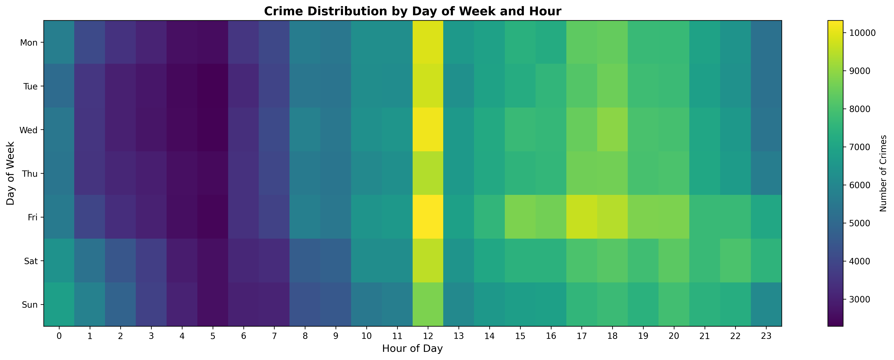

**Reporting Delay:**
The median reporting delay is 1 day, but the mean is 12.2 days, indicating a right-skewed distribution with some crimes reported long after occurrence:
- Same-day reports: 482,066 (48.0%)
- Within 7 days: 872,852 (86.9%)
- After 1 year: 7,523 (0.7%)

The longest delays likely correspond to crimes like identity theft that may not be discovered immediately.

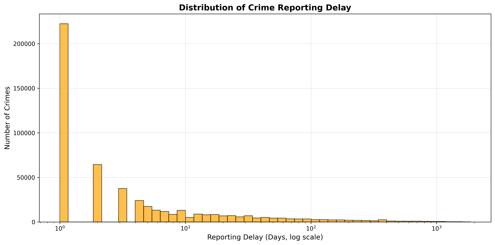

### 2.2 Crime Type Distribution

**Crime Concentration:**
The dataset contains 140 distinct crime types, but crime incidents are highly concentrated:
- Top 7 crime types account for 50% of all crimes
- Top 15 crime types account for 80% of all crimes

This demonstrates a typical long-tail distribution where most crime volume comes from a small number of crime categories.

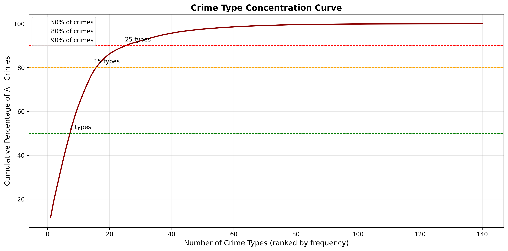

**Most Common Crimes:**
The top 15 crime types are:

1. VEHICLE - STOLEN: 115,190 (11.5%)
2. BATTERY - SIMPLE ASSAULT: 74,839 (7.4%)
3. BURGLARY FROM VEHICLE: 63,517 (6.3%)
4. THEFT OF IDENTITY: 62,537 (6.2%)
5. VANDALISM - FELONY: 61,092 (6.1%)
6. BURGLARY: 57,871 (5.8%)
7. THEFT PLAIN - PETTY: 53,717 (5.3%)
8. ASSAULT WITH DEADLY WEAPON: 53,525 (5.3%)
9. INTIMATE PARTNER - SIMPLE ASSAULT: 46,712 (4.6%)
10. THEFT FROM MOTOR VEHICLE - PETTY: 41,314 (4.1%)

Vehicle-related crimes (stolen vehicles, burglary from vehicle, theft from vehicle) collectively represent a substantial portion of all crimes.

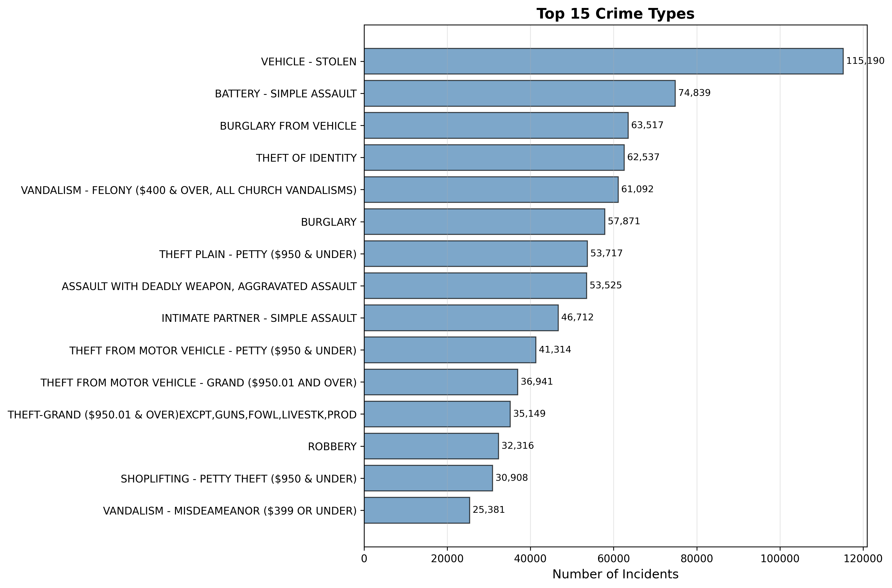

**Crime Severity:**
Crimes are classified into two categories:
- Part 1 (Serious crimes): 602,645 (60.0%)
- Part 2 (Less serious): 402,346 (40.0%)

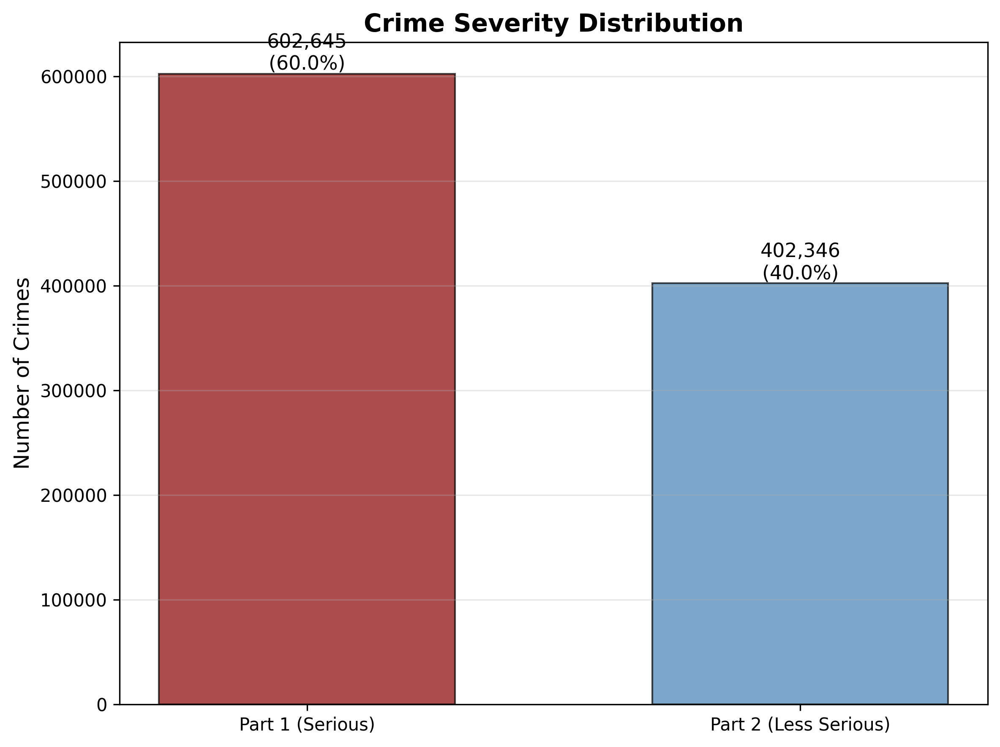

**Crime Categories Over Time:**
Categorizing crimes into Violent, Property, and Other reveals that property crimes dominate (62.8%), followed by violent crimes (25.2%). The time series shows all three categories following similar trends with a notable increase in 2021-2022.

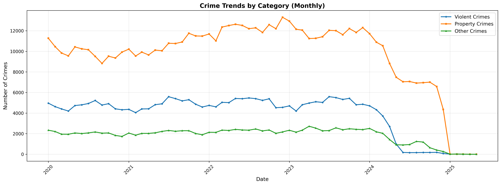

### 2.3 Victim Demographics

**Age Distribution:**
A critical data quality issue is that 269,222 records (26.8%) have victim age = 0, which appears to be a placeholder for unknown age. Additionally, 137 records have negative ages (-1 to -4), also indicating data entry issues or unknown values.

For the valid age range (2 to 120):
- Median age: 37 years
- Mean age: 39.5 years
- The distribution shows a right skew with most victims between ages 20-60

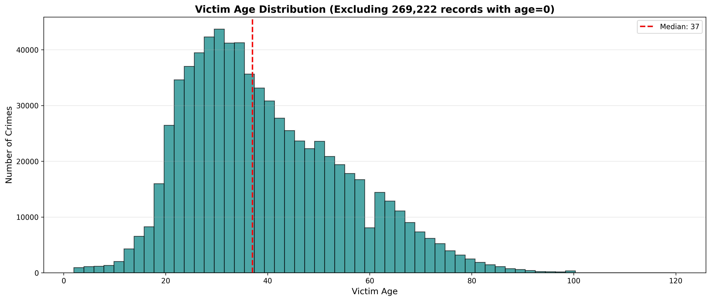

**Age Placeholder Values:**
The bar chart of most frequent age values reveals that age = 0 dominates by a massive margin (269,222 occurrences), confirming this is a default/unknown value. Beyond zero, the distribution appears relatively natural with common ages like 25, 30, 35, 40 showing elevated frequencies due to age rounding.

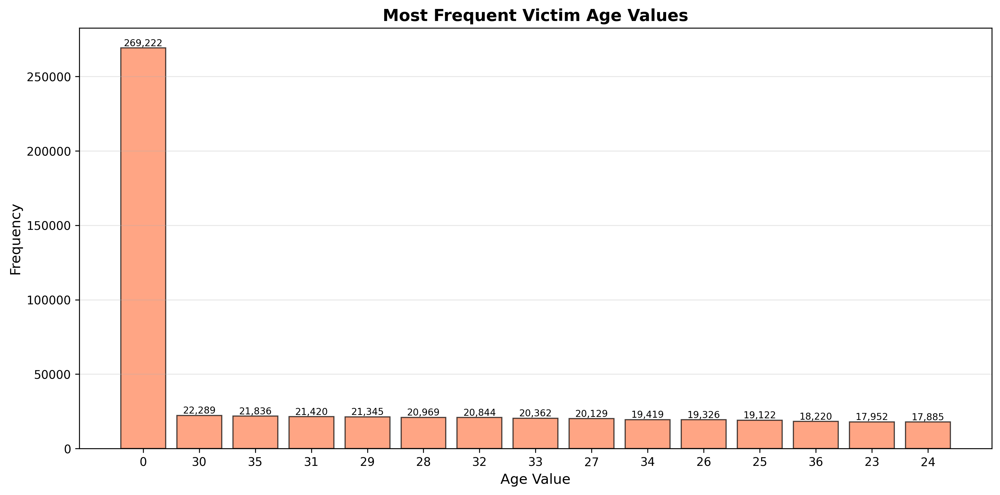

**Sex Distribution:**
- Male: 403,879 (40.2%)
- Female: 358,580 (35.7%)
- Unknown: 242,418 (24.1%)
- Transgender/Other: 114 (0.0%)

Nearly one-quarter of records have unknown victim sex, indicating substantial missing demographic information.

**Descent/Ethnicity:**
The most represented groups are:
- Hispanic/Latin/Mexican: 296,404 (29.5%)
- Unknown: 251,341 (25.0%)
- White: 201,442 (20.0%)
- Black: 135,816 (13.5%)
- Other: 78,005 (7.8%)

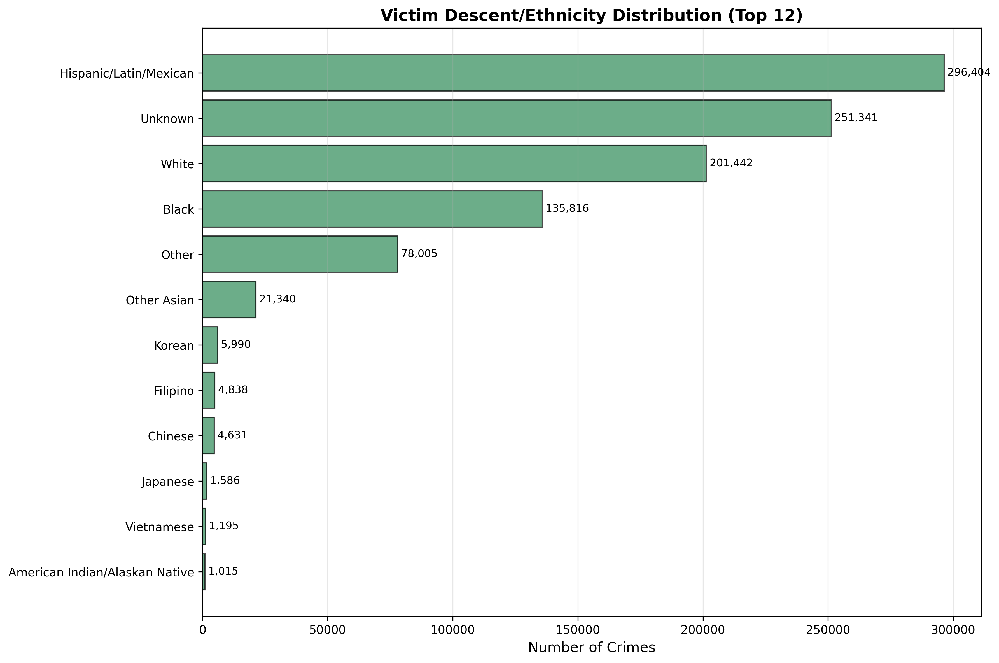

**Age by Sex:**
Box plots show that age distributions are similar across male and female victims, with both having median ages around 37-38. The "Unknown" sex category shows a similar age distribution, suggesting these are not systematically different types of crimes.

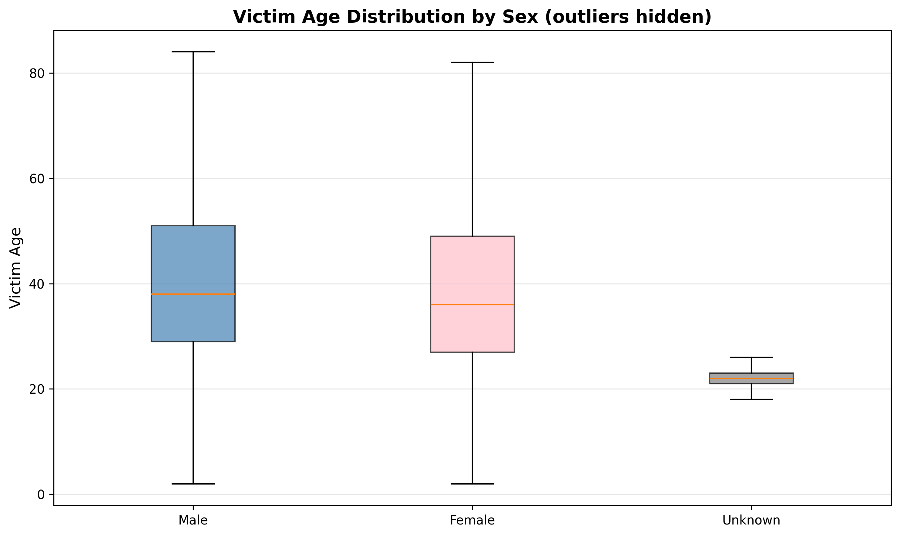

### 2.4 Location Analysis

**LAPD Areas:**
Crimes are distributed across 21 LAPD areas with considerable variation:
- Highest: Central (69,670 crimes)
- Lowest: Foothill (33,133 crimes)
- Ratio: 2.1:1 (highest to lowest)

The Central area has more than twice the crime volume of the lowest area, which may reflect both population density and the nature of activities in downtown Los Angeles.

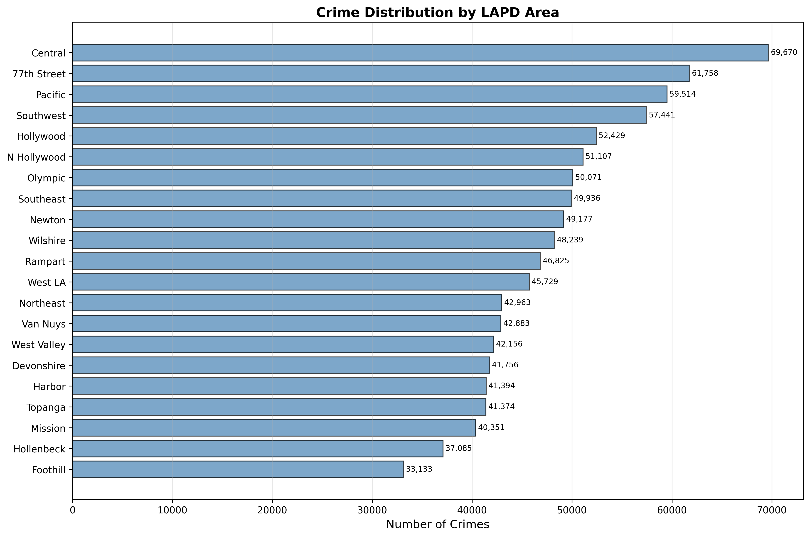

**Premises:**
The most common crime locations are:
- STREET: 261,284 (26.0% of all crimes)
- SINGLE FAMILY DWELLING: 143,362 (14.3%)
- MULTI-UNIT DWELLING: 119,661 (11.9%)
- PARKING LOT: 77,370 (7.7%)
- SIDEWALK: 46,464 (4.6%)

Over one-quarter of all crimes occur on streets, followed by residential properties.

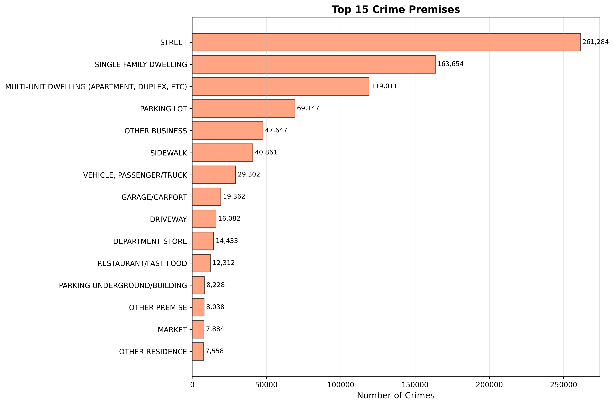

**Geographic Distribution:**
The geographic scatter plot and heatmap show crime concentrated in central Los Angeles, with clear hotspots. Only 2,240 records (0.22%) have missing coordinates (coded as 0,0), indicating good geocoding coverage.

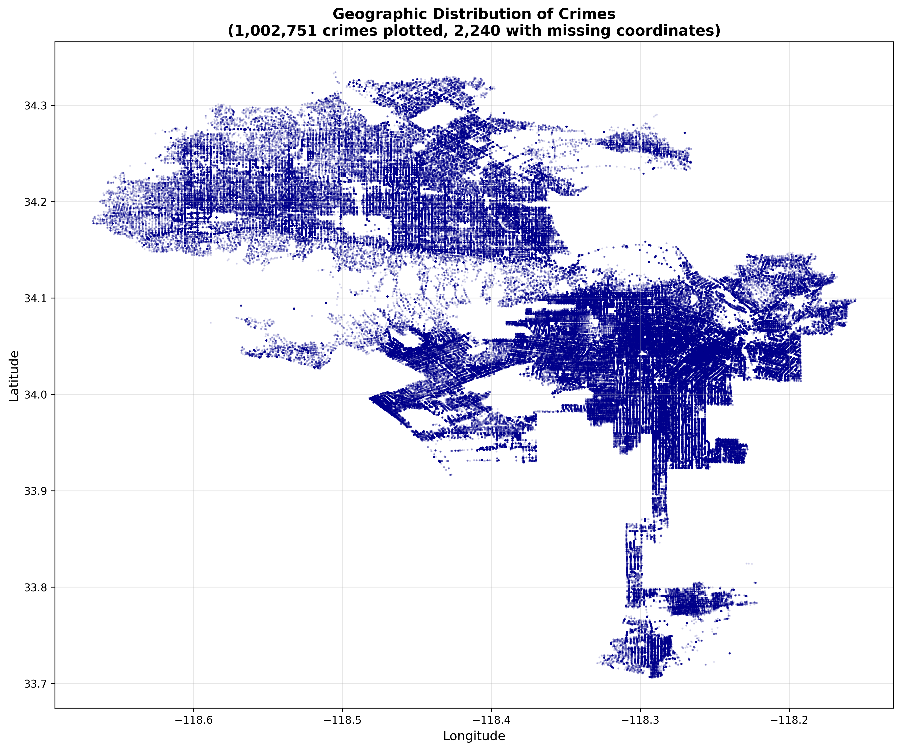

### 2.5 Weapons

In 67.4% of crimes (677,744 records), the weapon is listed as "Unknown". Among crimes with known weapons:
- STRONG-ARM (hands, fist, feet, bodily force): 174,761
- KNIFE WITH BLADE 6 INCHES OR LESS: 19,033
- HAND GUN: 17,653
- VERBAL THREAT: 13,859
- UNKNOWN FIREARM: 9,998

The prevalence of "strong-arm" indicates many assaults and batteries do not involve weapons beyond physical force.

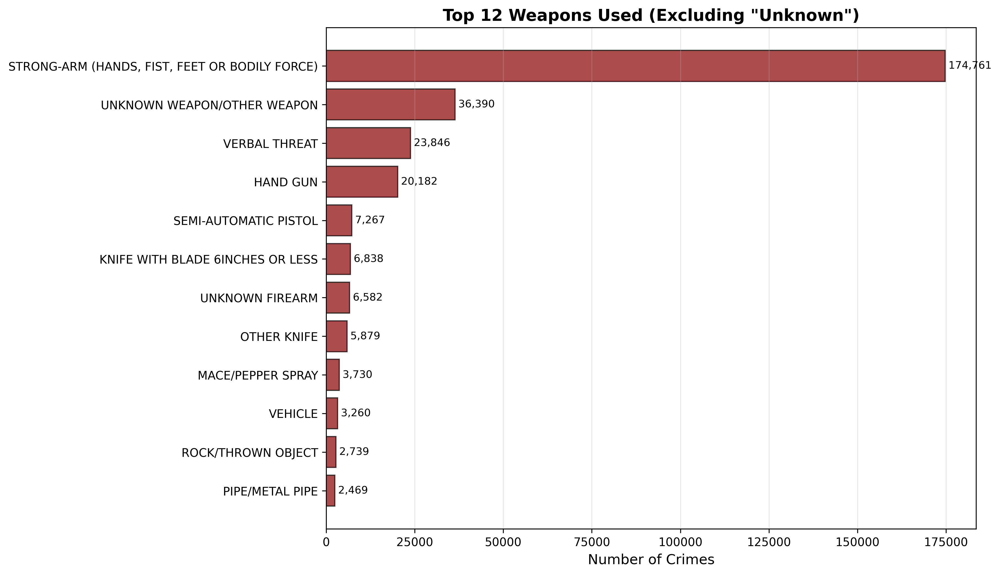

### 2.6 Case Status

The vast majority of cases (79.9%) have status "Invest Cont" (Investigation Continuing):
- Invest Cont: 802,862 (79.9%)
- Adult Other: 109,802 (10.9%)
- Adult Arrest: 87,155 (8.7%)
- Juv Arrest: 3,286 (0.3%)
- Juv Other: 1,879 (0.2%)

Only 9.0% of all crimes result in an arrest (combining Adult Arrest and Juv Arrest).

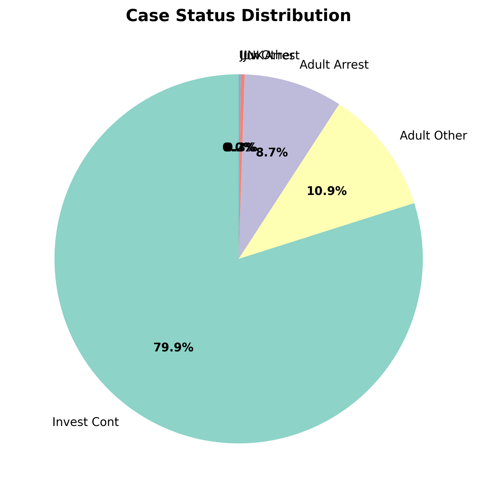

---

## 3. Key Findings

### 3.1 Temporal Insights

**The Noon Spike:**
The most striking temporal pattern is the dramatic peak at 12:00 noon, with 67,813 crimes. This is 35,200 crimes at exactly 12:00 (3.5% of all crimes occurring at a single hour marker). This concentration suggests data entry practices where the default time "12:00:00" may be used when exact time is unknown. The peak is far more extreme than would be expected from natural crime patterns alone.

**Consistent Weekly Patterns:**
Unlike some crime datasets that show strong weekend effects, this data shows relatively modest day-of-week variation (11.2% difference between highest and lowest). Friday shows the highest count, but the difference is not dramatic.

**Pandemic Recovery:**
The year-over-year increase from 2020 to 2022 may reflect both actual crime trends and reporting behavior changes during and after the COVID-19 pandemic.

### 3.2 Crime Type Patterns

**Property Crime Dominance:**
Property crimes (theft, burglary, vehicle-related) account for 62.8% of all crimes. Vehicle-related crimes alone (stolen vehicles, burglary from vehicle, theft from vehicle) represent approximately 22% of all crimes, indicating vehicle security is a major public safety concern.

**Low Arrest Rates:**
With only 9.0% of crimes resulting in arrest, the data reveals challenges in crime resolution. The heatmap of arrest rates by crime type shows substantial variation:
- Intimate partner assaults: ~20-25% arrest rate
- Most property crimes: <5% arrest rate
- Identity theft: <1% arrest rate

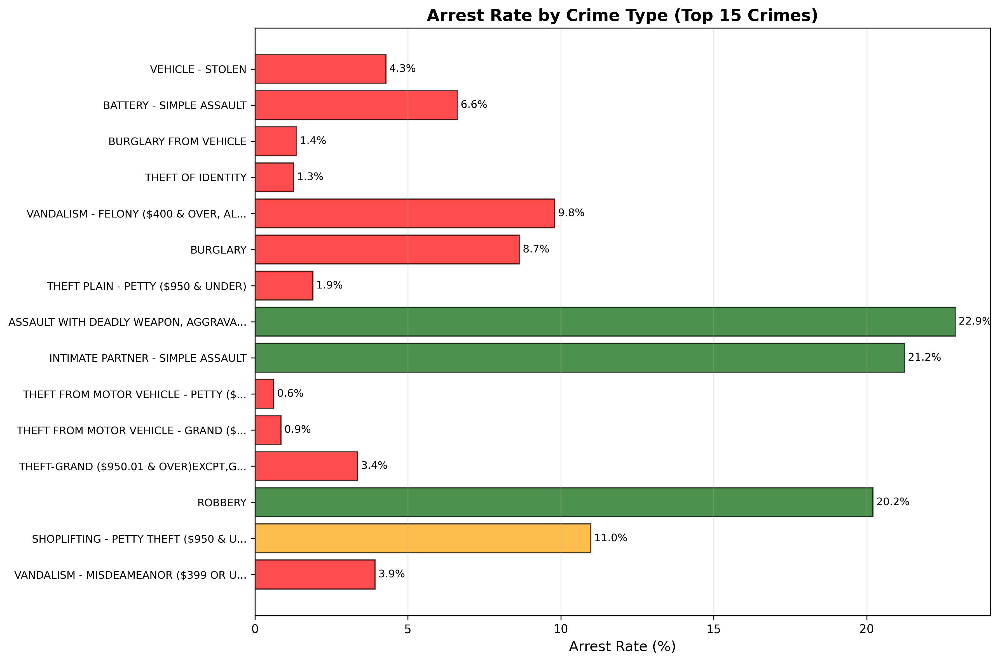

**Crime Type Variation by Hour:**
The heatmap of top crime types by hour reveals distinct temporal patterns:
- Battery and assault crimes peak in evening hours (18:00-23:00)
- Vehicle theft is more evenly distributed across hours
- Identity theft and fraud show the noon peak more strongly, supporting the hypothesis of default time entry

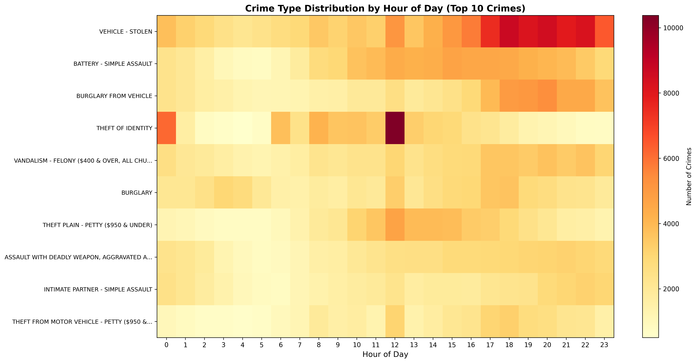

### 3.3 Victim Characteristics

**Age as a Data Quality Issue:**
The 26.8% of records with age = 0 represents a significant data quality concern. This is not randomly distributed - certain crime types (e.g., vehicle theft, vandalism) are more likely to have unknown victim age because there may be no clear individual victim or the victim is an organization.

**Age Patterns by Crime Type:**
Examining age distribution for the top 5 crime types shows variation:
- Vehicle theft victims: More concentrated in 30-50 age range
- Battery victims: Broader age distribution, younger median
- Identity theft victims: Peaks at working-age adults (30-60)

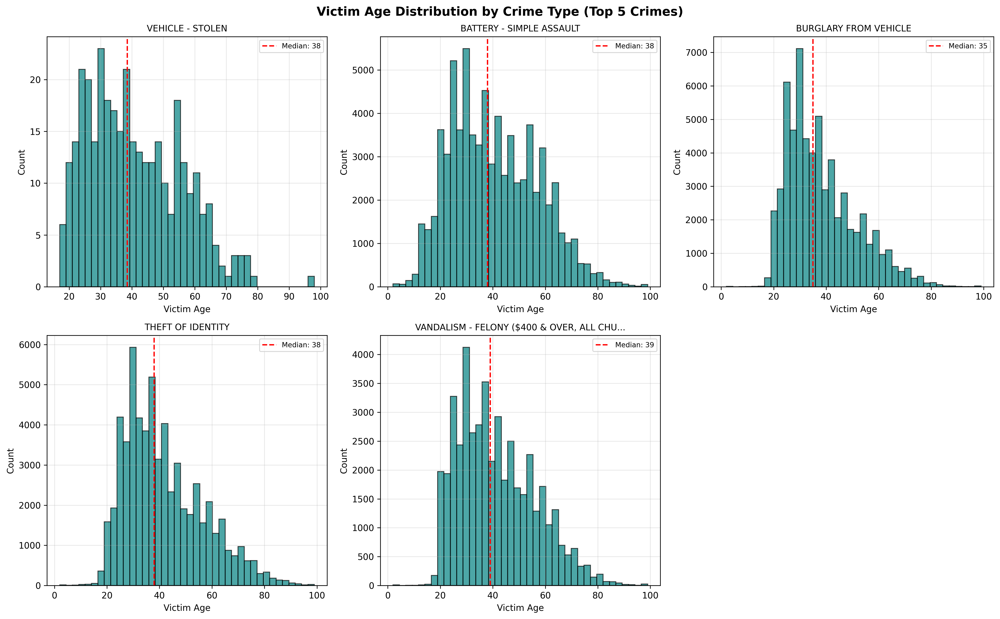

### 3.4 Geographic Concentration

**Central Area Burden:**
The Central LAPD area (downtown Los Angeles) bears a disproportionate crime burden with 69,670 crimes over the period. This represents approximately 6.9% of all crimes in just one of 21 areas, indicating concentration in the urban core.

**Street Crime Prevalence:**
With 26.0% of crimes occurring on streets, outdoor public spaces are the dominant crime location. This has implications for prevention strategies and resource allocation.

---

## 4. Data Quality and Preprocessing Recommendations

### 4.1 Issues Identified

**1. Victim Age = 0 (26.8% of records):**
This is a placeholder for unknown age and should be treated as missing data. For analysis requiring age, these records should be excluded or age should be imputed based on crime type if appropriate.

**2. Negative Ages (137 records):**
These are data entry errors and should be treated as unknown/missing.

**3. Time of Occurrence Default Values:**
The extreme concentration at 12:00 noon suggests this is used as a default when exact time is unknown. Analysis of temporal patterns should account for this data quality issue.

**4. Unknown Values:**
- Victim Sex Unknown: 24.1%
- Victim Descent Unknown: 25.0%
- Weapon Unknown: 67.4%

These high rates of unknown values should be considered when conducting demographic or weapon-related analyses.

**5. Incomplete 2024-2025 Data:**
The dataset appears to be incomplete for 2024 and 2025. Any year-over-year analysis should exclude these partial years or use annualized rates.

### 4.2 Recommended Transformations

**Temporal:**
- Create categorical variables for time periods (early morning, morning, afternoon, evening, night) to group hours and reduce noise from default time entries
- Flag records with potential default times (12:00, 18:00, other round hours) for sensitivity analysis
- Calculate reporting delay and flag delayed reports (>30 days) for special handling

**Age:**
- Create age groups (0-17, 18-25, 26-35, 36-50, 51-65, 66+) for categorical analysis
- For analysis requiring continuous age, filter to valid ages (>0, <100) to exclude placeholders and extreme outliers
- Consider separate analysis for "victim-less" crimes (vandalism, vehicle theft, etc.) where age=0 may be appropriate

**Geographic:**
- Filter out records with coordinates (0,0) for spatial analysis (only 0.22% of data)
- Consider creating distance-to-downtown or similar derived geographic features
- Group areas into regions for higher-level geographic analysis

**Crime Categories:**
- Create higher-level crime categories (Violent, Property, Other) as shown in the analysis
- Separate vehicle-related crimes as a distinct category given their prevalence
- Create binary indicators for specific crime characteristics (weapon involved, arrest made, etc.)

### 4.3 Outlier Handling

**Age:**
The maximum age of 120 is at the extreme edge of human lifespan and may represent data errors. Ages >100 should be reviewed. However, given the small number of such cases, simple filtering (age > 0 and age < 100) is appropriate for most analyses.

**Reporting Delay:**
Some crimes are reported years after occurrence (0.7% reported >1 year later). For time-series analysis of crime trends, using occurrence date (DATE OCC) rather than report date (Date Rptd) is essential to avoid temporal distortion.

**Geographic Outliers:**
The coordinates appear clean with only 0.22% missing (coded as 0). No spatial outlier removal appears necessary beyond filtering these missing values.

---

## 5. Conclusions

### 5.1 Clear Findings

1. **Property crimes dominate the crime landscape in Los Angeles**, with vehicle-related crimes particularly prevalent. This suggests resource allocation should prioritize vehicle theft prevention and property crime investigation.

2. **Crime incidents are highly concentrated** in a small number of crime types (7 types = 50% of crimes) and geographic areas (Central area has 2.1x the crimes of the lowest area).

3. **Arrest rates are low overall (9.0%)**, with substantial variation by crime type. Property crimes show particularly low clearance rates, while violent crimes (especially intimate partner violence) show higher arrest rates.

4. **The noon time spike (12:00) is an artifact** of data entry practices, not an actual crime pattern. This default time entry affects 3.5% of all records.

5. **Missing demographic data is substantial** (25-27% unknown for victim age, sex, and descent), limiting the depth of demographic analysis possible.

### 5.2 Interesting but Uncertain Patterns

1. **The increase from 2020 to 2022** could reflect pandemic effects, but separating reporting behavior changes from actual crime trend changes requires additional context and data.

2. **Friday has the highest crime count**, but the weekly variation is modest (11% range). Whether this represents real behavioral patterns or reporting patterns is unclear.

3. **The hourly crime pattern** (beyond the noon artifact) shows elevated crime in afternoon/evening hours, but the degree to which default time entry affects this pattern is unknown.

4. **Geographic crime patterns** show concentration in Central LA, but whether this reflects true crime rates or differential reporting/enforcement requires population-adjusted analysis (crimes per capita).

### 5.3 Recommendations for Further Analysis

1. **Population-adjusted crime rates**: Link to census data to compute crimes per capita by area, which would provide a clearer picture of true crime risk.

2. **Time-based default flagging**: Create indicators for likely default time entries and conduct sensitivity analyses with and without these records.

3. **Crime type deep-dives**: Focus analyses on the top 15 crime types which account for 80% of crimes, examining each for distinct patterns in time, location, and demographics.

4. **Arrest outcome modeling**: Investigate which factors predict arrest outcomes, controlling for crime type, to identify potential disparities or opportunities for intervention.

5. **Repeat location analysis**: Identify specific addresses or intersections with unusually high crime concentrations for targeted intervention.

---

**Report Generated By:** Claude Sonnet 4.5 (Model ID: claude-sonnet-4-5-20250929)  
**Analysis Date:** December 31, 2025  
**Dataset:** Los Angeles Crime Data (2020-Present)
