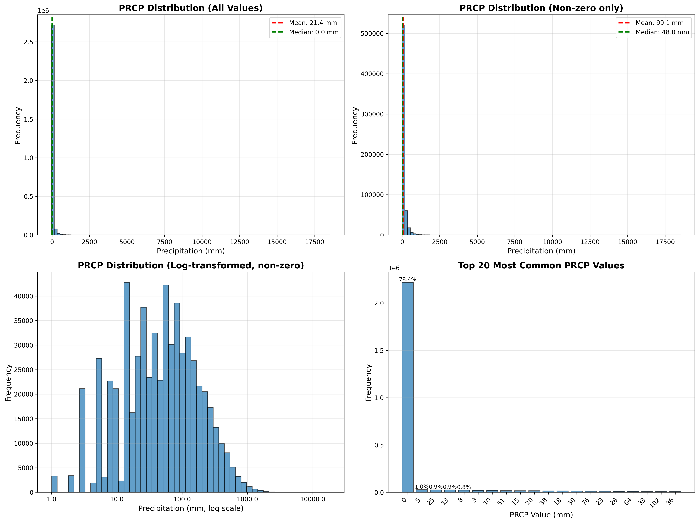
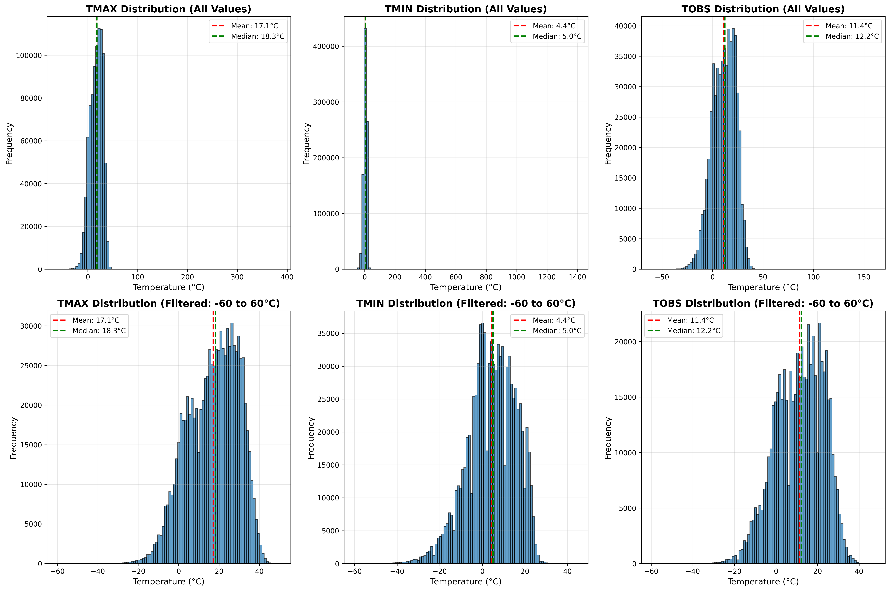
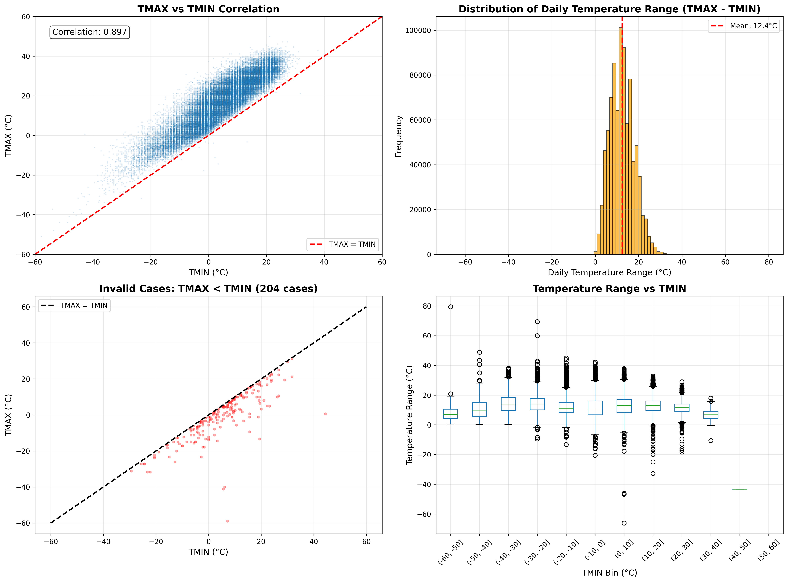
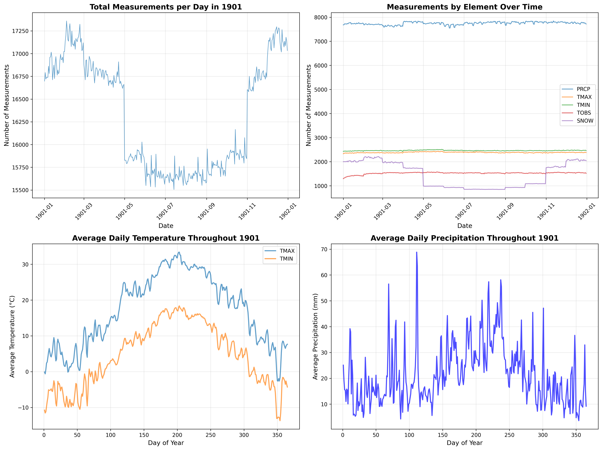
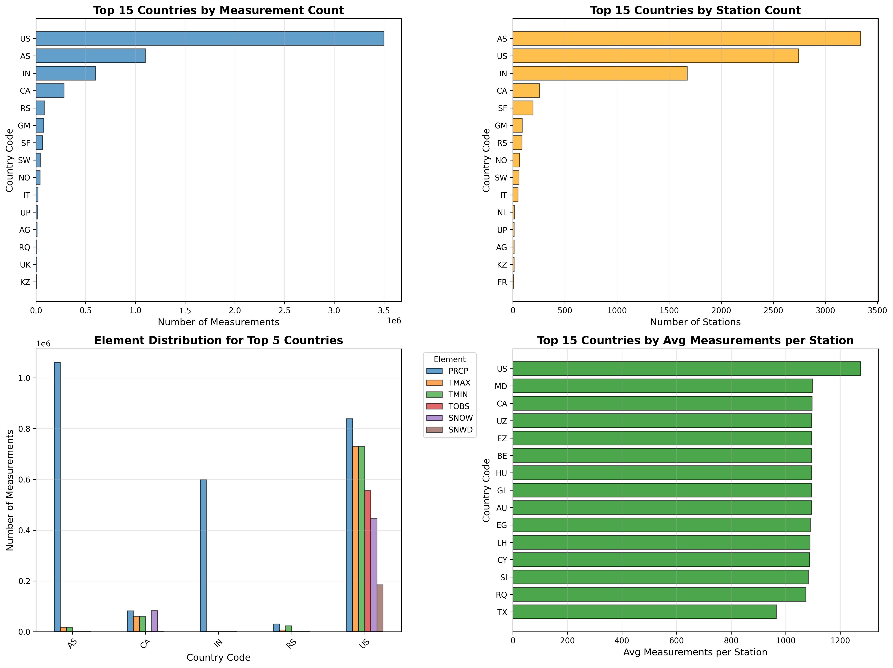
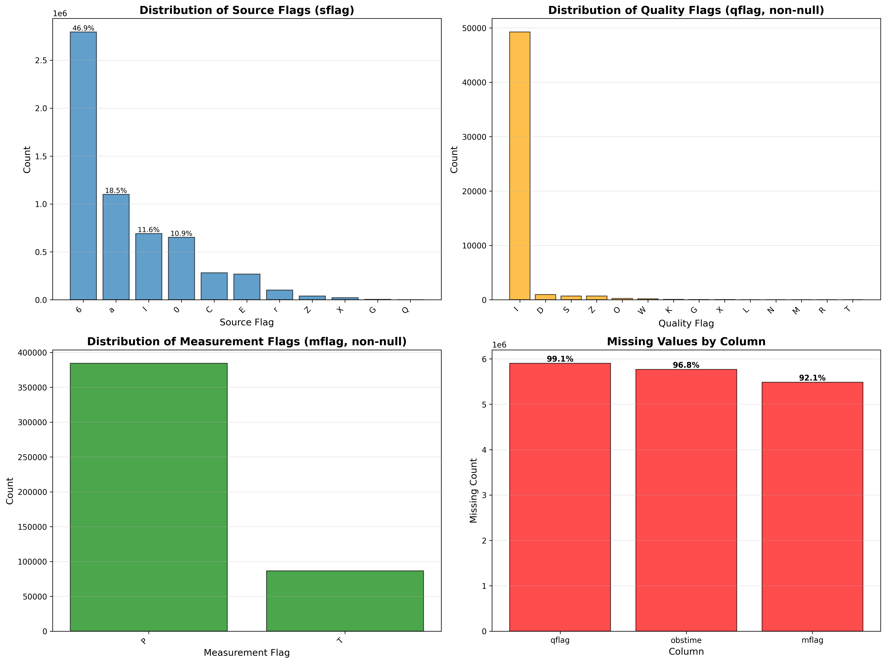
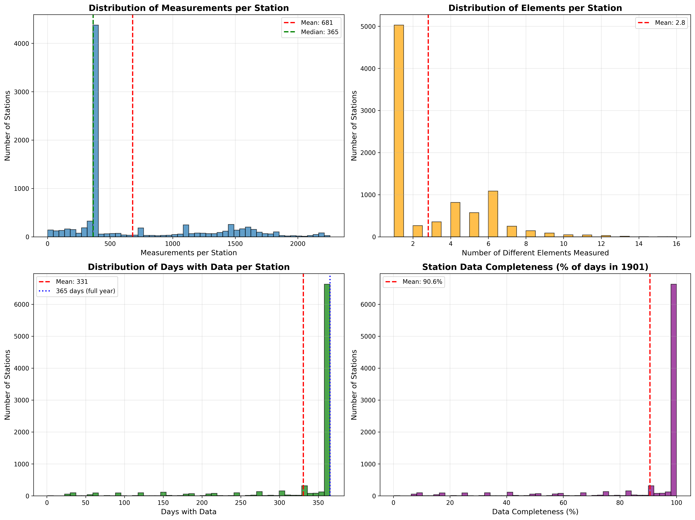

# Exploratory Data Analysis: Global Historical Climate Network (GHCN) Daily Data - 1901

## 1. Dataset Description and Structure

### Subject Matter
This dataset contains daily weather observations from the Global Historical Climatology Network (GHCN) for the year 1901. The data captures fundamental meteorological measurements from weather stations worldwide, including temperature, precipitation, and snow-related variables.

### File Structure
The dataset consists of a single file:
- `ghcn_daily_1901_kaggle.csv` (255.7 MB, 5,956,347 rows)

### Data Format
The dataset is in **long format**, where each row represents a single measurement. The key identifier is the combination of `(station_id, date, element)`, meaning each station can have multiple rows per day - one for each type of measurement (element).

**Columns (9 total):**
- `station_id` (object): Unique identifier for the weather station (8,749 unique stations)
- `date` (object): Date of observation in YYYY-MM-DD format (365 unique dates - full year 1901)
- `element` (object): Type of measurement (30 unique types)
- `value` (int64): Measured value (units vary by element type)
- `mflag` (object): Measurement flag indicating special measurement conditions
- `qflag` (object): Quality flag indicating data quality issues
- `sflag` (object): Source flag indicating data source
- `obstime` (float64): Observation time (mostly missing)
- `unit` (object): Unit of measurement (3 types: "mm", "tenths of °C", "varies")

### Measurement Types (Elements)
The most common elements measured:

| Element | Count | Description | Unit |
|---------|-------|-------------|------|
| PRCP | 2,827,990 (47.5%) | Precipitation | mm |
| TMIN | 899,576 (15.1%) | Minimum temperature | tenths of °C |
| TMAX | 870,665 (14.6%) | Maximum temperature | tenths of °C |
| TOBS | 556,467 (9.3%) | Temperature at observation time | varies |
| SNOW | 527,030 (8.8%) | Snowfall | mm |
| SNWD | 216,592 (3.6%) | Snow depth | varies |
| TAVG | 32,399 (0.5%) | Average temperature | varies |

Additionally, there are 23 less common elements including various weather type indicators (WT01-WT18) and derived statistics.

### Geographic Coverage
The dataset covers 52 country codes (first 2 letters of station_id), with significant geographic imbalance:

**Top 5 countries by measurement count:**
1. US (United States): 3,500,557 measurements (58.8%)
2. AS (American Samoa): 1,099,711 measurements (18.5%)
3. IN (India): 598,378 measurements (10.0%)
4. CA (Canada): 281,802 measurements (4.7%)
5. RS (Russia): 82,613 measurements (1.4%)

**Top 5 countries by station count:**
1. AS (American Samoa): 3,340 stations (38.2%)
2. US (United States): 2,745 stations (31.4%)
3. IN (India): 1,674 stations (19.1%)
4. CA (Canada): 257 stations (2.9%)
5. SF (South Africa): 194 stations (2.2%)

There is a discrepancy between station count and measurement count - American Samoa has the most stations but US has the most measurements, indicating US stations are more active or measure more elements.

### Temporal Coverage
- **Date range**: January 1, 1901 to December 31, 1901 (365 days)
- **Measurements per day**: 7,742 to 8,022 (mean: 7,926)
- **Stations per day**: 7,742 to 8,022 (mean: 7,926)

The dataset shows consistent daily coverage throughout the year with slight variations.

### Data Completeness
- **No duplicate rows**: 0 duplicates found
- **Station participation**: 69.8% of stations (6,105 out of 8,749) have data for all 365 days
- **Measurements per station**: Ranges from 1 to 2,257 (mean: 680.8, median: 365)
- **Days per station**: Ranges from 1 to 365 (mean: 330.7)
- **Elements per station**: Ranges from 1 to 16 (mean: 2.8)

## 2. General Statistics and Distributions

### 2.1 Precipitation (PRCP)

**Key Statistics:**
- Total measurements: 2,827,990
- Range: -30 mm to 18,542 mm
- Mean: 21.4 mm
- Median: 0.0 mm
- Standard deviation: 84.2 mm

**Distribution Characteristics:**

1. **Extreme zero-inflation**: 78.4% of precipitation measurements are exactly 0 mm (2,217,081 out of 2,827,990). This is expected for daily precipitation data, as most days at most locations do not receive precipitation.

2. **Clustering at round numbers**: A striking 82.1% of all PRCP values fall on common round numbers (0, 5, 10, 15, 20, 25, 50, 100 mm). This pattern suggests:
   - Measurement precision limitations in 1901
   - Rounding practices by observers
   - Potentially standardized measurement increments

   The most common non-zero values are:
   - 5 mm: 27,293 cases (0.97%)
   - 25 mm: 25,910 cases (0.92%)
   - 13 mm: 25,788 cases (0.91%)
   - 8 mm: 22,705 cases (0.80%)

3. **Heavy-tailed distribution**: Among non-zero values, the distribution is highly right-skewed with extreme outliers. The maximum recorded precipitation is 18,542 mm in a single day, which is physically impossible and represents a clear data error. Reasonable daily precipitation values rarely exceed 500 mm even in extreme tropical systems.

4. **Negative values**: There are 17 measurements with negative precipitation (-30 mm), which is physically impossible and represents data quality issues.

### 2.2 Temperature (TMAX, TMIN, TOBS)

**TMAX (Maximum Temperature):**
- Measurements: 870,665
- Range: -59.7°C to 385.0°C
- Mean: 17.1°C
- Median: 18.3°C
- Zero values: 7,689 (0.9%)

**TMIN (Minimum Temperature):**
- Measurements: 899,576
- Range: -61.7°C to 1,396.1°C
- Mean: 4.4°C
- Median: 5.0°C
- Zero values: 19,472 (2.2%)

**TOBS (Observed Temperature):**
- Measurements: 556,467
- Range: -59.4°C to 160.0°C
- Mean: 11.4°C
- Median: 12.2°C
- Zero values: 8,837 (1.6%)

**Distribution Characteristics:**

1. **Physically impossible extreme values**: The dataset contains clear data errors:
   - TMAX: 3 values above 60°C (max: 385.0°C)
   - TMIN: 6 values above 60°C (max: 1,396.1°C)
   - TOBS: 2 values above 60°C (max: 160.0°C)
   
   These extreme values represent less than 0.001% of the data but indicate data entry errors or unit conversion issues. The Earth's surface temperature record maximum is around 57°C (Death Valley).

2. **Round number preference**: Approximately 12-13% of temperature values are multiples of 10 (in tenths of °C), suggesting some degree of rounding. This is less severe than the precipitation rounding but still notable.

3. **Reasonable core distribution**: When filtered to reasonable ranges (-60°C to 60°C), the temperature distributions appear approximately normal with expected geographic variation.

4. **Zero concentration**: The presence of exactly 0°C (0 in tenths) appears more frequently than would be expected from a continuous distribution, possibly indicating:
   - Recording bias at the freezing point
   - Missing data coded as 0
   - Actual prevalence of freezing conditions

### 2.3 Temperature Range and Consistency

**Temperature Pair Analysis** (days with both TMAX and TMIN):
- Total paired measurements: 860,326
- Correlation between TMAX and TMIN: 0.979 (very strong positive correlation)
- Mean daily temperature range (TMAX - TMIN): 12.4°C
- Median daily temperature range: 12.2°C

**Data Consistency Issues:**

1. **Invalid cases (TMAX < TMIN)**: There are 204 measurements (0.02%) where the maximum temperature is lower than the minimum temperature, which is physically impossible. This represents data entry errors or measurement flag misinterpretation.

2. **Zero temperature range (TMAX = TMIN)**: There are 368 cases (0.04%) where TMAX equals TMIN exactly. While possible in stable conditions, this frequency suggests:
   - Measurement resolution issues
   - Missing data coded as duplicate values
   - Single daily temperature reading recorded for both fields

3. **Extreme temperature range**: There are 15 cases with daily temperature range exceeding 40°C, which is highly unusual but possible in desert environments. The maximum range observed is 79.4°C, which is impossible and indicates data errors.

4. **Negative temperature range**: The minimum observed range is -66.1°C (meaning TMAX was 66.1°C lower than TMIN), which clearly indicates swapped or incorrectly coded values.

### 2.4 Snow Measurements (SNOW, SNWD)

**SNOW (Snowfall):**
- Measurements: 527,030
- Range: 0 to 2,743 mm
- Mean: 3.7 mm
- Median: 0.0 mm
- Zero values: 489,131 (92.8%)

**SNWD (Snow Depth):**
- Measurements: 216,592
- Range: 0 to 4,572 mm
- Mean: 44.3 mm
- Median: 0.0 mm
- Zero values: 171,093 (79.0%)

Both snow variables show extreme zero-inflation, as expected for variables that are zero at most locations most of the time. The non-zero distributions are heavily right-skewed. Snow depth shows less zero-inflation than snowfall because snow can persist across multiple days without new snowfall.

## 3. Temporal Patterns

**Observations:**

1. **Consistent measurement volume**: The total number of measurements per day remains relatively stable throughout 1901, ranging from about 15,000 to 18,000. There are no major gaps or obvious seasonal data collection patterns.

2. **Element-specific patterns**: 
   - Precipitation (PRCP) shows the most stable daily counts throughout the year
   - Temperature measurements (TMAX, TMIN) show similar patterns to each other
   - SNOW measurements show clear seasonality, with higher measurement counts in winter months (Jan-Mar, Nov-Dec) in the Northern Hemisphere

3. **Temperature seasonality**: The average daily TMAX and TMIN show expected seasonal patterns:
   - Global average TMIN ranges from approximately -5°C in January to 10°C in July
   - Global average TMAX ranges from approximately 10°C in January to 23°C in July
   - The 6-month lag reflects the dominance of Northern Hemisphere stations in the dataset

4. **Precipitation variability**: Average daily precipitation shows high day-to-day variability with no obvious seasonal trend, which is expected given the geographic diversity and the fact that precipitation is event-driven.

## 4. Geographic Patterns

**Key Findings:**

1. **Measurement concentration**: The United States dominates the dataset with 58.8% of all measurements, despite having only 31.4% of stations. This indicates:
   - US stations measure more elements per day on average
   - US stations have higher data completeness
   - Possible oversampling of US locations

2. **Station distribution**: American Samoa (AS) has an unexpectedly large number of stations (3,340) compared to its geographic size. This may represent:
   - Historical data digitization efforts specific to this region
   - Station network density related to Pacific island monitoring
   - Potential miscoding of station IDs (AS prefix may represent multiple regions)

3. **Measurements per station**: Countries with higher measurements per station tend to be more developed nations (US, CA) where:
   - Multiple elements are routinely measured
   - Equipment and staffing support comprehensive observations
   - Data recording practices are more standardized

4. **Element distribution varies by country**: 
   - US and Canada measure all major elements (PRCP, TMAX, TMIN, SNOW)
   - Some countries focus primarily on temperature or precipitation
   - This reflects different climate monitoring priorities and capabilities in 1901

## 5. Data Quality and Missing Values

### 5.1 Missing Data Patterns

**High missingness columns:**
- `qflag` (Quality flag): 99.1% missing (5,903,962 out of 5,956,346)
- `obstime` (Observation time): 96.8% missing (5,768,669 out of 5,956,346)
- `mflag` (Measurement flag): 92.1% missing (5,485,215 out of 5,956,346)

**Interpretation:**
- The high missingness in quality flags is actually a positive signal - it means most data (99.1%) passed quality checks without issues
- Observation time was rarely recorded in 1901, limiting temporal analysis within days
- Measurement flags are only present for special conditions (7.9% of measurements)

### 5.2 Data Quality Flags

**Source flags (sflag)** - indicate data origin:
- Flag "6": 2,795,162 (46.9%) - most common source
- Flag "a": 1,099,711 (18.5%)
- Flag "I": 691,456 (11.6%)
- Other flags represent smaller specialized sources

**Quality flags (qflag)** - indicate issues (0.88% of data):
- "I" (Failed internal consistency): 49,269 cases
- "D" (Failed duplicate check): 980 cases
- Other quality issues: <1,000 cases each

Only 0.88% of measurements have quality flags, suggesting generally reliable data for the era.

**Measurement flags (mflag)** - special conditions (7.91% of data):
- "P" (Identified as missing and no estimated value): 384,576 cases
- "T" (Trace precipitation): 86,555 cases

The "T" flag for trace precipitation explains some of the zero values in PRCP data.

### 5.3 Data Quality Issues Summary

1. **Extreme outliers**: Temperature and precipitation contain physically impossible values that must be filtered for analysis
2. **Negative values**: 17 negative precipitation values indicate data entry errors
3. **Internal inconsistencies**: 204 cases where TMAX < TMIN
4. **Round number bias**: 82% of precipitation values are round numbers
5. **Quality flag rate**: Only 0.88% of data flagged with quality issues, suggesting good overall quality for 1901 data

## 6. Station-Level Analysis

**Station Participation Patterns:**

1. **Bimodal distribution of measurements**: Stations show two modes:
   - Large group around 365 measurements (1 measurement type per day for full year)
   - Another group around 730-1095 measurements (2-3 measurement types per day)
   - Top stations have >2,000 measurements (measuring many elements)

2. **Element diversity**: 
   - Most stations (mode) measure 2-3 different elements
   - Maximum of 16 different elements measured at a single station
   - Mean of 2.8 elements per station

3. **Data completeness**: 
   - 69.8% of stations have data for all 365 days of 1901
   - Mean completeness: 90.6% of days (330.7 out of 365)
   - Some stations have as few as 1 day of data (possibly new or closing stations)

4. **Top performing stations**: All top 10 stations by measurement count are in the United States (US prefix), with 2,232-2,257 measurements each. These comprehensive stations measured 6+ elements daily throughout the year.

## 7. Key Findings

### 7.1 Clear Findings

1. **Geographic bias**: The dataset is heavily biased toward the United States (59% of measurements) and Northern Hemisphere stations, limiting global climate conclusions.

2. **Zero-inflated precipitation**: 78.4% of precipitation measurements are exactly zero, which is expected for daily data but must be considered in any statistical modeling (zero-inflated models appropriate).

3. **Strong round-number preference in precipitation**: 82.1% of precipitation values fall on common round numbers (0, 5, 10, 15, 20, 25, 50, 100 mm), indicating measurement resolution limitations in 1901. This affects the precision of any precipitation statistics.

4. **High temperature correlation**: TMAX and TMIN are very strongly correlated (r=0.979), which is expected but confirms data consistency for the majority of measurements.

5. **Excellent station coverage**: Nearly 70% of stations provided complete year-long coverage in 1901, demonstrating strong data collection practices for the era.

6. **Low quality flag rate**: Only 0.88% of measurements have quality flags, suggesting reliable data collection and recording for 1901 technology.

### 7.2 Data Quality Concerns

1. **Physically impossible temperature extremes**: 11 temperature measurements exceed realistic bounds (>60°C or equivalent), representing clear data errors (0.001% of temperature data).

2. **Internal inconsistencies**: 204 cases (0.02%) where TMAX < TMIN indicate swapped values or data entry errors.

3. **Negative precipitation**: 17 cases of negative precipitation (-30 mm) are physically impossible.

4. **Extreme precipitation outlier**: Maximum value of 18,542 mm is impossible for daily precipitation (world record is <2,000 mm).

### 7.3 Interesting Patterns Requiring Further Investigation

1. **American Samoa station count**: The AS country code has 3,340 stations (38% of all stations) but only 18.5% of measurements. This apparent geographic concentration in a small island territory warrants investigation:
   - Possible station ID miscoding
   - Historical digitization project specific to Pacific islands
   - Network of closely-spaced island stations

2. **Measurement volume variability**: Some dates show notable peaks in total measurements (e.g., February 3 has 17,359 measurements). Investigating whether this represents:
   - Special observation campaigns
   - Batch data entry artifacts
   - Actual increased measurement activity

3. **Temperature at exactly 0°C**: Temperature values show concentration at exactly 0°C beyond what would be expected from natural variation. This may indicate:
   - Observer bias to record freezing conditions
   - Missing data coded as 0
   - Special notation for freeze/thaw events

4. **Snow measurement geographic patterns**: Snow-related measurements (SNOW, SNWD) account for 12.4% of all data. Investigating which regions contribute most to snow measurements and whether coverage is appropriate for global snow climatology.

## 8. Recommendations for Data Analysis

### 8.1 Data Cleaning Required

1. **Temperature filtering**: Remove or cap temperature values outside reasonable bounds:
   - TMAX: Remove values > 60°C or < -90°C
   - TMIN: Remove values > 50°C or < -90°C
   - TOBS: Remove values > 60°C or < -90°C
   - Remove 204 cases where TMAX < TMIN

2. **Precipitation filtering**: 
   - Remove negative values (17 cases)
   - Investigate and likely remove values > 500 mm as data errors
   - Consider log transformation for non-zero values in statistical modeling

3. **Quality flag filtering**: Consider excluding the 52,384 measurements (0.88%) with quality flags for critical analyses.

### 8.2 Statistical Considerations

1. **Account for zero-inflation**: Use zero-inflated models (ZIP, ZINB) for precipitation analysis rather than standard regression.

2. **Consider measurement precision**: The 82% round-number rate in precipitation indicates precision of ±2.5-5mm. Do not over-interpret small differences.

3. **Weight by station density**: Geographic analyses should account for the heavy US/Northern Hemisphere bias, potentially using area-weighted or station-density-adjusted statistics.

4. **Temperature range as quality check**: Daily temperature range (TMAX - TMIN) can serve as an additional quality filter. Values <0°C or >40°C warrant investigation.

### 8.3 Missing Data Handling

1. **Observation time**: With 96.8% missing, `obstime` is not usable for most analyses. TOBS (observed temperature) should be analyzed separately without time information.

2. **Quality and measurement flags**: Missingness is informative (indicates no issues). Treat missing flags as "passed" rather than unknown.

3. **Station-level missingness**: For climatological normals, only use stations with >80% daily coverage (already 70% of stations meet this).

### 8.4 Potential Transformations

1. **Temperature**: Already in reasonable units (°C after dividing by 10). No transformation needed after filtering.

2. **Precipitation**: Log transformation (log(PRCP + 1)) recommended for non-zero values to normalize heavy tail.

3. **Snow variables**: Similar to precipitation, log transformation appropriate for non-zero values.

4. **Date variables**: Already processed, can extract month, season, day-of-year for temporal analyses.

## 9. Conclusion

This 1901 GHCN daily climate dataset provides valuable historical weather observations from 8,749 stations worldwide. The data quality is generally good for its era, with only 0.88% of measurements flagged with quality issues. However, several important considerations must be addressed:

**Strengths:**
- Near-complete annual coverage (365 days)
- High station participation (70% provide full-year data)
- Diverse measurement types (30 elements)
- Low quality flag rate indicating reliable observations

**Limitations:**
- Heavy geographic bias toward United States (59% of data)
- Measurement precision limitations, especially for precipitation (82% round numbers)
- Small number of extreme outliers requiring filtering (<0.01% of data)
- Limited temporal resolution within days (observation times rarely recorded)
- Internal inconsistencies in temperature pairs (0.02% of cases)

**Key insight for users:** This dataset is well-suited for understanding 1901 climate patterns in the United States and to a lesser extent other Northern Hemisphere locations, but should not be interpreted as globally representative. The round-number preference in precipitation indicates measurement precision of approximately ±5mm, which should be considered when interpreting results.

The presence of physically impossible values (extreme temperatures, negative precipitation) is minimal (<0.01%) but must be filtered before analysis. The strong correlation between TMAX and TMIN (r=0.979), low quality flag rate, and high station completeness provide confidence in the overall data quality for properly cleaned analyses.

---

*Report generated by: claude-sonnet-4.5 (EDA Agent)*
*Date: 2025-12-31*
