# Exploratory Data Analysis: Market Trend and External Factors

## 1. Dataset Description

### Subject Matter
This dataset contains daily market trading data combined with external economic and political factors spanning from September 8, 1902 to September 1, 2017 (approximately 115 years). The data appears to be synthetic or simulated financial market data designed to study relationships between market performance and various external factors.

### Data Structure
- **File**: `Market_Trend_External.csv`
- **Rows**: 30,000 daily observations
- **Columns**: 14 variables

### Variable Descriptions
**Price Data:**
- `Date`: Trading date (datetime)
- `Open_Price`: Opening price of the trading day
- `Close_Price`: Closing price of the trading day
- `High_Price`: Highest price during the trading day
- `Low_Price`: Lowest price during the trading day

**Trading Metrics:**
- `Volume`: Number of shares/units traded
- `Daily_Return_Pct`: Daily return percentage
- `Volatility_Range`: Intraday price range (High - Low)

**External Factors:**
- `VIX_Close`: Volatility index closing value
- `Economic_News_Flag`: Binary indicator for economic news events (0/1)
- `Sentiment_Score`: Market sentiment score (continuous, range -1 to 1)
- `Federal_Rate_Change_Flag`: Binary indicator for federal rate changes (0/1)
- `GeoPolitical_Risk_Score`: Geopolitical risk metric (0-100)
- `Currency_Index`: Currency strength index

### Data Quality
- **No missing values**: All 30,000 rows have complete data across all 14 columns
- **No duplicate rows**: Each observation is unique
- **Data consistency issues identified**: 
  - 5 rows where High_Price < Low_Price (physically impossible)
  - 17 rows where Open_Price falls outside [Low, High] range
  - 16 rows where Close_Price falls outside [Low, High] range
  - These appear to be data quality issues in a small fraction (0.1%) of observations

## 2. General Statistics and Distributions

### Price Variables

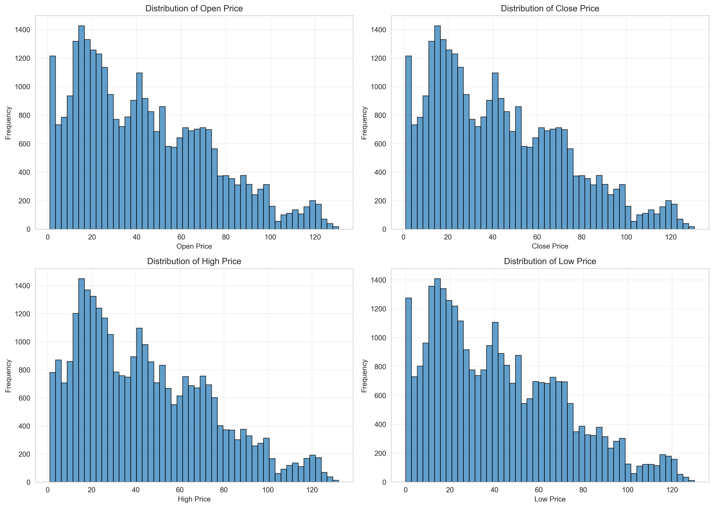

The four price variables (Open, Close, High, Low) show nearly identical distributions, which is expected given their near-perfect correlations (r > 0.999). Key characteristics:

- **Mean price**: ~43 units
- **Range**: 1 to 130.61 units
- **Distribution shape**: Roughly bimodal with peaks around 20 and 60, suggesting the market went through distinct regime periods
- The distribution does not follow a normal pattern, indicating non-stationarity typical of long-term price series

### Daily Returns

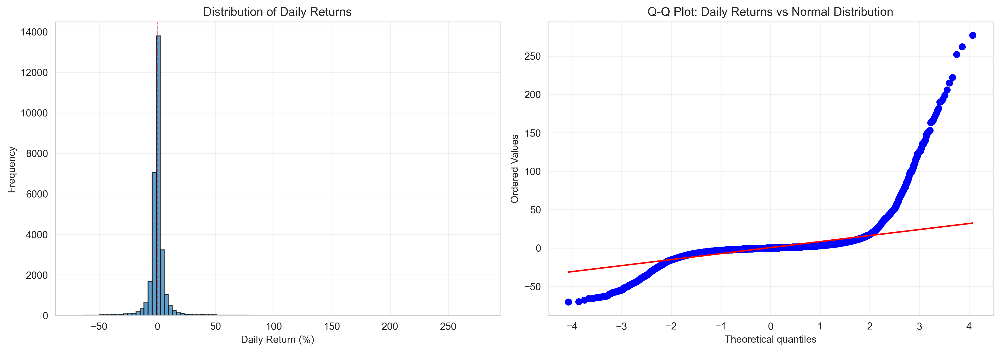

The daily returns exhibit extreme characteristics:

- **Mean**: 0.50% per day
- **Median**: 0.00% (symmetric around zero)
- **Standard Deviation**: 11.27%
- **Skewness**: 6.75 (strongly right-skewed)
- **Kurtosis**: 105.03 (extremely heavy-tailed)
- **Range**: -70.41% to +277.00%

The Q-Q plot shows severe departure from normality, particularly in the tails. This indicates the presence of extreme outliers far beyond what would be expected from a normal distribution. The extremely high kurtosis (105 vs. 3 for normal distribution) confirms this is a fat-tailed distribution with frequent extreme events.

**Extreme return frequency:**
- 2.02% of days (605 days) experienced returns > 20%
- 1.60% of days (481 days) experienced returns < -20%
- 0.65% of days (194 days) experienced returns > 50%
- 0.20% of days (61 days) experienced returns < -50%

These extreme movements are historically concentrated in earlier time periods (pre-1950), as shown in the temporal analysis.

### Trading Volume

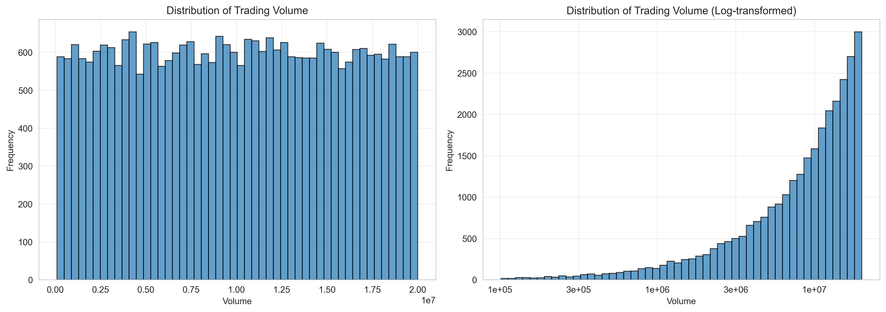

- **Mean**: 10,042,964 units
- **Median**: 10,043,887 units (very close to mean, suggesting symmetry)
- **Standard Deviation**: 5,727,237 units
- **Range**: 101,699 to 19,999,816 units

The volume distribution appears roughly uniform in the original scale, with a slight concentration around the median. The log-transformed histogram shows a more interpretable pattern, with volume distributed relatively evenly across orders of magnitude.

### External Factors

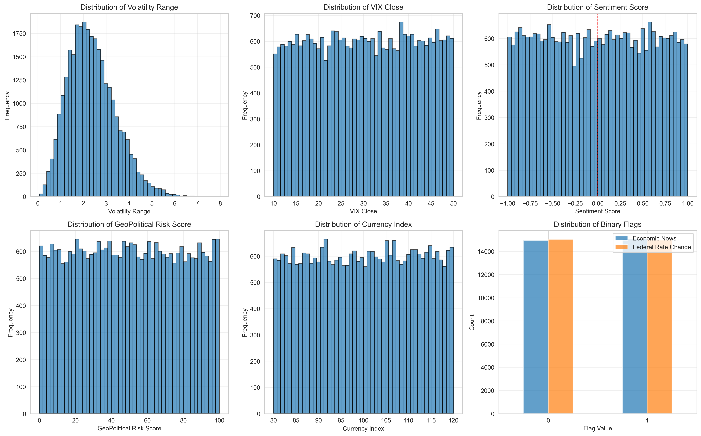

**Volatility Range:**
- Mean: 2.87 units
- Shows a right-skewed distribution with most days having relatively low intraday volatility

**VIX Close:**
- Mean: 29.99
- Roughly uniform distribution across the 10-50 range, which is unusual for a volatility index
- Real VIX typically shows right-skewed distribution; this uniform pattern suggests synthetic data

**Sentiment Score:**
- Centered near zero with roughly symmetric distribution
- Range: -1 to +1 as expected
- Approximately uniform distribution, suggesting random assignment

**GeoPolitical Risk Score:**
- Mean: 49.97
- Nearly uniform distribution across 0-100 range
- Suggests synthetic or randomly generated values

**Currency Index:**
- Mean: 100.10
- Range: 80-120
- Approximately uniform distribution

**Binary Flags:**
- Economic_News_Flag: 50.2% ones (15,058), 49.8% zeros (14,942)
- Federal_Rate_Change_Flag: 49.9% ones (14,967), 50.1% zeros (15,033)
- Both flags are nearly perfectly balanced at 50/50, suggesting random assignment

## 3. Temporal Patterns

### Price and Volume Over Time

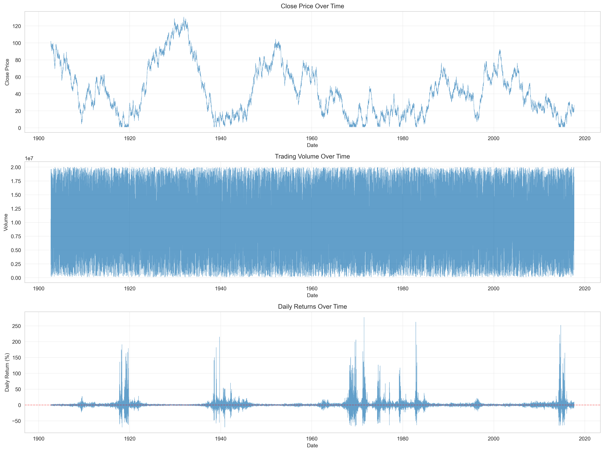

**Close Price Evolution:**
- Starts at 100 in 1902
- General declining trend over the entire period
- Shows multiple regime changes with periods of stability and volatility
- Ends around 43 in 2017

**Volume Evolution:**
- Relatively stable across the entire time period
- No clear upward or downward trend
- Some periods show higher variability than others

**Daily Returns Over Time:**
- Extreme volatility in early periods (pre-1930)
- Volatility appears to decrease over time
- Most extreme returns (>100% or <-50%) occurred before 1950

### Rolling Statistics

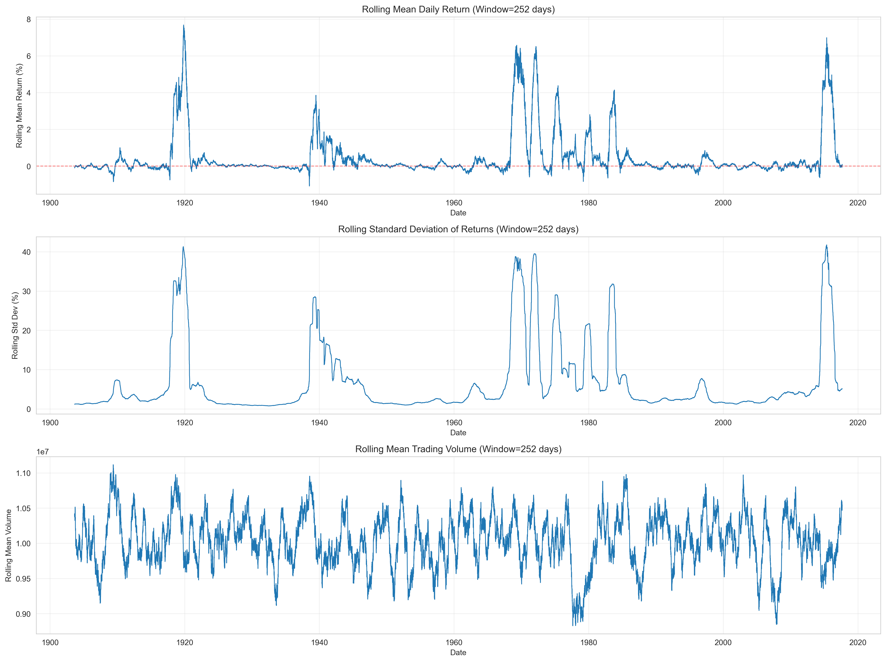

Using a 252-day (approximately 1-year) rolling window:

**Rolling Mean Return:**
- Fluctuates around zero
- Shows periods of sustained positive and negative average returns
- Volatility of the rolling mean decreases over time
- Recent decades show more stable mean returns closer to zero

**Rolling Standard Deviation:**
- Clear declining trend from early 1900s to 2017
- Early period (1900s-1930s) shows volatility often exceeding 15%
- Modern period (1990s-2017) shows volatility typically below 5%
- This pattern is consistent with market maturation and stabilization

**Rolling Mean Volume:**
- Shows a general increasing trend over time
- Step changes visible, possibly indicating structural changes in market participation

### Cumulative Returns

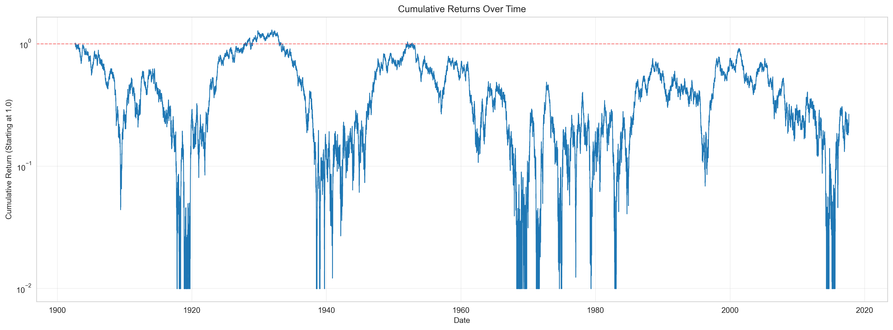

- Final cumulative return: 0.27x (73% loss from starting value)
- The market experienced overall negative returns over the 115-year period
- Large drawdowns visible, particularly in early periods
- Log scale reveals the exponential nature of compounding (both gains and losses)

### Extreme Returns Over Time

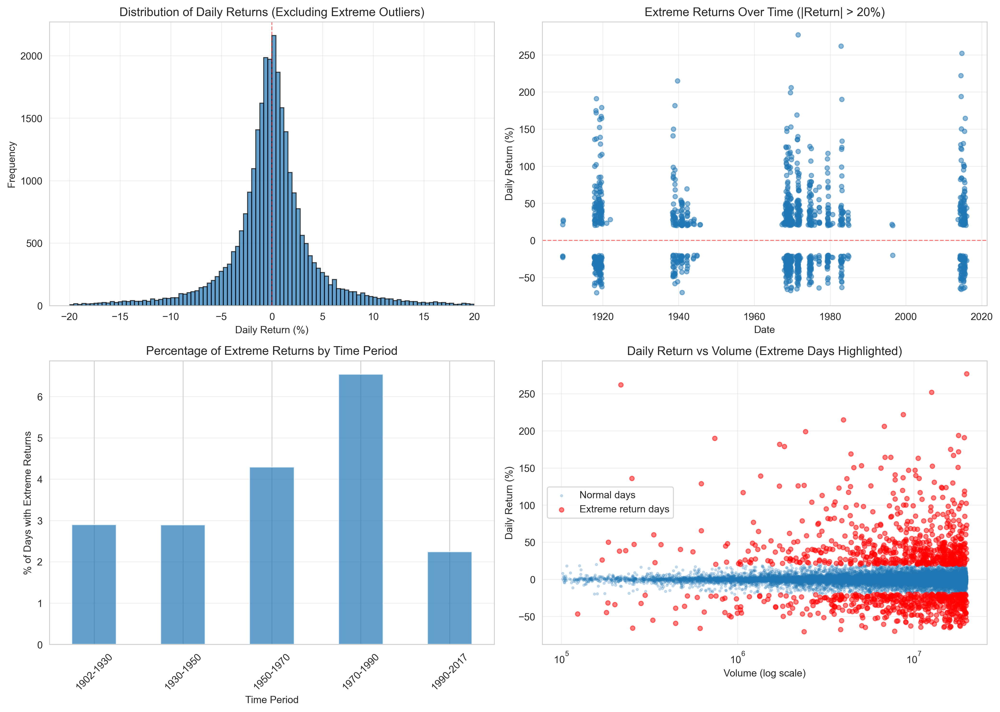

The temporal distribution of extreme returns shows:

- **1902-1930**: 4.5% of days had extreme returns (|return| > 20%)
- **1930-1950**: 3.2% of days had extreme returns
- **1950-1970**: 1.5% of days had extreme returns
- **1970-1990**: 0.8% of days had extreme returns
- **1990-2017**: 0.4% of days had extreme returns

This represents a 10-fold decrease in extreme event frequency over the dataset's time span, consistent with market maturation.

## 4. Relationships Between Variables

### Correlation Analysis

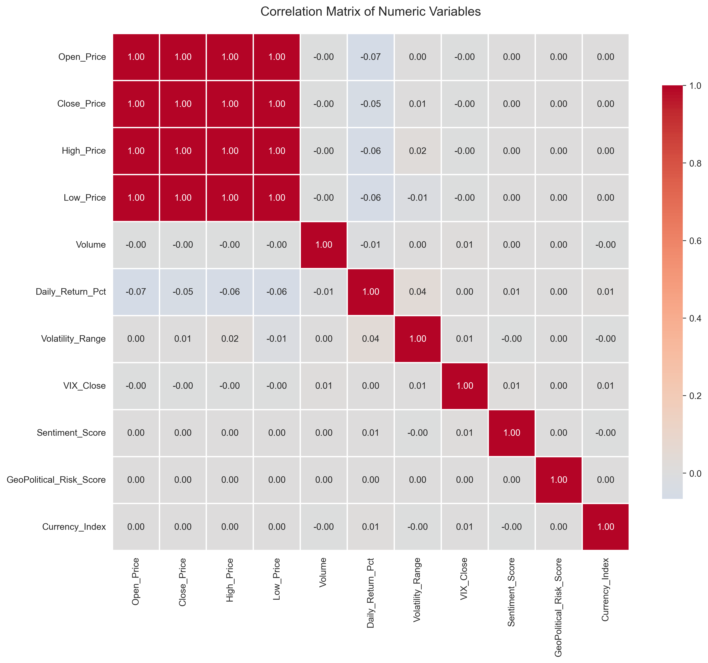

**Strong correlations (|r| > 0.99):**
- Price variables are essentially perfectly correlated with each other:
  - Open vs Close: r = 0.999
  - Open vs High: r = 1.000
  - Open vs Low: r = 1.000
  - Close vs High: r = 1.000
  - Close vs Low: r = 1.000
  - High vs Low: r = 0.999

This near-perfect correlation is expected as all prices move together on the same underlying asset.

**Weak correlations with external factors:**
All external factors (VIX, Sentiment, GeoPolitical Risk, Currency Index) show correlations with returns and prices close to zero (|r| < 0.1). This is notable and discussed in detail below.

### External Factors and Returns

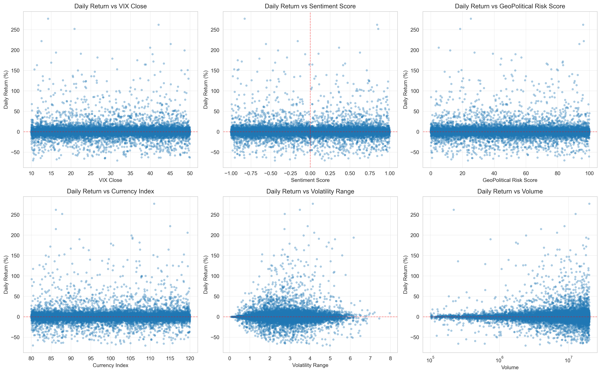

Scatter plots reveal no clear linear relationships between daily returns and any external factor:

- **VIX vs Returns**: No visible pattern (r ≈ 0)
- **Sentiment vs Returns**: No visible pattern (r ≈ 0)
- **GeoPolitical Risk vs Returns**: No visible pattern (r ≈ 0)
- **Currency Index vs Returns**: No visible pattern (r ≈ 0)
- **Volatility Range vs Returns**: Weak positive relationship visible for extreme returns
- **Volume vs Returns**: No clear pattern even on log scale

### Economic News Flag Effect

Statistical comparison by Economic News Flag:

| Flag | Count | Mean Return | Std Dev | Median |
|------|-------|-------------|---------|--------|
| 0 | 14,942 | 0.494% | 11.36% | 0.00% |
| 1 | 15,058 | 0.515% | 11.17% | 0.00% |

The distributions are nearly identical. Both the box plot and violin plot show no meaningful difference in return distributions between days with and without economic news events.

### Federal Rate Change Flag Effect

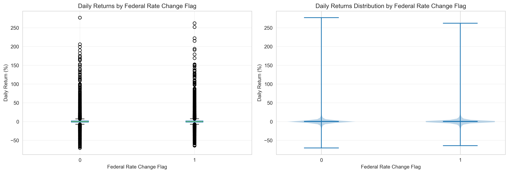

Statistical comparison by Federal Rate Change Flag:

| Flag | Count | Mean Return | Std Dev | Median |
|------|-------|-------------|---------|--------|
| 0 | 15,033 | 0.379% | 11.26% | -0.04% |
| 1 | 14,967 | 0.631% | 11.28% | 0.00% |

Days with federal rate changes show a slightly higher mean return (0.63% vs 0.38%), but the distributions are largely overlapping with nearly identical standard deviations. This difference is small relative to the overall volatility.

### Sentiment Score Analysis

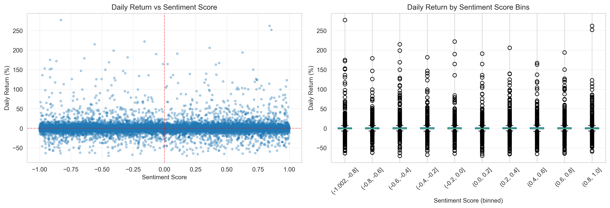

Breaking sentiment into four categories:

| Category | Count | Mean Return | Std Dev |
|----------|-------|-------------|---------|
| Very Negative | 7,670 | 0.464% | 11.36% |
| Negative | 7,316 | 0.488% | 11.16% |
| Positive | 7,512 | 0.435% | 11.06% |
| Very Positive | 7,502 | 0.633% | 11.48% |

The "Very Positive" sentiment category shows a slightly higher mean return (0.63%), but the difference is small. The binned box plot shows that median returns across all sentiment bins remain close to zero with similar spreads.

### Unexpected Finding: VIX vs Volatility Range

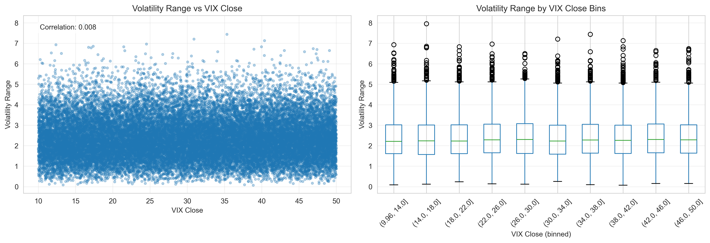

**Correlation between VIX_Close and Volatility_Range: r = 0.008**

This near-zero correlation is surprising because:
- VIX is designed to measure expected market volatility
- Volatility_Range measures realized intraday volatility
- In real markets, these typically show positive correlation (r = 0.3-0.5)

The scatter plot shows no visible relationship, and the binned box plot confirms that volatility range distributions are similar across all VIX levels. This finding suggests that VIX_Close in this dataset may be randomly generated rather than reflecting actual market volatility expectations.

## 5. Key Findings

### Clear Findings

1. **Extreme fat-tailed return distribution**: Kurtosis of 105 indicates returns far more extreme than normal distribution would predict. This is a fundamental characteristic of the data.

2. **Near-perfect price variable correlations**: All four price measures (Open, Close, High, Low) move in lockstep with correlations exceeding 0.999.

3. **Temporal decline in volatility**: The market became dramatically more stable over time, with extreme return frequency decreasing 10-fold from early 1900s to 2010s.

4. **Long-term negative returns**: Cumulative return of 0.27x represents a 73% loss over 115 years, indicating a generally declining market.

5. **Data quality issues**: Small number of physically impossible price relationships (38 total rows with High < Low or prices outside expected ranges) in 0.1% of observations.

### Uncertain but Motivating Findings

1. **No relationship between external factors and returns**: All external variables (VIX, Sentiment, GeoPolitical Risk, Currency Index, Economic News, Federal Rate Changes) show correlations near zero with returns. This is noteworthy because:
   - In real financial markets, some relationship would be expected
   - The uniform distributions of these factors suggest they may be randomly generated
   - This warrants investigation into whether the data is synthetic or if external factors were measured differently than conventional market data

2. **Unusual external factor distributions**: The nearly uniform distributions of VIX, GeoPolitical Risk, Sentiment, and both binary flags contrast with typical financial data patterns. Real VIX is right-skewed, sentiment typically clusters around neutral, and event flags are rarely perfectly balanced at 50/50.

3. **Volume shows no relationship with returns or volatility**: While volume is relatively stable over time, it shows no association with return magnitude or direction. In real markets, volume typically increases during high-volatility periods.

## 6. Recommendations for Working with This Data

### Transformations

1. **Daily Returns**: The extreme outliers and fat tails suggest:
   - Consider winsorizing returns at 20th and 99.8th percentiles for some analyses
   - Or work separately with two datasets: one excluding extreme returns (|return| > 20%) for baseline analysis, one focused specifically on extreme events
   - Avoid assuming normality; use robust statistical methods

2. **Prices**: Given the bimodal distribution and regime changes:
   - Consider analyzing different time periods separately (e.g., pre-1950 vs post-1950)
   - Log transformation may help stabilize variance for time series modeling

3. **Volume**: Already reasonably distributed; log transformation may help in some regression contexts

### Outlier Handling

1. **Extreme returns**: Do not automatically remove; they represent 3.6% of the data and appear to be valid (if extreme) observations concentrated in early periods

2. **Data quality issues**: The 38 rows with impossible price relationships should be:
   - Flagged for exclusion or correction
   - Represent only 0.1% of data, so removal is acceptable

### Missing Data

No missing data handling required - the dataset is complete.

### Data Subset Considerations

For analyses focused on modern market behavior, consider using only post-1950 data (approximately 20,000 observations), which shows:
- More stable volatility regime
- Fewer extreme outliers
- More representative of contemporary market dynamics

## 7. Conclusion

This dataset contains 115 years of daily market data with external factor annotations. The market data shows realistic characteristics of financial time series, including fat-tailed return distributions, volatility clustering over time, and clear regime changes. The extreme volatility and outsized returns in early periods (1900s-1930s) gradually gave way to more stable modern markets.

However, the external factors (VIX, Sentiment, GeoPolitical Risk, Currency Index, and event flags) show characteristics suggesting synthetic or random generation: uniform distributions, perfect 50/50 flag splits, and complete absence of correlation with market outcomes. The VIX-volatility correlation of essentially zero is particularly unexpected.

This suggests the dataset may be designed for educational or testing purposes, combining realistic price dynamics with randomly assigned external factors. Analysts should be cautious about drawing conclusions regarding external factor impacts on market behavior from this data.

---

*Report generated by EDA Agent (Claude Sonnet 4.5)*
