# Exploratory Data Analysis: Steam Games Dataset (2021-2025)

## 1. Dataset Overview

### 1.1 Data Source and Structure

The dataset contains information about **65,521 Steam games** released between 2021 and 2025. The data is stored in a single CSV file (`a_steam_data_2021_2025.csv`) and was collected using the Steam API (as indicated by the accompanying `collect_data_v2.py` script).

**Dataset Dimensions:**
- Rows: 65,521 games
- Columns: 10 variables

**Column Descriptions:**

| Column | Type | Description | Missing Values |
|--------|------|-------------|----------------|
| `appid` | int64 | Unique Steam application ID | 0 (0.00%) |
| `name` | object | Game title | 0 (0.00%) |
| `release_year` | int64 | Year of release (2021-2025) | 0 (0.00%) |
| `release_date` | object | Detailed release date | 0 (0.00%) |
| `genres` | object | Semicolon-separated game genres | 66 (0.10%) |
| `categories` | object | Semicolon-separated game features | 7 (0.01%) |
| `price` | float64 | Price in USD | 0 (0.00%) |
| `recommendations` | int64 | Number of user recommendations | 0 (0.00%) |
| `developer` | object | Game developer(s) | 53 (0.08%) |
| `publisher` | object | Game publisher(s) | 183 (0.28%) |

**Data Quality:**
- No duplicate rows (0 duplicates)
- No duplicate appids (each game is unique)
- Missing data is minimal (<0.3% for all columns)
- All numeric columns have valid ranges

### 1.2 Temporal Coverage

The dataset shows an **accelerating trend in game releases** over the five-year period:

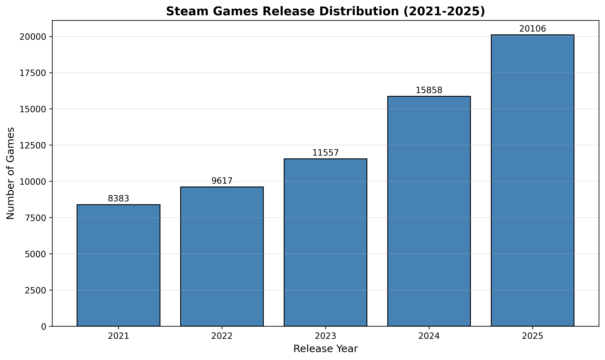

| Year | Game Count | Percentage |
|------|------------|------------|
| 2021 | 8,383 | 12.79% |
| 2022 | 9,617 | 14.68% |
| 2023 | 11,557 | 17.64% |
| 2024 | 15,858 | 24.20% |
| 2025 | 20,106 | 30.69% |

The number of games increased by **140% from 2021 to 2025**, with 2025 having 2.4 times as many games as 2021. This reflects the continued growth of the Steam platform and the increasing accessibility of game development tools.

---

## 2. Distribution Analysis

### 2.1 Price Distribution

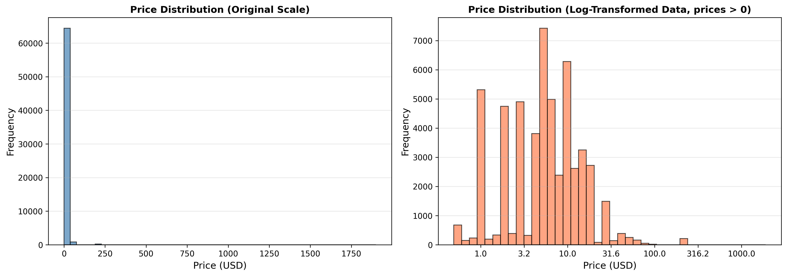

**Price Statistics:**
- Mean: $7.20
- Median: $3.99
- Standard deviation: $16.91
- Range: $0.00 - $1,900.00

**Key Findings:**

1. **Clustering at round price points**: 85.76% of all games are priced at common round values ($0.00, $0.99, $1.99, $2.99, $3.99, $4.99, etc.). This indicates deliberate pricing strategies rather than precise value-based pricing.

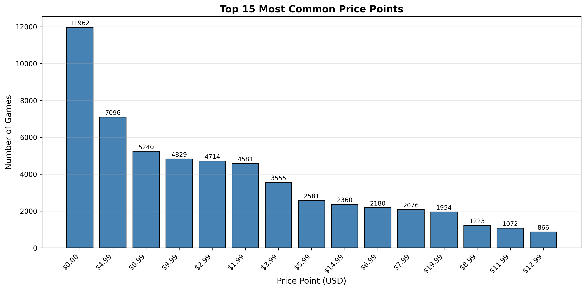

2. **Free games dominate**: 11,962 games (18.26%) are free-to-play. This is the single most common price point.

3. **Most popular paid price points**:
   - $4.99: 7,096 games (10.83%)
   - $0.99: 5,240 games (8.00%)
   - $9.99: 4,829 games (7.37%)

4. **Heavy right tail**: While most games are inexpensive, there are outliers:
   - 227 games priced over $100
   - 4 games priced over $500
   - Most expensive: "MolCollabo v2" at $1,900.00

The log-transformed distribution reveals that paid games cluster around $1-$10, with decreasing frequency at higher price points.

### 2.2 Recommendations Distribution

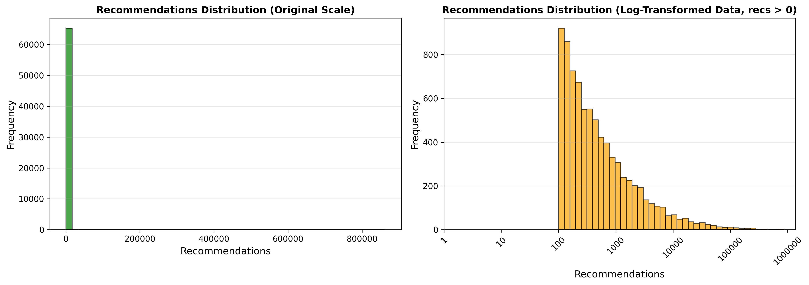

**Recommendations Statistics:**
- Mean: 362.2
- Median: 0
- Standard deviation: 6,936.8
- Range: 0 - 862,487

**Key Findings:**

1. **Extreme sparsity**: 87.78% of games (57,515 out of 65,521) have **zero recommendations**. This indicates that the vast majority of Steam games receive little to no user engagement.

2. **Heavy-tailed distribution**: Among games with recommendations > 0:
   - Mean: 2,969 recommendations
   - Median: 357 recommendations
   - The distribution is highly right-skewed

3. **Top recommended games**:
   - Black Myth: Wukong (862,487 recommendations, 2024)
   - ELDEN RING (793,463 recommendations, 2022)
   - Call of Duty® (402,294 recommendations, 2022, free)
   - Lethal Company (401,836 recommendations, 2023)
   - Palworld (342,592 recommendations, 2024)

### 2.3 Genre Distribution

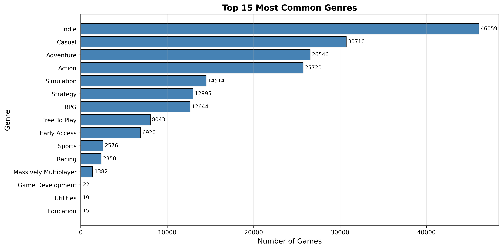

Games can have multiple genres. The top 15 most common genres are:

| Genre | Count | Percentage |
|-------|-------|------------|
| Indie | 46,059 | 70.30% |
| Casual | 30,710 | 46.87% |
| Adventure | 26,546 | 40.52% |
| Action | 25,720 | 39.25% |
| Simulation | 14,514 | 22.15% |
| Strategy | 12,995 | 19.83% |
| RPG | 12,644 | 19.30% |
| Free To Play | 8,043 | 12.28% |
| Early Access | 6,920 | 10.56% |
| Sports | 2,576 | 3.93% |

**Indie games dominate the platform**, comprising over 70% of all releases. Most games have multiple genre tags (median: 3 genres per game).

### 2.4 Category Distribution

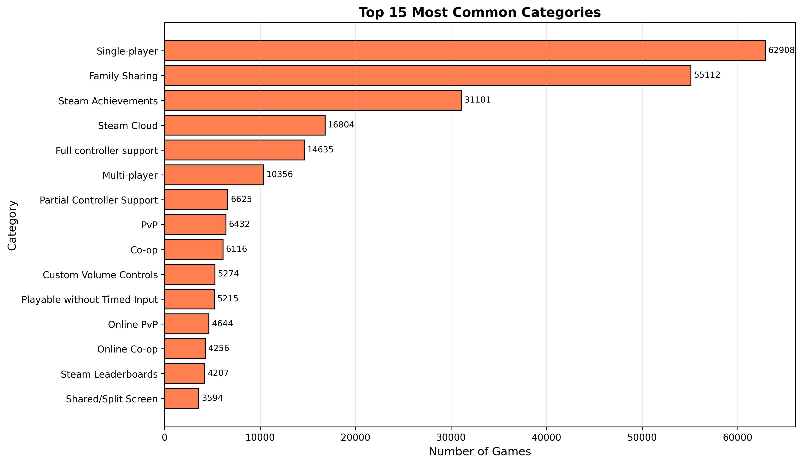

Categories describe gameplay features and platform support. Top categories:

| Category | Count | Percentage |
|----------|-------|------------|
| Single-player | 62,908 | 96.01% |
| Family Sharing | 55,112 | 84.11% |
| Steam Achievements | 31,101 | 47.47% |
| Steam Cloud | 16,804 | 25.65% |
| Full controller support | 14,635 | 22.34% |
| Multi-player | 10,356 | 15.81% |

**Single-player games are overwhelmingly dominant** (96%), while multiplayer represents only 15.81% of games.

---

## 3. Relationship Analysis

### 3.1 Price vs Recommendations

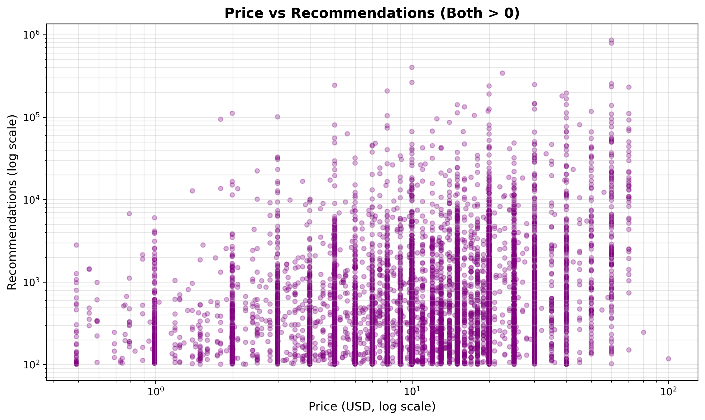

**Correlation Analysis:**
- Pearson correlation (for games with recommendations > 0): **r = 0.16**

This weak positive correlation indicates that price and recommendations are only loosely related. Higher-priced games do not systematically receive more recommendations.

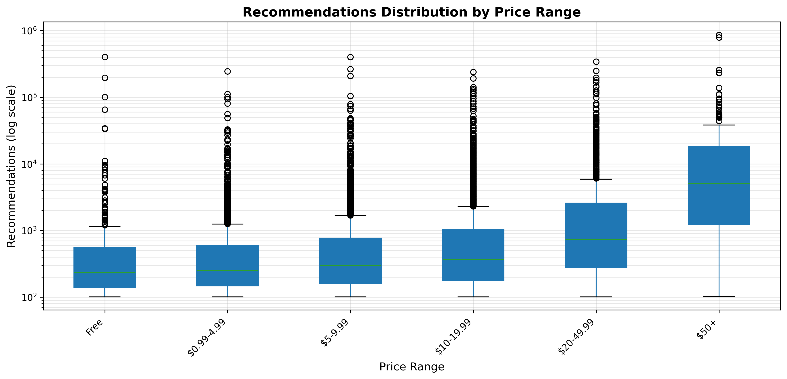

**Box plot analysis reveals a more nuanced pattern**:

| Price Range | Median Recs | Mean Recs | Count |
|-------------|-------------|-----------|-------|
| Free | 232.5 | 3,725 | 342 |
| $0.99-4.99 | 249.0 | 1,318 | 1,653 |
| $5-9.99 | 301.5 | 1,894 | 2,022 |
| $10-19.99 | 367.0 | 2,125 | 2,699 |
| $20-49.99 | 738.0 | 5,319 | 1,128 |
| $50+ | 5,048.0 | 29,097 | 162 |

Games in the $50+ category show substantially higher median recommendations (5,048 vs 232-738 for other tiers), suggesting that premium-priced games tend to be higher-quality AAA titles with larger audiences. However, the wide spread in all categories indicates high variability.

### 3.2 Temporal Trends

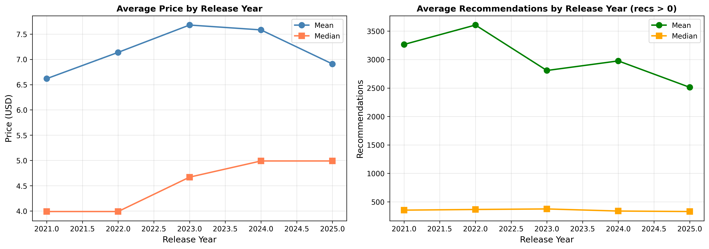

**Price trends by year:**
- Average price peaked in 2023 ($7.68) and has since declined
- Median price has gradually increased from $3.99 (2021-2022) to $4.99 (2024-2025)
- The mean-median gap suggests continued presence of high-priced outliers

**Recommendations trends by year** (for games with recommendations > 0):
- Average recommendations peaked in 2022 (481.6) and declined to 258.4 in 2025
- This likely reflects **recency bias**: older games have had more time to accumulate recommendations
- 2025 data may also be incomplete (some games scheduled for late 2025)

### 3.3 Genre-Specific Patterns

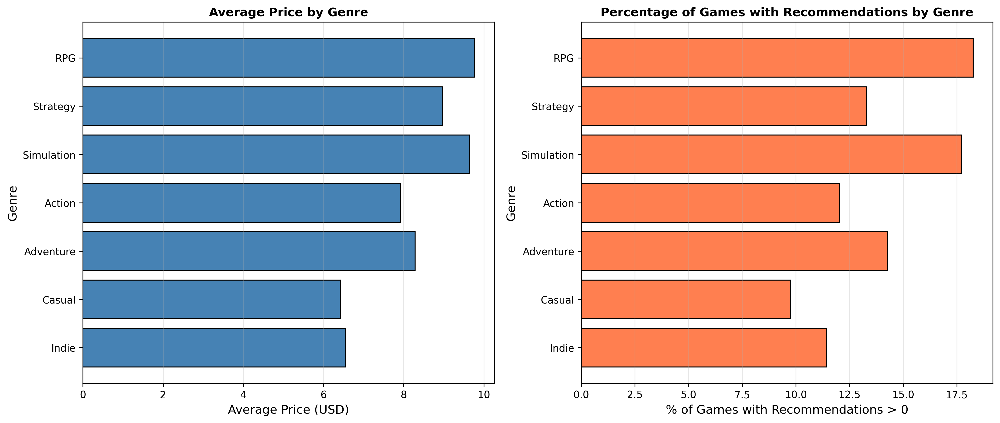

**Pricing by genre:**
- Simulation games command the highest average price ($8.01)
- Casual and Indie games are typically cheaper (around $6-7)
- RPG and Action games fall in the middle range

**Engagement by genre** (% of games with recommendations > 0):
- RPG: 18.26% of games have recommendations
- Simulation: 17.71%
- Adventure: 14.25%
- Action: 12.03%
- Indie: 11.42%
- Casual: 9.75%

RPG and Simulation games appear to have higher engagement rates, though the majority of games in all genres still have zero recommendations.

### 3.4 Complexity vs Success

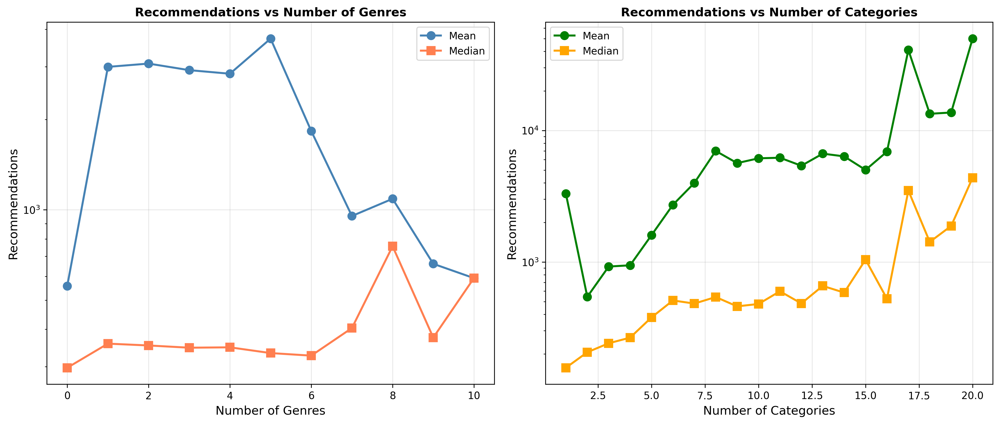

**Number of genres per game:**
- Median: 3 genres
- Range: 0-11 genres

Games with 1-5 genres show relatively similar recommendation patterns. Games with many genres (7+) tend to have fewer recommendations, possibly indicating a lack of focused identity.

**Number of categories per game:**
- Median: 4 categories
- Range: 0-37 categories

A clear positive trend emerges: games with **more categories (features) tend to have higher recommendations**. Games with 10+ categories show substantially higher median recommendations (479-1,042) compared to games with 2-4 categories (206-266). This suggests that feature-rich games with robust platform support (achievements, cloud saves, multiplayer, etc.) attract more engaged players.

---

## 4. Concentration and Inequality

### 4.1 Extreme Concentration of Recommendations

The distribution of recommendations exhibits a **severe power-law (Pareto) structure**:

- **Top 1%** of games (655 games) account for **79.74%** of all recommendations
- **Top 5%** of games (3,276 games) account for **95.59%** of all recommendations
- **Top 10%** of games (6,552 games) account for **99.26%** of all recommendations

This extreme concentration indicates a "winner-take-all" dynamic on Steam. The vast majority of user attention is captured by a tiny fraction of games, while most games receive virtually no engagement.

### 4.2 Free vs Paid Games

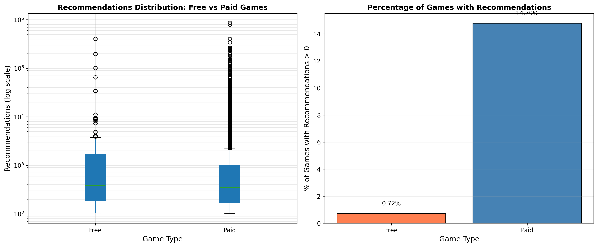

**Free games (18.26% of dataset):**
- Only 0.72% have recommendations > 0
- Mean recommendations (among those with recs > 0): 11,144
- Median recommendations: 0

**Paid games (81.74% of dataset):**
- 14.79% have recommendations > 0
- Mean recommendations (among those with recs > 0): 2,928
- Median recommendations: 0

**Key finding**: Paid games are **20.5 times more likely** to receive recommendations than free games (14.79% vs 0.72%). However, among the few free games that do gain traction, they can achieve very high engagement (likely popular F2P titles like Call of Duty®).

### 4.3 Developer Landscape

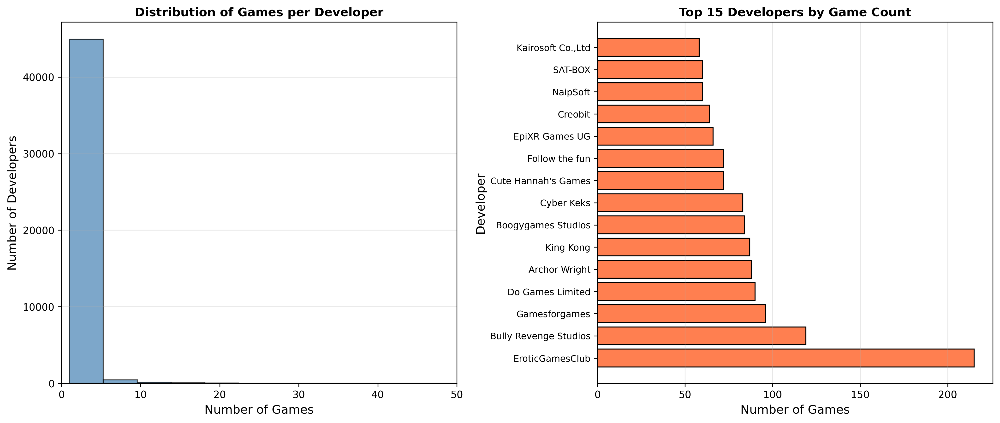

**Developer statistics:**
- Total unique developers: 45,679
- 82.55% of developers (37,708) have only **one game** in the dataset
- Only 266 developers have released more than 10 games
- Only 20 developers have released more than 50 games

**Most prolific developers:**
1. EroticGamesClub (215 games)
2. Bully Revenge Studios (119 games)
3. Gamesforgames (96 games)

The developer landscape is highly fragmented, dominated by individual developers and small studios releasing a single title.

### 4.4 Early Access Games

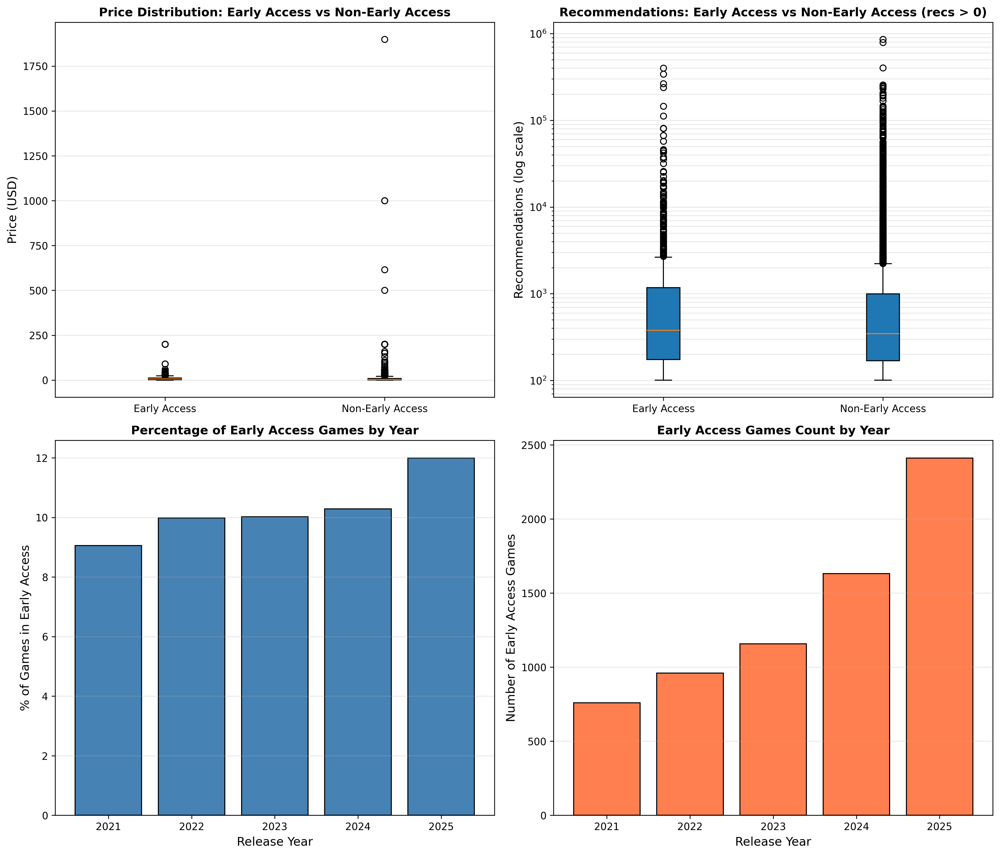

**Early Access presence:**
- 6,920 games (10.56%) are in Early Access
- This percentage has remained relatively stable across years (9-12%)

**Early Access characteristics:**
- Average price: $7.86 (vs $7.13 for non-EA)
- Median price: $5.99 (vs $3.99 for non-EA)
- 13.09% have recommendations > 0 (vs 12.12% for non-EA)

Early Access games are priced slightly higher on average and show marginally better engagement rates, though the differences are modest.

---

## 5. Data Quality and Transformation Recommendations

### 5.1 Missing Data

Missing data is minimal and appears to occur when information is unavailable from the Steam API:
- `genres`: 66 games (0.10%) - likely games with no genre tags
- `categories`: 7 games (0.01%) - very rare
- `developer`: 53 games (0.08%) - unlisted developers
- `publisher`: 183 games (0.28%) - self-published or unlisted

**Recommendation**: Missing values in `genres` and `categories` can be filled with empty strings for text analysis. Missing `developer`/`publisher` fields can be flagged or imputed as "Unknown."

### 5.2 Outliers and Data Integrity

**Price outliers:**
Several games are priced at $199.99 or higher without clear justification (e.g., "Click and Relax" at $199.99). These may be:
- Placeholder prices for unreleased games
- Business/enterprise editions
- Pricing errors
- Deliberate obfuscation to limit sales

**Recommendation**: Cap prices at the 99th percentile ($49.99) for modeling purposes, or create a binary flag for extreme outliers (price > $100).

**Recommendations outliers:**
Games with hundreds of thousands of recommendations (e.g., Black Myth: Wukong with 862K) are legitimate outliers representing blockbuster titles.

**Recommendation**: Use log-transformed recommendations for modeling. Consider creating engagement tiers (None, Low, Medium, High, Very High).

### 5.3 Default/Placeholder Values

**Price concentration**: The fact that 85.76% of games fall on round price points ($X.99 or $X) is expected behavior, not data quality issues. These are deliberate pricing decisions by developers.

**Zero recommendations**: The 87.78% of games with zero recommendations is a true reflection of low engagement, not missing data. Steam's recommendation count reflects actual user reviews.

### 5.4 Transformations for Analysis

**Recommended transformations:**

1. **Price**:
   - Create binary `is_free` flag
   - Create ordinal `price_tier` variable (Free, Budget, Standard, Premium, Luxury)
   - Log-transform for regression (log10(price + 1))

2. **Recommendations**:
   - Create binary `has_recommendations` flag
   - Create ordinal `engagement_tier` variable
   - Log-transform for visualization and regression (log10(recs + 1))

3. **Genres and Categories**:
   - One-hot encode top genres/categories
   - Create `num_genres` and `num_categories` count variables (already done in analysis)
   - Extract specific high-value features (e.g., "Multiplayer", "VR", "Achievements")

4. **Release Date**:
   - Parse to datetime
   - Create `days_since_release` variable (games may accumulate recommendations over time)
   - Create `release_month` and `release_quarter` variables

5. **Developer/Publisher**:
   - Create `developer_game_count` variable (prolific vs. one-time developers)
   - Create binary `is_self_published` flag

---

## 6. Key Findings

### Clear Findings

1. **Winner-take-all dynamics**: The Steam ecosystem exhibits extreme inequality. The top 1% of games capture 79.74% of all user recommendations. Most games (87.78%) receive zero engagement.

2. **Indie saturation**: 70% of games are tagged as "Indie," reflecting the democratization of game development but also intense competition. Most indie games fail to gain traction.

3. **Single-player dominance**: 96% of games are single-player. Multiplayer games represent a small minority (15.81%).

4. **Price clustering**: 85.76% of games use round pricing ($X.99 or $X.00), indicating strategic pricing rather than value-based pricing.

5. **Free games struggle**: Only 0.72% of free games receive any recommendations, compared to 14.79% of paid games. Paid games are 20.5× more likely to engage users.

6. **Platform growth**: Steam game releases have accelerated dramatically, with 2025 having 2.4× as many releases as 2021.

7. **Developer fragmentation**: 82.55% of developers have released only one game in this period. The market is dominated by hobbyists and small studios.

8. **Feature richness matters**: Games with more categories (features like achievements, cloud saves, multiplayer modes) tend to receive higher recommendations. This suggests that feature-complete, polished games are rewarded.

### Suggestive Patterns (Require Further Investigation)

1. **Price-quality signal**: Games priced at $50+ show substantially higher median recommendations (5,048) compared to budget games (232-768). This may indicate that higher prices signal AAA quality, or it may reflect selection bias (only confident publishers price high).

2. **Genre engagement differences**: RPG and Simulation games show higher engagement rates (18% of games have recommendations) compared to Casual and Indie games (10-11%). This may reflect genre preferences or differences in target audiences.

3. **Recency effects**: Average recommendations have declined from 482 (2022) to 258 (2025) for games with engagement. This likely reflects the time required to accumulate reviews, though it could also indicate declining average quality or increasing competition.

4. **Early Access premium**: Early Access games are priced 19% higher (median $5.99 vs $3.99) and show slightly higher engagement. This may indicate that developers with more ambitious projects choose EA, or that EA status builds anticipation.

---

## 7. Conclusions

This dataset reveals a **highly competitive, fragmented, and unequal digital marketplace**. The Steam platform has democratized game distribution, enabling tens of thousands of developers to publish their work. However, this democratization has created a "long tail" where visibility and engagement are concentrated among a tiny elite of games.

**For developers**, the data suggests several success factors:
- **Feature completeness** (more categories) correlates with higher engagement
- **Paid games** are far more likely to engage users than free games
- **Clear genre identity** (2-4 genres) may be preferable to sprawling tags
- **Pricing** should align with market tiers ($4.99, $9.99, $19.99, etc.)

**For analysts**, the extreme skewness of recommendations makes median-based statistics more meaningful than means. Log transformations and percentile-based binning are essential for modeling. The zero-inflation problem (88% zeros) suggests that binary classification (will this game get any engagement?) may be more tractable than regression (how many recommendations will it get?).

**For researchers**, this dataset exemplifies power-law distributions in digital platforms. It aligns with prior findings on YouTube videos, mobile apps, and other winner-take-all markets. The mechanisms driving this concentration (network effects, algorithmic curation, quality variance, or luck) warrant further causal investigation.

---

## Appendix: Technical Details

**Report generated by**: Claude Sonnet 4.5 (EDA Agent)  
**Analysis date**: 2025-12-31  
**Tools used**: Python 3.13.5, pandas, numpy, matplotlib, seaborn  
**Dataset**: `a_steam_data_2021_2025.csv` (65,521 games)  
**Figures**: 15 visualizations (see `figures/` directory)  
**Scripts**: Available in `scripts/` directory  

All findings are based on descriptive statistics and visualization. No inferential tests were performed. Correlation does not imply causation.
