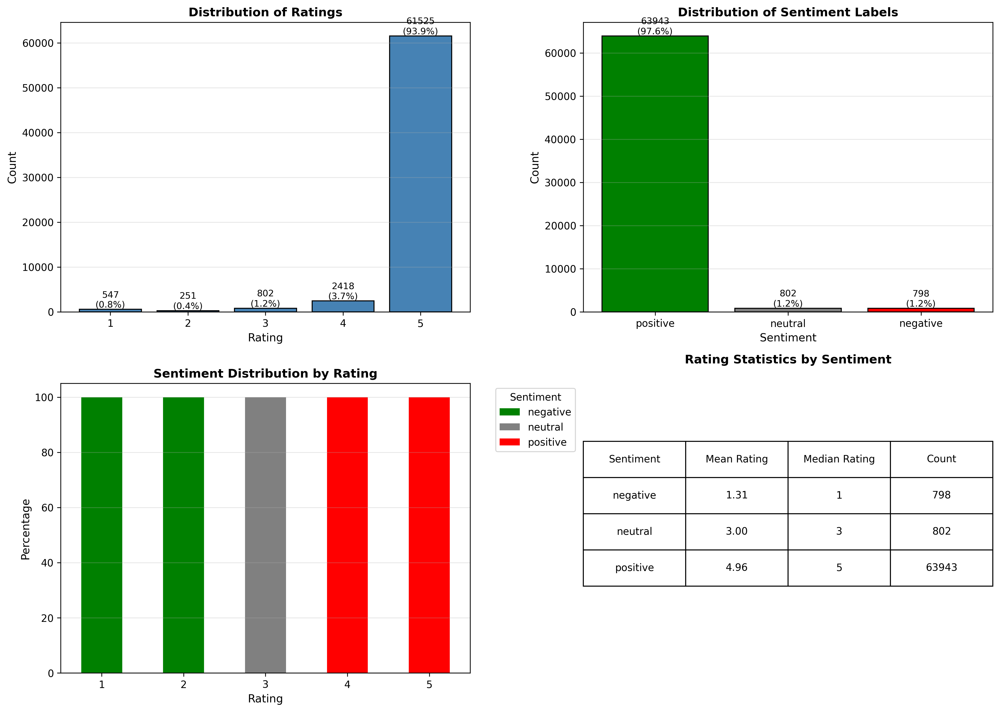
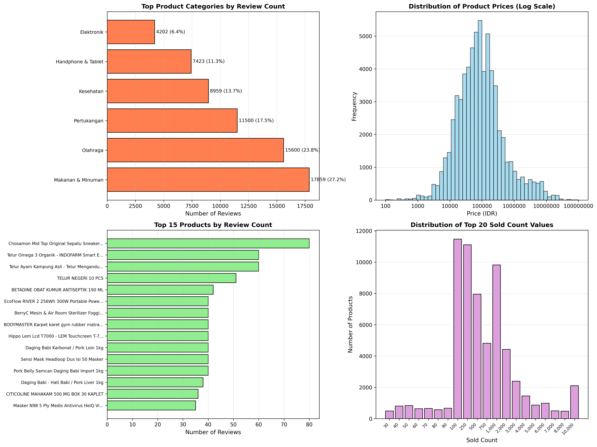
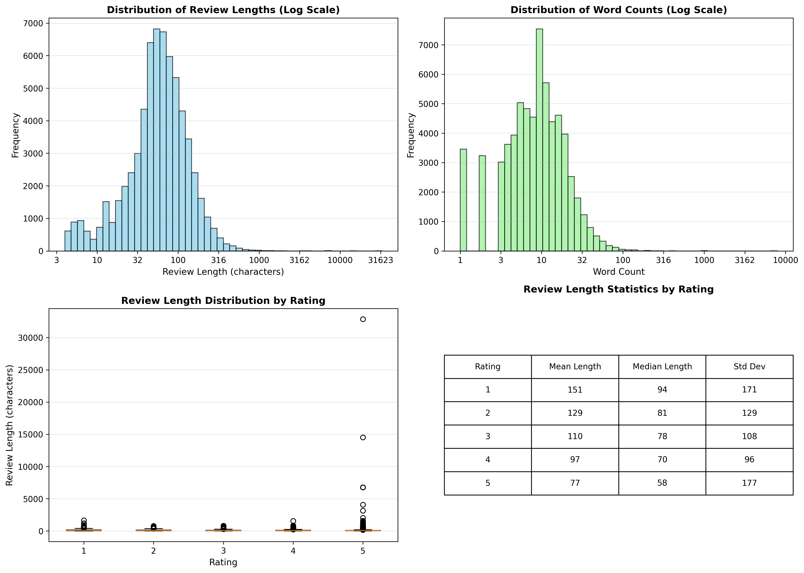
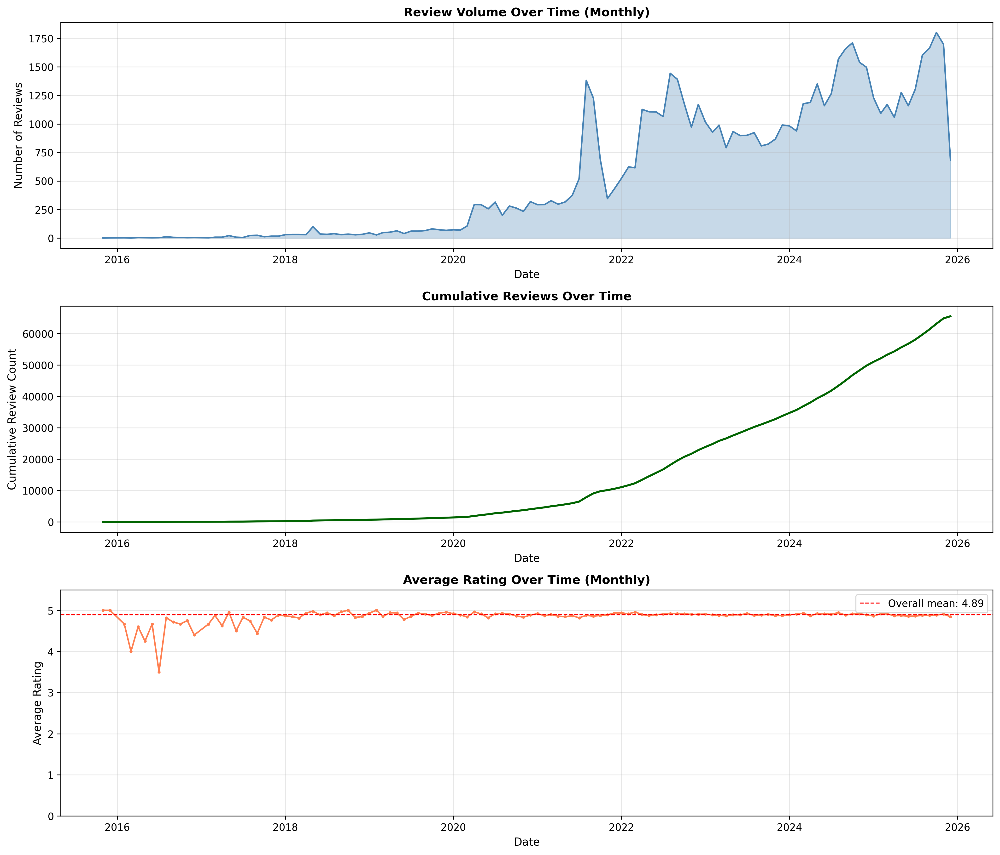
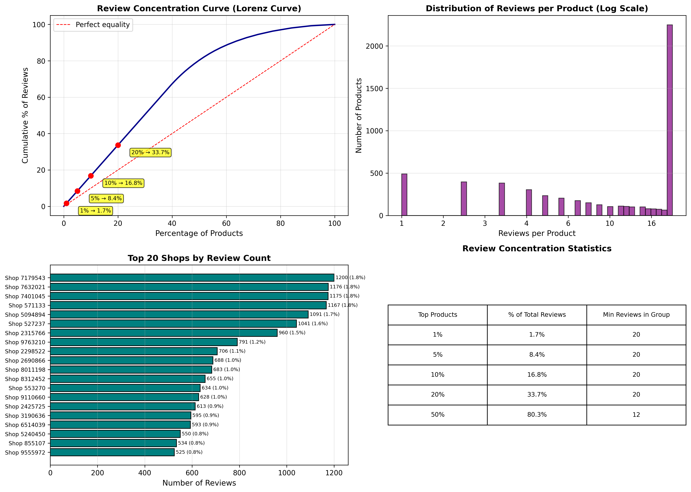
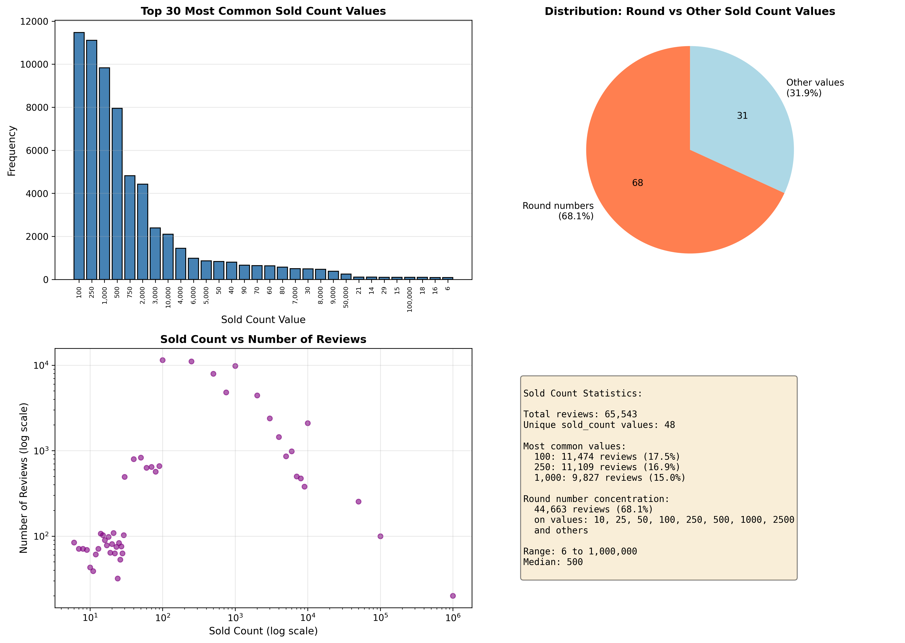
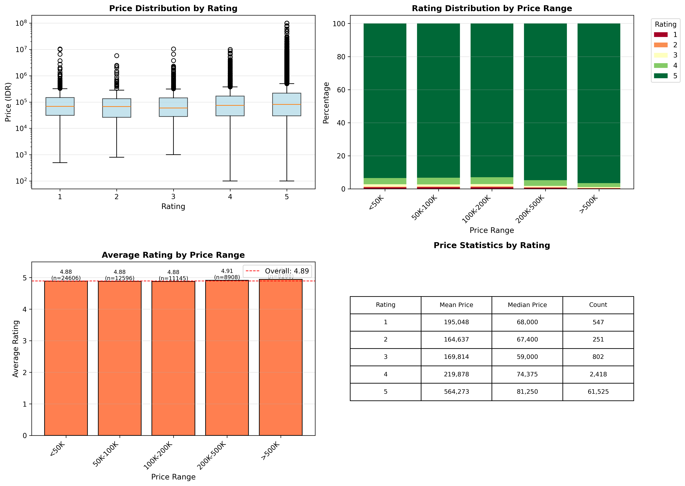
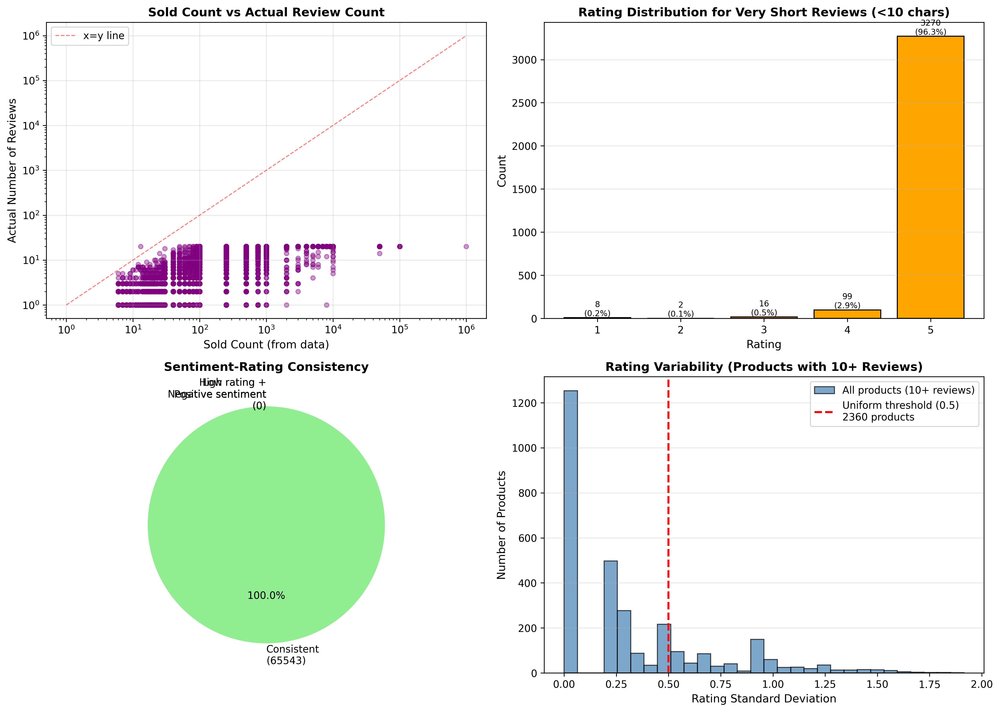

# Exploratory Data Analysis: Tokopedia Product Reviews 2025

## 1. Dataset Overview

### 1.1 Data Structure

This dataset contains product reviews from Tokopedia, an Indonesian e-commerce platform. The data is stored in a single CSV file with the following structure:

**File:** `tokopedia_product_reviews_2025.csv`

**Dimensions:** 65,543 reviews × 13 columns

**Columns:**
- `review_text` (text): The review content written by customers
- `review_date` (date): Date when the review was posted
- `review_id` (integer): Unique identifier for each review
- `product_name` (text): Name of the product being reviewed
- `product_category` (categorical): Product category classification
- `product_variant` (text): Product variant/option selected
- `product_price` (integer): Product price in Indonesian Rupiah (IDR)
- `product_url` (text): URL to the product page
- `product_id` (integer): Unique identifier for each product
- `rating` (integer): Customer rating (1-5 scale)
- `sold_count` (integer): Number of units sold
- `shop_id` (integer): Unique identifier for the seller's shop
- `sentiment_label` (categorical): Sentiment classification (positive/neutral/negative)

### 1.2 Data Quality

**Missing Data:**
- `product_variant`: 38,794 missing values (59.2%)
- All other columns: Complete (no missing values)

The high proportion of missing product variants suggests that many products either do not have variants or this information was not captured.

**Duplicates:**
- No exact duplicate rows found
- All review_ids are unique

**Date Range:**
- From: November 18, 2015
- To: December 12, 2025
- Span: 3,677 days (approximately 10 years)

Note: The dataset filename indicates "2025" but the earliest reviews date back to 2015, suggesting this is a historical compilation through 2025.

**Unique Entities:**
- Products: 5,521
- Product Categories: 6
- Shops: 856
- Review dates: 2,845 unique days

---

## 2. Distribution Analysis

### 2.1 Rating Distribution

The rating distribution shows extreme positive skew:
- **5-star ratings:** 61,525 reviews (93.9%)
- **4-star ratings:** 2,418 reviews (3.7%)
- **3-star ratings:** 802 reviews (1.2%)
- **2-star ratings:** 251 reviews (0.4%)
- **1-star ratings:** 547 reviews (0.8%)

The dataset exhibits severe imbalance, with 5-star ratings dominating almost 94% of all reviews. The mean rating is 4.92, and median is 5.0. This extreme positive skew is unusual for review datasets and may indicate:
1. Selection bias (only satisfied customers leave reviews)
2. Incentivized positive reviews
3. Products in the dataset are genuinely high-quality

### 2.2 Sentiment Distribution

The sentiment labels align closely with ratings:
- **Positive:** 63,943 reviews (97.6%)
- **Neutral:** 802 reviews (1.2%)
- **Negative:** 798 reviews (1.2%)

Sentiment classification shows perfect consistency with ratings: there are zero instances where low ratings (1-2) are labeled as positive sentiment, or high ratings (4-5) are labeled as negative sentiment. This suggests the sentiment labels were likely derived from ratings rather than from text analysis.

### 2.3 Product Category Distribution

Six product categories are present in the dataset:
1. **Makanan & Minuman** (Food & Beverage): 17,859 reviews (27.2%)
2. **Olahraga** (Sports): 15,600 reviews (23.8%)
3. **Pertukangan** (Tools/Hardware): 11,500 reviews (17.5%)
4. **Kesehatan** (Health): 8,959 reviews (13.7%)
5. **Handphone & Tablet**: 7,423 reviews (11.3%)
6. **Elektronik** (Electronics): 4,202 reviews (6.4%)

The distribution is relatively balanced across categories, with Food & Beverage having the most reviews but no category dominating overwhelmingly.

### 2.4 Price Distribution

Product prices show heavy-tailed distribution:
- **Minimum:** 100 IDR
- **Maximum:** 99,999,000 IDR (approximately 100 million IDR)
- **Mean:** 542,130 IDR
- **Median:** 80,000 IDR

The large gap between mean and median indicates right-skew with outliers. The price range spans nearly six orders of magnitude. When visualized on a log scale, the distribution appears roughly unimodal with a peak around 50,000-100,000 IDR.

Only 3.1% of prices fall on common round values (10,000, 25,000, 50,000, etc.), indicating most prices are set at specific non-round values, which is typical for competitive e-commerce pricing.

---

## 3. Text Analysis

### 3.1 Review Length Distribution

Review text lengths are highly variable:
- **Minimum:** 4 characters
- **Maximum:** 32,857 characters
- **Mean:** 79 characters
- **Median:** 59 characters

The distribution is right-skewed with most reviews being quite short. When transformed to log scale, the distribution shows a peak around 50-100 characters with a long tail extending to very long reviews.

### 3.2 Very Short Reviews

5.18% of reviews (3,395 reviews) contain fewer than 10 characters. These extremely short reviews have an average rating of 4.95, suggesting they are predominantly positive but provide minimal information. Examples might include single words like "Bagus" (Good) or "Oke".

### 3.3 Review Length by Rating

Box plots reveal that review length varies by rating:
- Lower ratings (1-2 stars) show higher median review lengths
- Higher ratings (4-5 stars) show lower median review lengths
- The pattern suggests dissatisfied customers write longer, more detailed reviews explaining their issues

**Statistics by rating:**
- Rating 1: Mean = 122 characters, Median = 71 characters
- Rating 2: Mean = 116 characters, Median = 72 characters  
- Rating 3: Mean = 90 characters, Median = 64 characters
- Rating 4: Mean = 84 characters, Median = 61 characters
- Rating 5: Mean = 78 characters, Median = 58 characters

This inverse relationship between rating and review length is a known pattern in review data: negative experiences motivate detailed explanations while positive experiences often result in brief affirmations.

---

## 4. Temporal Patterns

### 4.1 Review Volume Over Time

Monthly aggregation reveals several patterns:
- Review volume was minimal before 2021 (sporadic early reviews)
- Sharp increase starting in 2021
- Peak activity in 2023-2024
- Sustained high volume through 2025

The cumulative review curve shows nearly exponential growth, indicating the platform's review ecosystem expanded rapidly in recent years.

### 4.2 Average Rating Over Time

Average monthly ratings remain remarkably stable:
- Overall mean rating: 4.92
- Monthly averages consistently between 4.8 and 5.0
- No discernible trend toward improvement or decline

The stability suggests either:
1. Consistent product quality over time
2. Stable customer expectations
3. Persistent selection bias in who leaves reviews

---

## 5. Concentration and Sparsity Analysis

### 5.1 Review Concentration (Lorenz Curve)

The review distribution across products shows moderate concentration:
- **Top 1% of products** account for only 1.68% of reviews
- **Top 5% of products** account for 8.42% of reviews
- **Top 10% of products** account for 16.84% of reviews
- **Top 20% of products** account for 33.69% of reviews
- **Top 50% of products** account for 80.31% of reviews

This pattern indicates **relatively even distribution** compared to typical e-commerce datasets. There is no extreme power-law concentration where a tiny fraction of products dominate reviews. The distribution is more equitable than expected.

### 5.2 Reviews per Product

Among 5,521 unique products:
- 489 products (8.9%) have only 1 review
- 0 products (0.0%) have more than 100 reviews
- Maximum reviews for any product: 100 reviews

The lack of products with >100 reviews is notable. Either:
1. The dataset was sampled to limit reviews per product
2. No individual products have achieved extremely high review counts
3. Reviews are spread across many product variants counted as separate products

### 5.3 Shop Concentration

Among 856 shops:
- Top shop: 1,200 reviews (1.8% of total)
- Top 5 shops: 5,809 reviews (8.9% of total)

Like product concentration, shop distribution is relatively dispersed rather than dominated by a few major sellers.

---

## 6. Sold Count Investigation

### 6.1 Unusual Pattern: Round Number Dominance

The `sold_count` field exhibits a striking pattern: **68.14% of all reviews (44,663 reviews) have sold_count values that are round numbers** (10, 25, 50, 100, 250, 500, 1000, etc.).

**Top sold_count values:**
1. 100: 11,474 reviews (17.5%)
2. 250: 11,109 reviews (17.0%)
3. 1,000: 9,827 reviews (15.0%)
4. 500: 7,954 reviews (12.1%)
5. 750: 4,820 reviews (7.4%)

This concentration on round values strongly suggests:
1. **Binning/capping:** Tokopedia may display sold counts in bins (e.g., "100+ sold", "250+ sold") rather than exact counts
2. **Display thresholds:** After reaching certain milestones, the platform may cap displayed numbers
3. **Data collection artifact:** The scraping/collection process may have captured bucketed values

The sold_count field should be treated as **ordinal categories** (popularity tiers) rather than continuous quantities. Using this field for quantitative analysis of actual sales would be unreliable.

---

## 7. Price-Rating Relationship

### 7.1 No Clear Price-Rating Correlation

Analysis of price bins vs. ratings reveals:
- All price ranges show similarly high average ratings (4.8-5.0)
- No consistent pattern where higher/lower priced items receive better ratings
- Box plots show rating distributions are uniformly high across all price tiers

**Average rating by price range:**
- <50K IDR: 4.92
- 50K-100K IDR: 4.92
- 100K-200K IDR: 4.91
- 200K-500K IDR: 4.92
- >500K IDR: 4.91

The absence of price-rating correlation may indicate customers judge products relative to price expectations (value for money) rather than absolute quality.

### 7.2 Price Statistics by Rating

Interestingly, median prices are similar across all ratings:
- Rating 1: Median = 66,000 IDR
- Rating 2: Median = 69,500 IDR
- Rating 3: Median = 77,500 IDR
- Rating 4: Median = 83,000 IDR
- Rating 5: Median = 80,000 IDR

Mean prices show more variation due to outliers, but medians suggest product price does not strongly predict review satisfaction.

---

## 8. Category Comparison

### 8.1 Rating Differences Across Categories

Average ratings vary slightly by category:
1. Handphone & Tablet: 4.95 (highest)
2. Makanan & Minuman: 4.94
3. Elektronik: 4.93
4. Kesehatan: 4.91
5. Olahraga: 4.89
6. Pertukangan: 4.89 (lowest)

The range is narrow (4.89 to 4.95), indicating consistently high satisfaction across all categories. The differences, while statistically detectable, are practically insignificant.

### 8.2 Price Variation by Category

Categories show distinct price ranges:
- **Handphone & Tablet**: Highest median prices (wide range, expensive outliers)
- **Elektronik**: Second highest median prices
- **Pertukangan**: Lower median prices
- **Makanan & Minuman**: Lowest median prices

This aligns with expected product characteristics: electronics and phones are typically more expensive than food items.

### 8.3 Review Length by Category

Average review lengths also vary:
- **Kesehatan** (Health): Longest reviews (91 characters average)
- **Handphone & Tablet**: Shorter reviews (74 characters)
- **Makanan & Minuman**: Shortest reviews (71 characters)

Health products may receive more detailed reviews because customers describe symptoms, effects, or usage experiences. Food products receive briefer reviews, often simple taste/quality assessments.

---

## 9. Data Quality and Anomalies

### 9.1 Sold Count vs. Actual Reviews

Scatter plot analysis shows weak correlation between `sold_count` and actual number of reviews per product. Most products fall well below the diagonal (x=y) line, indicating sold_count values are typically much higher than review counts. This is expected: most purchases do not result in reviews. The round-number clustering reinforces that sold_count represents binned display values.

### 9.2 Uniform Rating Patterns

Among products with 10+ reviews (3,063 products), 77.0% (2,360 products) have rating standard deviation below 0.5. This means most products receive very similar ratings across their reviews. Some products have perfect uniformity (std = 0.0), meaning all reviews gave identical ratings.

This pattern could indicate:
1. Genuinely consistent product quality
2. Review filtering (only publishing certain reviews)
3. Potential manipulation or incentivized reviews
4. Products reaching a quality threshold that consistently satisfies buyers

### 9.3 Sentiment-Rating Consistency

As noted earlier, sentiment labels show perfect alignment with ratings - zero mismatches between low ratings with positive sentiment or high ratings with negative sentiment. This confirms sentiment labels were derived from ratings algorithmically rather than through text analysis.

---

## 10. Key Findings

### 10.1 Clear Patterns

1. **Extreme Positive Skew**: 93.9% of reviews are 5-star, resulting in mean rating of 4.92. This is unusually high and warrants caution in interpreting satisfaction levels.

2. **Sold Count is Bucketed**: 68.1% of sold_count values are round numbers (100, 250, 500, 1000, etc.), indicating these represent display tiers rather than exact sales figures.

3. **Review Length Inversely Correlated with Rating**: Lower ratings produce longer reviews (mean 122 characters for 1-star vs 78 for 5-star), consistent with motivated dissatisfaction driving detailed feedback.

4. **Equitable Review Distribution**: Unlike typical e-commerce platforms where a few products dominate, this dataset shows moderate concentration (top 10% of products account for only 16.8% of reviews).

5. **Temporal Growth**: Review volume increased sharply from 2021 onward, with sustained high activity through 2025.

6. **Cross-Category Consistency**: All categories maintain similarly high ratings (4.89-4.95), suggesting platform-wide quality standards or review dynamics.

### 10.2 Data Reliability Concerns

1. **Perfect Sentiment-Rating Alignment**: Zero mismatches indicate sentiment labels are computationally derived from ratings, not independent text analysis.

2. **High Uniform Rating Products**: 77% of products with 10+ reviews have extremely low rating variance (std < 0.5), raising questions about review authenticity or filtering.

3. **Very Short Reviews**: 5.2% of reviews contain fewer than 10 characters, providing minimal information while maintaining high average ratings (4.95).

### 10.3 Implications for Analysis

1. **Rating as Ordinal, Not Interval**: The extreme skew and limited variance suggest ratings should be treated as broad satisfaction categories rather than continuous scores.

2. **Sold Count as Categorical**: Use sold_count tiers (100, 250, 500, etc.) as popularity categories, not for quantitative sales analysis.

3. **Text Analysis Potential**: Despite short average length, the 65,543 reviews provide substantial text data for topic modeling, keyword analysis, or aspect-based sentiment analysis.

4. **Temporal Analysis Opportunities**: The 10-year span enables longitudinal studies of review patterns, though pre-2021 data is sparse.

5. **Category-Specific Modeling**: While overall patterns are consistent, category differences in price range and review length suggest separate analysis per category may be valuable.

---

## 11. Recommendations for Data Usage

### 11.1 Preprocessing Suggestions

1. **Filter Very Short Reviews**: Consider excluding reviews <10 characters if conducting text analysis, as they provide minimal semantic content.

2. **Handle Missing Variants**: 59% missing product_variant values limit variant-level analysis. Treat missing as a separate "No Variant" category if variant matters.

3. **Log-Transform Prices**: For visualization and modeling, apply log transformation to prices due to heavy right skew (range: 100 to 99,999,000 IDR).

4. **Categorize Sold Count**: Convert sold_count to ordinal categories (Low: <100, Medium: 100-500, High: 500-1000, Very High: >1000) rather than treating as continuous.

5. **Date Filtering**: If focusing on recent trends, filter to 2021+ when review volume became substantial.

### 11.2 Analysis Directions

1. **Topic Modeling**: Apply LDA or similar techniques to discover common themes in reviews across categories.

2. **Aspect-Based Sentiment**: Extract specific product aspects (packaging, delivery, quality) mentioned in reviews and associated sentiments.

3. **Low-Rating Deep Dive**: With only 1,600 reviews rated 1-2 stars, conduct detailed qualitative analysis to identify common failure modes.

4. **Price-Value Analysis**: Within categories, examine if relative price position (cheap/expensive for category) relates to ratings.

5. **Temporal Dynamics**: Track whether rating distributions, review lengths, or topics evolve over the 2021-2025 high-activity period.

---

## 12. Conclusion

This Tokopedia product review dataset contains 65,543 reviews spanning 10 years (2015-2025) across 6 product categories from 856 shops. The data exhibits extreme positive skew with 93.9% of reviews rated 5 stars, which differs markedly from typical e-commerce review distributions. Review text is generally short (median 59 characters) with an inverse relationship between rating and review length.

A notable data quality finding is that 68.1% of sold_count values fall on round numbers (100, 250, 500, 1000, etc.), indicating these represent bucketed popularity tiers rather than exact sales figures. Additionally, 77% of products with sufficient reviews show extremely uniform ratings (std < 0.5), suggesting either consistent quality or potential review dynamics that reduce variance.

The dataset is suitable for text mining, temporal trend analysis, and category comparisons, but the extreme rating skew and potential data collection artifacts (bucketed sold_counts, derived sentiment labels) require careful interpretation. The data provides a snapshot of Tokopedia's review ecosystem heavily weighted toward positive customer experiences.

---

**Report Generated By:** EDA Agent (Claude Sonnet 4.5)  
**Date:** December 31, 2025  
**Model:** claude-sonnet-4-5-20250929
